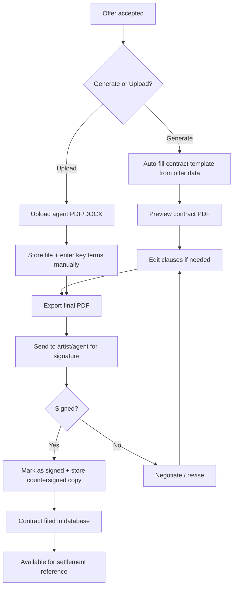
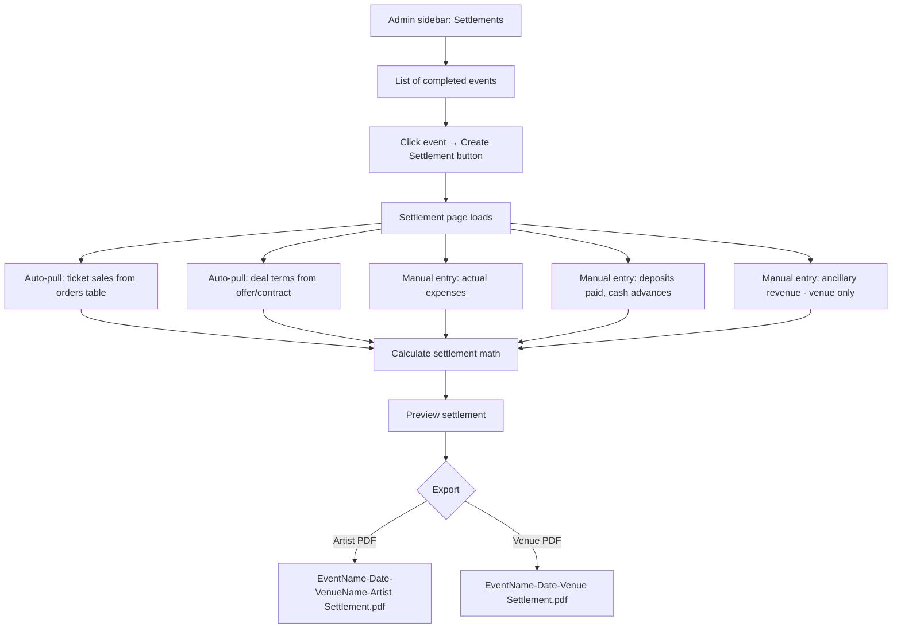

# Contracts & Settlements — Architecture Design

## Feature 1: Contract Management

### The Concept

When an offer reaches `status: "accepted"`, the organizer can either:
- **Generate a contract** from the offer data (auto-populated with deal terms + standard clauses)
- **Upload an agent-generated contract** (PDF/DOCX from the agency)

Both produce a `contract` record linked to the offer, stored in Supabase storage with metadata tracked in a `contracts` table.

### Pros & Cons

**Generate from Offer:**
| Pro | Con |
|-----|-----|
| Consistent formatting across all shows | Legal language must be vetted by actual entertainment attorney |
| Auto-fills from offer data — zero re-entry | Complex edge cases per deal type require conditional clauses |
| Version control — every edit creates a new version | Initial template creation is substantial work |
| Searchable clause database | Some agents insist on using their own contract form |
| Faster turnaround — no waiting for agent to send | |

**Upload Agent Contract:**
| Pro | Con |
|-----|-----|
| Zero template maintenance | No structured data — just a file blob |
| Works with agents who insist on their own forms | Cant auto-extract deal terms for settlement |
| Simple implementation | Inconsistent across shows |
| | Manual entry of key terms still needed for settlement |

**Recommendation:** Support both. Default to generating from offer data. Allow upload as override. Store key contract metadata either way so settlements can reference terms.

### Contract Clauses to Include

Standard performance contract sections:

1. **Parties** — Buyer/Promoter info from venue, Artist/Agency info from offer
2. **Engagement Details** — Date, venue, show time, billing, number of shows
3. **Compensation** — Guarantee, deal type, backend %, bonus structure
4. **Ticket Scaling** — Tiers, prices, capacity, facility fees
5. **Expenses** — Fixed + variable from offer, who pays what
6. **Deposit & Payment** — Deposit %, amount, due date, balance due date
7. **Radius Clause** — Distance, days prior/after, exceptions
8. **Production** — Who provides: sound, lights, backline, stage plot reference
9. **Hospitality & Catering** — Rider requirements, buyout amount if applicable
10. **Merchandising** — Split %, who sells, who provides staff
11. **Cancellation** — By artist, by venue, weather, low sales threshold
12. **Force Majeure** — Acts of God, government orders, pandemic, war
13. **Indemnification** — Mutual indemnity, limits of liability
14. **Insurance** — CGL requirements, additional insured, certificate deadline
15. **Licensing** — ASCAP/BMI/SESAC/GMR, liquor license, occupancy permits
16. **Recording/Streaming** — No unauthorized recording, livestream rights
17. **Confidentiality** — Deal terms are confidential
18. **Governing Law** — Jurisdiction, dispute resolution
19. **Signatures** — Artist/Agent signature block, Buyer/Promoter signature block, date

### Data Model

```
contracts table:
  id UUID PK
  offer_id UUID FK → offers
  event_id UUID FK → events
  venue_id UUID FK → venues
  
  -- Source
  source: generated | uploaded
  
  -- Key terms snapshot for settlement linkage
  guarantee NUMERIC
  deal_type TEXT (VS/FLAT/PLUS/BONUS)
  backend_percentage TEXT
  bonus_structure TEXT
  radius_clause TEXT
  deposit_amount NUMERIC
  deposit_paid BOOLEAN DEFAULT false
  
  -- File
  file_url TEXT -- Supabase storage path
  file_name TEXT
  version INTEGER DEFAULT 1
  
  -- Status
  status: draft | sent | signed | void
  signed_at TIMESTAMPTZ
  signed_by_artist TEXT
  signed_by_buyer TEXT
  
  created_at TIMESTAMPTZ
  updated_at TIMESTAMPTZ
```

### Workflow



### Implementation Approach

1. **Contract template** — jsPDF-generated multi-page PDF (like the existing offer export but with legal sections added). Template is a TypeScript function, not a Word doc.
2. **Clause library** — JSONB column on venues table OR separate `contract_clauses` table with venue defaults that can be overridden per contract.
3. **Upload path** — Supabase storage `contracts/{venue_id}/{offer_id}/` with file upload via existing `/api/upload` route.
4. **UI** — Button on offer detail page: "Generate Contract" / "Upload Contract". Contracts tab showing all contracts for that venue.

---

## Feature 2: Settlement System

### The Concept

After a show happens, the organizer creates a settlement to reconcile **projected** offer numbers with **actual** performance. This is the industry-standard show accounting process.

### User Flow



### Settlement Math

All from your spec, formalized:

```
PER TIER:
  Gross Receipts = Tickets Sold × Price
  
TOTALS:
  Total Gross Receipts = SUM of all tier Gross Receipts
  
  Adj. Gross Receipts = Total Gross - Ticketing Fees - Venue Facility Fees
  
  Net Receipts = Adj. Gross - Taxes
  
  Total Expenses = SUM of all entered expenses
  
  Splitpoint = Net Receipts - Total Expenses
  (only applicable for VS/PLUS/BONUS deals)
  
FOR VS DEAL:
  If Splitpoint > 0:
    Artist Backend = Splitpoint × backend_percentage
    Artist Total = Guarantee + Artist Backend
  Else:
    Artist Total = Guarantee (floor)
    
FOR FLAT DEAL:
  Artist Total = Guarantee (no backend)

FOR PLUS DEAL:
  Artist Total = Guarantee + (Splitpoint × backend_percentage)
  (artist gets backend even if splitpoint is negative — rare)

FOR BONUS DEAL:
  Artist Total = Guarantee + bonus_amount if threshold met
```

### Ticket Audit Section

Auto-populated from real sales data:

```
Tier Name | Capacity | Sold | Comps | Unsold | Price | Gross
───────────────────────────────────────────────────────────────
GA        | 500      | 420  | 15    | 65     | $25   | $10,500
VIP       | 50       | 48   | 2     | 0      | $75   | $3,600
───────────────────────────────────────────────────────────────
TOTAL     | 550      | 468  | 17    | 65     |       | $14,100
```

### Expense Tracking

Pre-populated from offer estimates, editable with actuals:

```
FIXED EXPENSES (entered manually):
  Rent ................... $2,000
  Production ............. $1,500
  Catering Buyout ........ $500
  Security ............... $800
  Marketing .............. $300
  [...etc]

VARIABLE EXPENSES (auto-calculated from actual gross):
  ASCAP (0.8%) ........... $112.80
  BMI (0.8%) ............. $112.80
  Credit Card (3.0%) ..... $423.00

DEPOSITS & ADVANCES:
  Deposit Paid ........... $5,000  (date: 2025-10-01)
  Cash Advance ........... $0

UPLOADS:
  [📎 Production Invoice.pdf]
  [📎 Catering Receipt.jpg]
```

### Two PDF Exports

**Artist Settlement** includes:
- Deal terms header: Guarantee, Deal Type, Backend %, Bonus, Radius
- Full ticket audit by tier
- Total Gross → Adj. Gross → Net Receipts
- All expenses itemized
- Splitpoint calculation
- Artist payment calculation
- Deposits/advances applied
- Balance due to/from artist

**Venue Settlement** includes everything in Artist Settlement PLUS:
- Ancillary revenues section:
  - Bar revenue
  - Concessions
  - Merch commission (venue cut)
  - Ticketing rebates (from ticketing fees)
  - Parking
  - Sponsorship revenue allocated to this show
- Venue P&L summary:
  - Total Revenue (Net Receipts + Ancillary)
  - Total Costs (Expenses + Artist Payment)
  - Venue Net Profit/Loss

### Data Model

```
settlements table:
  id UUID PK
  event_id UUID FK → events
  offer_id UUID FK → offers (nullable)
  contract_id UUID FK → contracts (nullable)
  venue_id UUID FK → venues
  
  -- Deal terms snapshot
  guarantee NUMERIC
  deal_type TEXT
  backend_percentage NUMERIC
  bonus_structure JSONB
  radius_clause TEXT
  
  -- Ticket audit: auto-pulled, stored as snapshot
  ticket_audit JSONB
  -- format: [{tier, capacity, sold, comps, kills, price, facility_fee, gross}]
  
  -- Financial summary: calculated
  total_gross NUMERIC
  ticketing_fees NUMERIC
  facility_fees NUMERIC
  adj_gross NUMERIC
  taxes NUMERIC
  net_receipts NUMERIC
  total_expenses NUMERIC
  splitpoint NUMERIC
  artist_backend NUMERIC
  artist_total NUMERIC
  
  -- Deposits
  deposit_paid NUMERIC DEFAULT 0
  cash_advance NUMERIC DEFAULT 0
  balance_due NUMERIC  -- artist_total - deposit_paid - cash_advance
  
  -- Ancillary: venue settlement only
  bar_revenue NUMERIC DEFAULT 0
  concessions_revenue NUMERIC DEFAULT 0
  merch_commission NUMERIC DEFAULT 0
  ticketing_rebate NUMERIC DEFAULT 0
  parking_revenue NUMERIC DEFAULT 0
  sponsorship_revenue NUMERIC DEFAULT 0
  other_ancillary JSONB  -- [{name, amount}]
  venue_total_revenue NUMERIC
  venue_net_profit NUMERIC
  
  -- Status
  status: draft | finalized
  finalized_at TIMESTAMPTZ
  finalized_by UUID FK → admin_users
  
  created_at TIMESTAMPTZ
  updated_at TIMESTAMPTZ

settlement_expenses table:
  id UUID PK
  settlement_id UUID FK → settlements
  name TEXT
  category: fixed | variable
  estimated_amount NUMERIC  -- from offer
  actual_amount NUMERIC     -- entered by organizer
  rate NUMERIC              -- for variable expenses
  receipt_url TEXT           -- uploaded invoice/receipt
  notes TEXT
  sort_order INTEGER

settlement_deposits table:
  id UUID PK
  settlement_id UUID FK → settlements
  type: deposit | cash_advance | other
  amount NUMERIC
  date DATE
  notes TEXT
  receipt_url TEXT
```

### Implementation Efficiency

The most efficient approach:

1. **Reuse existing data** — The offer system already has ticket_scaling, expenses, deal terms. The settlement pre-fills from the offer. Actual sales come from the `orders` + `tickets` tables joined with `ticket_types`.

2. **Single page with sections** — `/admin/settlements/[id]` with collapsible sections: Deal Terms, Ticket Audit, Expenses, Deposits, Ancillary (venue only). All editable in place.

3. **Auto-calculation** — All math is client-side in real-time as values change. No server round-trips for calculations.

4. **Snapshot on finalize** — When the organizer clicks Finalize, snapshot all calculated values into the `settlements` row. This freezes the numbers even if future ticket refunds happen.

5. **PDF reuse** — Extend the existing jsPDF pattern from offers. Same branded header. Two export functions: `exportArtistSettlement()` and `exportVenueSettlement()`.

6. **File uploads** — Reuse existing `/api/upload` route for receipts/invoices. Store URLs in `settlement_expenses.receipt_url`.

### Page Structure

```
/admin/settlements          → List of events with Create Settlement button
/admin/settlements/[id]     → Settlement detail/edit page
```

The list page shows completed events. Events that already have a settlement show View/Edit. Events without one show Create Settlement.

### PDF Layout

Both PDFs follow this structure:

```
┌─────────────────────────────────────────┐
│ [Venue Logo]  ARTIST/VENUE SETTLEMENT   │
│ Venue Name · Address · Phone · Email    │
├─────────────────────────────────────────┤
│ DEAL TERMS                              │
│ Artist: [name]  Guarantee: $X           │
│ Deal: VS 85/15  Radius: 150mi/60days    │
│ Bonus: $X if sold out                   │
├─────────────────────────────────────────┤
│ TICKET AUDIT                            │
│ Tier | Cap | Sold | Comps | Price | Gross│
│ GA   | 500 | 420  | 15    | $25   | $10.5k│
│ VIP  | 50  | 48   | 2     | $75   | $3.6k│
│ TOTAL|     |      |       |       | $14.1k│
├─────────────────────────────────────────┤
│ FINANCIAL SUMMARY                       │
│ Total Gross Receipts ........ $14,100   │
│ Less: Ticketing Fees ........ ($1,404)  │
│ Less: Facility Fees ......... ($550)    │
│ Adj. Gross Receipts ......... $12,146   │
│ Less: Taxes (9%) ............ ($1,093)  │
│ Net Receipts ................ $11,053   │
├─────────────────────────────────────────┤
│ EXPENSES                                │
│ Rent ........................ $2,000    │
│ Production .................. $1,500    │
│ [... all items ...]                     │
│ Total Expenses .............. $8,200    │
├─────────────────────────────────────────┤
│ SETTLEMENT                              │
│ Net Receipts ................ $11,053   │
│ Less: Total Expenses ........ ($8,200)  │
│ Splitpoint .................. $2,853    │
│ Artist Backend (15%) ........ $428      │
│ Artist Guarantee ............ $5,000    │
│ ARTIST TOTAL ................ $5,428    │
│ Less: Deposit Paid .......... ($2,500)  │
│ BALANCE DUE TO ARTIST ....... $2,928    │
├─────────────────────────────────────────┤
│ ** VENUE SETTLEMENT ONLY **             │
│ ANCILLARY REVENUE                       │
│ Bar Revenue ................. $4,200    │
│ Merch Commission (15%) ...... $680      │
│ Ticketing Rebate ............ $702      │
│ Total Ancillary ............. $5,582    │
│                                         │
│ VENUE P&L                               │
│ Revenue (Net + Ancillary) ... $16,635   │
│ Costs (Expenses + Artist) ... $13,628   │
│ VENUE NET PROFIT ............ $3,007    │
└─────────────────────────────────────────┘
```

### File Naming

- Artist: `{EventName}-{EventDate}-{VenueName}-Artist_Settlement.pdf`
- Venue: `{EventName}-{EventDate}-Venue_Settlement.pdf`

---

## Questions Before Implementation

1. **Contract signatures** — Do you want e-signature integration (DocuSign/HelloSign) or just a "mark as signed" checkbox with uploaded countersigned PDF?

2. **Settlement approval workflow** — Should settlements require dual approval (venue admin + owner) before finalizing, or single user is fine?

3. **Retroactive settlements** — For shows that happened before VenueCore was tracking sales, should there be a manual gross receipts entry mode?

4. **Multi-artist settlements** — Festival/multi-act shows: one settlement per artist, or one master settlement with artist sub-sections?

5. **Contract templates** — Do you have existing contract language you want to use as the base template, or should I draft standard clauses?
