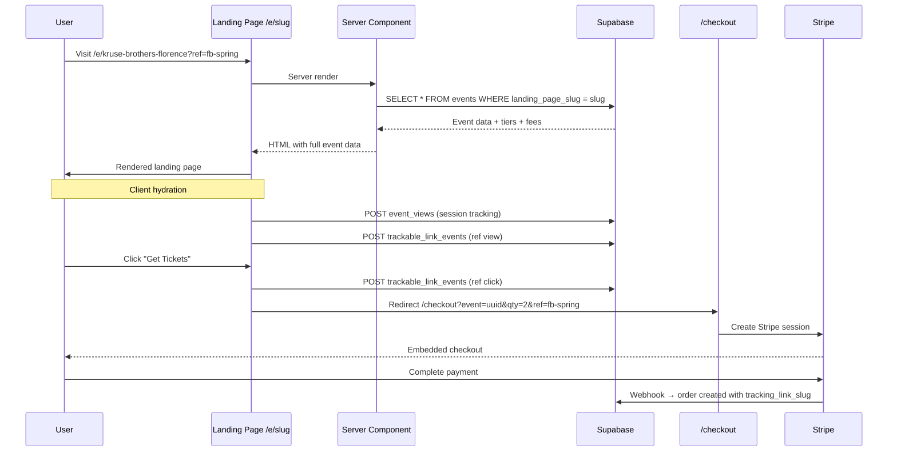

# Event Landing Pages — Architecture Plan

## Overview

Build a dynamic, conversion-first landing page system that auto-generates a unique URL for every event. These pages are **not** informational event detail pages — they are stripped-down, high-converting funnels designed to drive immediate ticket purchases with minimal friction.

**Key Principle:** Every decision prioritizes speed and action over detail.

---

## Current State Analysis

### Existing Infrastructure
- **Events** stored in Supabase with `id` (UUID), `title`, `venue`, `date`, `price`, `image_url`, `description`, `venue_id`, `event_type`, etc.
- **Event detail page** at `app/events/[id]/` — full-featured page with ticket selection, seat maps, sponsors, FAQs, etc.
- **Tracking links** (`/t/[slug]`) — redirect system with click/conversion tracking via `trackable_links` + `trackable_link_events` tables
- **Checkout** at `/checkout?event={id}&qty={n}&ref={trackingSlug}` — Stripe Embedded Checkout
- **View tracking** via `event_views` table with session-based dedup
- **Middleware** handles operator/venue detection, sets cookies, skips `/api/` and `/t/` routes
- **Root layout** includes `Header`, `VenueThemeProvider`, `OperatorProvider` — landing pages must bypass the Header

### What Does NOT Exist Yet
- No `landing_page_slug` column on the `events` table
- No `/e/[slug]` route
- No landing page component
- No slug-based event lookup API

---

## Architecture

```mermaid
flowchart TD
    A[Admin creates event] --> B[API auto-generates landing_page_slug]
    B --> C[Slug stored in events table]
    C --> D[Landing page URL: /e/slug]
    
    E[User clicks tracking link] --> F[/t/tracking-slug]
    F --> G[Redirect to /e/event-slug?ref=tracking-slug]
    G --> H[Landing page renders]
    
    I[User visits /e/slug directly] --> H
    
    H --> J[Fire view event + trackable link view]
    H --> K[User clicks Get Tickets CTA]
    K --> L[Fire click event + Meta Pixel]
    K --> M[Redirect to /checkout with event_id + qty + ref]
    M --> N[Stripe Embedded Checkout]
    N --> O[Conversion attributed to tracking_id]
```

---

## 1. Database Migration

**File:** `plans/event-landing-page-migration.sql`

Full migration SQL (to be saved as `.sql` file in Code mode):

```sql
-- ============================================================================
-- EVENT LANDING PAGES — Migration
-- ============================================================================
--
-- Adds a `landing_page_slug` column to the `events` table for SEO-friendly
-- landing page URLs at /e/[slug].
--
-- The slug is auto-generated from the event title + venue when an event is
-- created via the API. Admins can edit it manually from the event edit page.
--
-- Run in Supabase SQL Editor.
-- ============================================================================

-- =========================
-- COLUMN: landing_page_slug
-- =========================
ALTER TABLE events
ADD COLUMN IF NOT EXISTS landing_page_slug TEXT UNIQUE;

-- Index for fast slug lookups (the UNIQUE constraint creates one, but explicit for clarity)
CREATE INDEX IF NOT EXISTS idx_events_landing_page_slug
  ON events(landing_page_slug)
  WHERE landing_page_slug IS NOT NULL;

-- =========================
-- BACKFILL: Generate slugs for existing events
-- =========================
-- This generates slugs from existing event titles using a simple slugify:
--   lowercase -> replace non-alphanumeric with hyphens -> trim hyphens -> truncate to 80 chars
--
-- NOTE: This may produce collisions if two events have the same title.
-- After running, check for and manually resolve any duplicates.

UPDATE events
SET landing_page_slug = LEFT(
  TRIM(BOTH '-' FROM
    regexp_replace(
      regexp_replace(
        lower(title),
        '[^a-z0-9]+', '-', 'g'
      ),
      '-+', '-', 'g'
    )
  ),
  80
)
WHERE landing_page_slug IS NULL
  AND title IS NOT NULL
  AND status = 'published';

-- =========================
-- FUNCTION: generate_landing_page_slug
-- =========================
-- Helper function that generates a unique slug from a title string.
-- Appends -2, -3, etc. if the base slug already exists.
-- Called from the application layer (not a trigger).

CREATE OR REPLACE FUNCTION generate_landing_page_slug(
  p_title TEXT,
  p_event_id UUID DEFAULT NULL
)
RETURNS TEXT AS $$
DECLARE
  base_slug TEXT;
  candidate TEXT;
  counter INT := 1;
  existing_count INT;
BEGIN
  -- Slugify: lowercase, replace non-alphanumeric with hyphens, collapse, trim
  base_slug := LEFT(
    TRIM(BOTH '-' FROM
      regexp_replace(
        regexp_replace(
          lower(p_title),
          '[^a-z0-9]+', '-', 'g'
        ),
        '-+', '-', 'g'
      )
    ),
    80
  );

  IF base_slug IS NULL OR base_slug = '' THEN
    base_slug := 'event';
  END IF;

  candidate := base_slug;

  LOOP
    IF p_event_id IS NOT NULL THEN
      SELECT COUNT(*) INTO existing_count
      FROM events
      WHERE landing_page_slug = candidate AND id != p_event_id;
    ELSE
      SELECT COUNT(*) INTO existing_count
      FROM events
      WHERE landing_page_slug = candidate;
    END IF;

    EXIT WHEN existing_count = 0;

    counter := counter + 1;
    candidate := base_slug || '-' || counter;
  END LOOP;

  RETURN candidate;
END;
$$ LANGUAGE plpgsql;

-- =========================
-- UPDATE trackable_link_events CHECK CONSTRAINT
-- =========================
-- Add 'view' as a valid event_type for landing page view tracking.

ALTER TABLE trackable_link_events
DROP CONSTRAINT IF EXISTS trackable_link_events_event_type_check;

ALTER TABLE trackable_link_events
ADD CONSTRAINT trackable_link_events_event_type_check
CHECK (event_type IN ('click', 'conversion', 'view'));
```

### Slug Generation Logic
- Lowercase, strip non-alphanumeric (except hyphens)
- Deduplicate: if slug exists, append `-2`, `-3`, etc.
- Max 80 characters
- Stored on the `events` row alongside the UUID `id`
- Example: `kruse-brothers-florence`

---

## 2. Route Structure

### `app/e/layout.tsx` — Minimal Landing Page Layout

The landing page uses a **separate layout** that excludes the standard `Header` component. This is critical for conversion — no navigation means no exit paths.

```
app/e/
  layout.tsx          ← No Header, no Footer, minimal providers
  [slug]/
    page.tsx          ← Server component: fetch + metadata + render client
    EventLandingPage.tsx  ← Client component: the actual landing page UI
```

The layout still includes:
- `OperatorProvider` (for branding/pixel)
- `TrackingPixels` (Meta Pixel fires on every landing page)
- `VenueProvider` (for theme colors)
- `VenueThemeProvider` (dynamic CSS vars)
- **No** `Header` component

### `app/e/[slug]/page.tsx` — Server Component

Responsibilities:
1. Fetch event by `landing_page_slug` using `createAdminClient()`
2. Return 404 via `notFound()` if no event matches
3. Generate rich OG metadata (title, description, image) for social sharing
4. Fetch ticket tiers, venue fees server-side
5. Pass all data as props to `EventLandingPage`

Uses **server-side rendering** (default in App Router) — no `getServerSideProps` needed since this is not Pages Router. Data is fetched in the server component and passed as props.

### Why Not Static Generation?
Events are dynamic (prices change, sell out, get cancelled). Server-rendering on every request ensures fresh data. Supabase queries are fast enough (<100ms) for acceptable TTFB.

---

## 3. Landing Page Component

### `app/e/[slug]/EventLandingPage.tsx`

A `"use client"` component that receives all event data as props (no client-side fetching needed — data comes from the server component).

### Above the Fold
```
+---------------------------------------+
|  HERO IMAGE (full-width, 60vh)        |
|  with dark gradient overlay           |
|                                       |
|  HEADLINE: bold, 2-3 words max        |
|  SUBHEADLINE: urgency-driven          |
|  e.g. "Limited tickets remaining"     |
|                                       |
|  DATE · TIME · VENUE                  |
|                                       |
|  PRICE: $XX ALL-IN (no hidden fees)   |
|                                       |
|  [ QTY -/+ ]  [ GET TICKETS >>> ]     |
+---------------------------------------+
```

### CTA Behavior
- Primary CTA links to `/checkout?event={id}&qty={n}`
- If `?ref=` param exists in URL, append `&ref={slug}` to checkout URL
- Also persist ref to `sessionStorage` (same pattern as existing event detail page)
- NO intermediate steps between CTA and checkout
- Fire Meta Pixel `InitiateCheckout` on click

### Mid Section (Below the Fold)
```
+---------------------------------------+
|  3 BULLET POINTS:                     |
|  - "Live music you won't forget"      |
|  - "Only X tickets left"             |
|  - "Join 200+ fans already going"     |
|                                       |
|  ARTIST CREDIBILITY LINE              |
|  Short bio or tag (if available)      |
+---------------------------------------+
```

### Social Proof
- "X people already going" — pull from `orders` count for this event, or show a static fallback like "Selling fast"
- Badge: "Limited Availability" when capacity is >70% sold

### Sticky Mobile CTA
- Fixed bottom bar on mobile (below 768px)
- Shows price + "Get Tickets" button
- Always visible as user scrolls
- Uses `position: fixed; bottom: 0;` with safe-area padding for notch devices

### Ticket Tier Selection
- If multiple tiers exist, show a compact tier selector above the CTA
- Each tier: name + price (all-in)
- Default to the first/cheapest tier
- Quantity selector: simple -/+ buttons (1-10 range)

---

## 4. API Routes

### `app/api/landing/[slug]/route.ts` — GET

Fetches everything the landing page needs in a single query:

```typescript
// 1. Fetch event by landing_page_slug
SELECT * FROM events WHERE landing_page_slug = :slug AND status = 'published'

// 2. Fetch ticket tiers
SELECT * FROM ticket_tiers WHERE event_id = :id ORDER BY sort_order

// 3. Fetch venue fees (from venues or event_venues table)
// 4. Calculate all-in prices (base + ticketing_fee + facility_fee + tax)

// 5. Fetch social proof: count of paid orders
SELECT count(*) FROM orders WHERE event_id = :id AND status = 'paid'
```

Returns a single JSON payload with everything needed to render the page.

> **Note:** This API route exists primarily as a fallback. The server component in `page.tsx` performs these queries directly server-side, avoiding an extra HTTP round-trip.

### `app/api/landing/[slug]/view/route.ts` — POST

Records a landing page view in `event_views` with `source = 'landing_page'` metadata. Also records a trackable link view if `?ref=` param is present.

---

## 5. Tracking Integration

### On Page Load
1. Fire `event_views` POST with `session_id`, `referrer_url`, UTM params
2. If `?ref=` param present:
   - Persist to `sessionStorage` as `vc_tracking_ref`
   - Record a `trackable_link_events` row with `event_type = 'view'` (new event type — currently only `click` and `conversion` exist, but the CHECK constraint needs updating)
3. Fire Meta Pixel `ViewContent` with event data

### On CTA Click
1. Fire Meta Pixel `InitiateCheckout`
2. If tracking ref exists, fire `trackable_link_events` with `event_type = 'click'`
3. Redirect to `/checkout` with all params including `ref`

### On Purchase (Existing — No Changes Needed)
The existing checkout flow already:
- Reads `ref` from query params
- Persists `tracking_link_slug` to the `orders` table
- Records conversion via `record-conversion` API

---

## 6. Admin Portal Integration

### Auto-Generate Slug on Event Creation

In `app/api/events/route.js` POST handler:
1. After inserting the event, generate a slug from `slugify(title + venue)`
2. Check for uniqueness, append suffix if needed
3. Update the event row with `landing_page_slug`

### Show Landing Page URL in Admin Edit

In `app/admin/events/[id]/edit/page.tsx`:
1. Display the landing page URL: `{origin}/e/{landing_page_slug}`
2. Copy-to-clipboard button
3. Allow manual slug editing (with auto-slugify on input)

### Trackable Links Destination Option

When creating a trackable link, allow selecting the destination:
- **Event Page** (default): `/events/{id}?ref={slug}` 
- **Landing Page**: `/e/{landing_page_slug}?ref={slug}`

Update `app/api/events/[id]/trackable-links/route.ts` POST handler to accept a `destination_type` field.

---

## 7. Middleware

The existing middleware in `middleware.ts` skips `/api/` and `/t/` routes. For `/e/` routes, the middleware **should still run** because:
- It sets `operatorSlug` and `venueSlug` cookies needed by the landing page layout
- It refreshes the Supabase auth session

No middleware changes needed — the `/e/` route is a normal page route, not an API route.

---

## 8. Performance Requirements

| Metric | Target |
|--------|--------|
| TTFB | < 500ms |
| LCP | < 2s |
| CLS | 0 |
| Mobile-first | Yes |
| Images | Next.js `Image` component with priority loading |
| Bundle size | Minimal — no heavy dependencies |

### Optimization Strategies
- Server component fetches data — no client-side loading spinners
- Hero image uses `priority` prop on Next.js `Image`
- No navigation/menu = fewer components to hydrate
- Inline critical CSS (Tailwind utility classes)
- No third-party scripts except Meta Pixel (already loaded by root)

---

## 9. File Manifest

### New Files
| File | Purpose |
|------|---------|
| `plans/event-landing-page-migration.sql` | DB migration: add landing_page_slug column |
| `app/e/layout.tsx` | Minimal layout without Header |
| `app/e/[slug]/page.tsx` | Server component: data fetching + OG metadata |
| `app/e/[slug]/EventLandingPage.tsx` | Client component: landing page UI |
| `app/api/landing/[slug]/route.ts` | API: fetch event by slug (fallback) |
| `app/api/landing/[slug]/view/route.ts` | API: record landing page view |
| `lib/slugify.ts` | Utility: generate URL-safe slugs |

### Modified Files
| File | Changes |
|------|---------|
| `app/api/events/route.js` | Auto-generate `landing_page_slug` on POST |
| `app/api/events/[id]/route.ts` | Support updating `landing_page_slug` in PUT |
| `app/api/events/[id]/trackable-links/route.ts` | Support `destination_type` for landing page URLs |
| `app/admin/events/[id]/edit/page.tsx` | Show landing page URL, slug editor, destination picker |
| `lib/types/event.ts` | Add `landing_page_slug` to Event type |

---

## 10. Edge Cases

| Case | Handling |
|------|----------|
| Event not found | `notFound()` → Next.js 404 page |
| Event is draft/unpublished | Return 404 (don't expose unpublished events) |
| Event is sold out | Show "Sold Out" state — CTA disabled, waitlist option |
| Event is past | Show "Event Has Passed" message |
| Missing image | Use a default gradient hero background |
| Missing price | Show "Free" or hide price section |
| Slug collision | Append `-2`, `-3`, etc. during generation |
| Slow Supabase query | Server component has built-in timeout; show error page |
| Bot/crawler | OG metadata renders server-side (no JS needed) |

---

## 11. Data Flow Diagram



---

## 12. Landing Page Wireframe

### Mobile (Primary Target)

```
+---------------------------+
| [HERO IMAGE - full width] |
| gradient overlay          |
|                           |
|  THE KRUSE BROTHERS       |
|  Live in Florence         |
|                           |
|  Sat, Nov 8 · 8:00 PM    |
|  Renaissance Theatre      |
|                           |
|  $35 ALL-IN               |
|  No hidden fees           |
|                           |
| [===== GET TICKETS =====] |
+---------------------------+
|                           |
|  WHY YOU CAN'T MISS THIS  |
|                           |
|  * An unforgettable live  |
|    music experience       |
|  * Only 47 tickets left   |
|  * 200+ fans already in   |
|                           |
+---------------------------+
|                           |
|  ABOUT THE ARTIST         |
|  Short credibility bio    |
|                           |
+---------------------------+
|                           |
|  "Incredible show!"       |
|  - Social proof quote     |
|                           |
+---------------------------+

+---------------------------+
| $35  [=== GET TICKETS ==] | ← Sticky bottom bar
+---------------------------+
```

### Desktop
Same content, max-width 600px centered, larger hero. The landing page should feel like a mobile-first funnel even on desktop.
