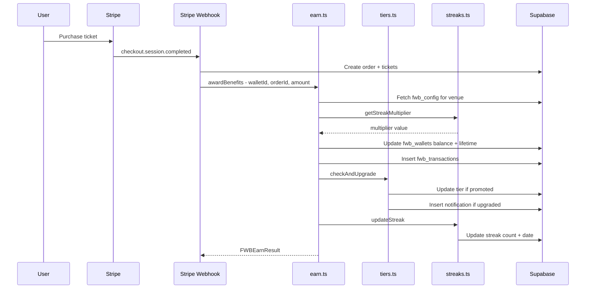
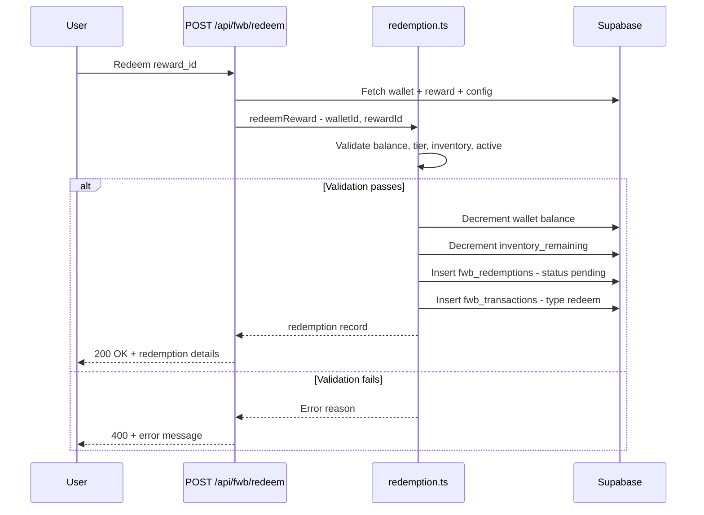
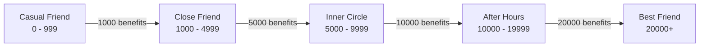
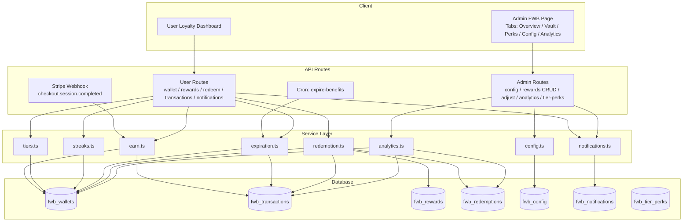

# Friends With Benefits (FWB) Loyalty Engine — Architecture Document

> **Status:** Blueprint  
> **Last Updated:** 2026-03-04  
> **Project:** VenueCore — `/Users/mattirby/shoals-ticketing`

---

## Table of Contents

1. [Overview & Tier System](#1-overview--tier-system)
2. [Database Schema](#2-database-schema)
3. [RLS Policies](#3-rls-policies)
4. [SQL Migration](#4-sql-migration)
5. [Type Definitions](#5-type-definitions)
6. [Service Module Structure](#6-service-module-structure)
7. [API Route Structure](#7-api-route-structure)
8. [Integration Points](#8-integration-points)
9. [Admin UI Page Structure](#9-admin-ui-page-structure)
10. [Test File Structure](#10-test-file-structure)
11. [Data Flow Diagrams](#11-data-flow-diagrams)

---

## 1. Overview & Tier System

The FWB loyalty engine rewards users with **Benefits** (points) for ticket purchases at a venue. Benefits can be redeemed for rewards from the **Benefits Vault**. Users progress through tiers based on lifetime benefits earned, and streaks reward consecutive event attendance with multipliers.

### Tier Breakdown

| Tier | Name | Lifetime Benefits Range | Perks |
|------|------|------------------------|-------|
| 1 | Casual Friend | 0 – 999 | Base earn rate |
| 2 | Close Friend | 1,000 – 4,999 | Early reward access |
| 3 | Inner Circle | 5,000 – 9,999 | Priority seating, exclusive drops |
| 4 | After Hours | 10,000 – 19,999 | VIP perks, meet & greets |
| 5 | Best Friend | 20,000+ | All perks + surprise rewards |

### Streak Multipliers

| Streak Count | Multiplier |
|-------------|------------|
| 1–2 events | 1.0x (base) |
| 3 events | 1.5x |
| 5+ events | 2.0x |

Streak resets after configurable inactivity period (default: 60 days).

---

## 2. Database Schema

### 2.1 `fwb_wallets`

Primary wallet for each user at each venue.

| Column | Type | Constraints | Default | Notes |
|--------|------|-------------|---------|-------|
| `id` | `uuid` | PK | `gen_random_uuid()` | |
| `user_id` | `uuid` | FK → `auth.users(id)`, NOT NULL | | Supabase auth user |
| `venue_id` | `uuid` | FK → `venues(id)`, NOT NULL | | Scoped per venue |
| `current_benefits_balance` | `numeric(12,2)` | NOT NULL | `0` | Spendable balance |
| `lifetime_benefits_earned` | `numeric(12,2)` | NOT NULL | `0` | Never decreases; drives tier |
| `current_tier` | `text` | NOT NULL | `'casual_friend'` | Enum: casual_friend, close_friend, inner_circle, after_hours, best_friend |
| `current_streak_count` | `integer` | NOT NULL | `0` | Consecutive events attended |
| `last_event_attended_date` | `timestamptz` | NULLABLE | | Used for streak calculation |
| `benefits_expiration_date` | `timestamptz` | NOT NULL | `now() + interval '12 months'` | Rolling expiration |
| `created_at` | `timestamptz` | NOT NULL | `now()` | |
| `updated_at` | `timestamptz` | NOT NULL | `now()` | |

**Unique constraint:** `(user_id, venue_id)` — one wallet per user per venue.

**Indexes:**
- `idx_fwb_wallets_user_venue` on `(user_id, venue_id)` UNIQUE
- `idx_fwb_wallets_venue` on `(venue_id)`
- `idx_fwb_wallets_expiration` on `(benefits_expiration_date)` WHERE `current_benefits_balance > 0`

---

### 2.2 `fwb_transactions`

Immutable ledger of all benefit movements.

| Column | Type | Constraints | Default | Notes |
|--------|------|-------------|---------|-------|
| `id` | `uuid` | PK | `gen_random_uuid()` | |
| `wallet_id` | `uuid` | FK → `fwb_wallets(id)`, NOT NULL | | |
| `type` | `text` | NOT NULL | | Enum: `earn`, `redeem`, `expire`, `admin_adjust` |
| `amount` | `numeric(12,2)` | NOT NULL | | Positive for earn/adjust-up, negative for redeem/expire/adjust-down |
| `balance_after` | `numeric(12,2)` | NOT NULL | | Snapshot of balance after this txn |
| `description` | `text` | NOT NULL | | Human-readable description |
| `event_id` | `uuid` | NULLABLE | | FK → `events(id)` if earn from ticket |
| `order_id` | `uuid` | NULLABLE | | FK → `orders(id)` if earn from purchase |
| `reward_id` | `uuid` | NULLABLE | | FK → `fwb_rewards(id)` if redemption |
| `multiplier_applied` | `numeric(4,2)` | NOT NULL | `1.0` | Streak/promo multiplier used |
| `created_at` | `timestamptz` | NOT NULL | `now()` | |

**Indexes:**
- `idx_fwb_transactions_wallet` on `(wallet_id, created_at DESC)`
- `idx_fwb_transactions_order` on `(order_id)` WHERE `order_id IS NOT NULL`
- `idx_fwb_transactions_type` on `(wallet_id, type)`

---

### 2.3 `fwb_rewards` (Benefits Vault)

Rewards available for redemption at each venue.

| Column | Type | Constraints | Default | Notes |
|--------|------|-------------|---------|-------|
| `id` | `uuid` | PK | `gen_random_uuid()` | |
| `venue_id` | `uuid` | FK → `venues(id)`, NOT NULL | | |
| `reward_name` | `text` | NOT NULL | | e.g. "Free Beer Token" |
| `description` | `text` | NULLABLE | | Detailed description |
| `reward_cost_in_benefits` | `numeric(12,2)` | NOT NULL | | Cost to redeem |
| `reward_type` | `text` | NOT NULL | | Enum: `ticket`, `bar_tab`, `hotel`, `merch`, `experience` |
| `inventory_limit` | `integer` | NULLABLE | | NULL = unlimited |
| `inventory_remaining` | `integer` | NULLABLE | | Decremented on redemption |
| `min_tier` | `text` | NOT NULL | `'casual_friend'` | Minimum tier to see/redeem |
| `expiration_date` | `timestamptz` | NULLABLE | | NULL = no expiry |
| `image_url` | `text` | NULLABLE | | Reward image |
| `is_active` | `boolean` | NOT NULL | `true` | Soft disable |
| `created_at` | `timestamptz` | NOT NULL | `now()` | |
| `updated_at` | `timestamptz` | NOT NULL | `now()` | |

**Indexes:**
- `idx_fwb_rewards_venue_active` on `(venue_id)` WHERE `is_active = true`

---

### 2.4 `fwb_redemptions`

Tracks each reward redemption.

| Column | Type | Constraints | Default | Notes |
|--------|------|-------------|---------|-------|
| `id` | `uuid` | PK | `gen_random_uuid()` | |
| `wallet_id` | `uuid` | FK → `fwb_wallets(id)`, NOT NULL | | |
| `reward_id` | `uuid` | FK → `fwb_rewards(id)`, NOT NULL | | |
| `benefits_spent` | `numeric(12,2)` | NOT NULL | | Snapshot of cost at time of redemption |
| `status` | `text` | NOT NULL | `'pending'` | Enum: `pending`, `fulfilled`, `cancelled` |
| `redeemed_at` | `timestamptz` | NOT NULL | `now()` | |
| `fulfilled_at` | `timestamptz` | NULLABLE | | Set when staff marks fulfilled |
| `cancelled_at` | `timestamptz` | NULLABLE | | Set if cancelled (benefits refunded) |
| `notes` | `text` | NULLABLE | | Staff notes |

**Indexes:**
- `idx_fwb_redemptions_wallet` on `(wallet_id, redeemed_at DESC)`
- `idx_fwb_redemptions_status` on `(status)` WHERE `status = 'pending'`

---

### 2.5 `fwb_config`

Admin-configurable settings per venue.

| Column | Type | Constraints | Default | Notes |
|--------|------|-------------|---------|-------|
| `id` | `uuid` | PK | `gen_random_uuid()` | |
| `venue_id` | `uuid` | FK → `venues(id)`, UNIQUE, NOT NULL | | One config per venue |
| `earn_rate_per_dollar` | `numeric(6,2)` | NOT NULL | `1.0` | Benefits earned per $1 spent |
| `streak_3_multiplier` | `numeric(4,2)` | NOT NULL | `1.5` | Multiplier at 3-event streak |
| `streak_5_multiplier` | `numeric(4,2)` | NOT NULL | `2.0` | Multiplier at 5+ event streak |
| `tier_casual_max` | `integer` | NOT NULL | `999` | Max lifetime for Casual Friend |
| `tier_close_max` | `integer` | NOT NULL | `4999` | Max lifetime for Close Friend |
| `tier_inner_max` | `integer` | NOT NULL | `9999` | Max lifetime for Inner Circle |
| `tier_after_hours_max` | `integer` | NOT NULL | `19999` | Max lifetime for After Hours |
| `expiration_months` | `integer` | NOT NULL | `12` | Benefits expire after N months |
| `streak_reset_days` | `integer` | NOT NULL | `60` | Streak resets after N days inactivity |
| `double_benefits_active` | `boolean` | NOT NULL | `false` | Global promo toggle |
| `double_benefits_event_ids` | `uuid[]` | NOT NULL | `'{}'` | Specific events with double benefits |
| `created_at` | `timestamptz` | NOT NULL | `now()` | |
| `updated_at` | `timestamptz` | NOT NULL | `now()` | |

---

### 2.6 `fwb_notifications`

In-app notification feed for loyalty events.

| Column | Type | Constraints | Default | Notes |
|--------|------|-------------|---------|-------|
| `id` | `uuid` | PK | `gen_random_uuid()` | |
| `wallet_id` | `uuid` | FK → `fwb_wallets(id)`, NOT NULL | | |
| `notification_type` | `text` | NOT NULL | | Enum: `tier_upgrade`, `streak_milestone`, `reward_drop`, `double_benefits`, `benefits_earned`, `benefits_expiring`, `redemption_fulfilled` |
| `title` | `text` | NOT NULL | | |
| `message` | `text` | NOT NULL | | |
| `metadata` | `jsonb` | NULLABLE | | Extra data (tier name, reward id, etc.) |
| `is_read` | `boolean` | NOT NULL | `false` | |
| `created_at` | `timestamptz` | NOT NULL | `now()` | |

**Indexes:**
- `idx_fwb_notifications_wallet_unread` on `(wallet_id, created_at DESC)` WHERE `is_read = false`

---

### 2.7 `fwb_tier_perks`

Configurable perks displayed per tier per venue.

| Column | Type | Constraints | Default | Notes |
|--------|------|-------------|---------|-------|
| `id` | `uuid` | PK | `gen_random_uuid()` | |
| `venue_id` | `uuid` | FK → `venues(id)`, NOT NULL | | |
| `tier` | `text` | NOT NULL | | Enum: same as wallet tiers |
| `perk_name` | `text` | NOT NULL | | e.g. "Priority Entry" |
| `perk_description` | `text` | NULLABLE | | |
| `sort_order` | `integer` | NOT NULL | `0` | Display ordering |
| `is_active` | `boolean` | NOT NULL | `true` | |
| `created_at` | `timestamptz` | NOT NULL | `now()` | |

**Indexes:**
- `idx_fwb_tier_perks_venue_tier` on `(venue_id, tier)` WHERE `is_active = true`

---

## 3. RLS Policies

All FWB tables should have RLS enabled. The app uses `createAdminClient()` (service role) for server-side operations which bypasses RLS, but browser-side reads need proper policies.

### 3.1 `fwb_wallets`

```sql
-- Users can read their own wallet
CREATE POLICY "Users can view own wallet"
  ON fwb_wallets FOR SELECT
  USING (auth.uid() = user_id);

-- Only service role can insert/update (via API routes)
CREATE POLICY "Service role manages wallets"
  ON fwb_wallets FOR ALL
  USING (auth.role() = 'service_role');
```

### 3.2 `fwb_transactions`

```sql
-- Users can view their own transactions
CREATE POLICY "Users can view own transactions"
  ON fwb_transactions FOR SELECT
  USING (
    wallet_id IN (SELECT id FROM fwb_wallets WHERE user_id = auth.uid())
  );

-- Only service role can insert
CREATE POLICY "Service role manages transactions"
  ON fwb_transactions FOR INSERT
  USING (auth.role() = 'service_role');
```

### 3.3 `fwb_rewards`

```sql
-- Anyone can view active rewards (public storefront)
CREATE POLICY "Anyone can view active rewards"
  ON fwb_rewards FOR SELECT
  USING (is_active = true);

-- Admins manage rewards via service role
CREATE POLICY "Service role manages rewards"
  ON fwb_rewards FOR ALL
  USING (auth.role() = 'service_role');
```

### 3.4 `fwb_redemptions`

```sql
-- Users can view their own redemptions
CREATE POLICY "Users can view own redemptions"
  ON fwb_redemptions FOR SELECT
  USING (
    wallet_id IN (SELECT id FROM fwb_wallets WHERE user_id = auth.uid())
  );

-- Service role manages
CREATE POLICY "Service role manages redemptions"
  ON fwb_redemptions FOR ALL
  USING (auth.role() = 'service_role');
```

### 3.5 `fwb_config`

```sql
-- Public read for earn rates (shown in UI)
CREATE POLICY "Anyone can view config"
  ON fwb_config FOR SELECT
  USING (true);

-- Only service role can modify
CREATE POLICY "Service role manages config"
  ON fwb_config FOR ALL
  USING (auth.role() = 'service_role');
```

### 3.6 `fwb_notifications`

```sql
-- Users can view and update (mark read) their own notifications
CREATE POLICY "Users can view own notifications"
  ON fwb_notifications FOR SELECT
  USING (
    wallet_id IN (SELECT id FROM fwb_wallets WHERE user_id = auth.uid())
  );

CREATE POLICY "Users can mark own notifications read"
  ON fwb_notifications FOR UPDATE
  USING (
    wallet_id IN (SELECT id FROM fwb_wallets WHERE user_id = auth.uid())
  )
  WITH CHECK (
    wallet_id IN (SELECT id FROM fwb_wallets WHERE user_id = auth.uid())
  );
```

### 3.7 `fwb_tier_perks`

```sql
-- Public read
CREATE POLICY "Anyone can view active tier perks"
  ON fwb_tier_perks FOR SELECT
  USING (is_active = true);

-- Service role manages
CREATE POLICY "Service role manages tier perks"
  ON fwb_tier_perks FOR ALL
  USING (auth.role() = 'service_role');
```

---

## 4. SQL Migration

File: `plans/fwb-loyalty-migration.sql`

The migration should:
1. Create all 7 tables with constraints
2. Create all indexes
3. Enable RLS on all tables
4. Create all RLS policies
5. Create an `updated_at` trigger function (reuse if exists) for `fwb_wallets`, `fwb_rewards`, `fwb_config`
6. Seed default `fwb_config` rows for each existing venue
7. Seed default `fwb_tier_perks` for each existing venue with sensible defaults

---

## 5. Type Definitions

File: `lib/types/fwb.ts`

```typescript
// ── Tier enum ──
export type FWBTier =
  | 'casual_friend'
  | 'close_friend'
  | 'inner_circle'
  | 'after_hours'
  | 'best_friend';

export type FWBTransactionType = 'earn' | 'redeem' | 'expire' | 'admin_adjust';

export type FWBRewardType = 'ticket' | 'bar_tab' | 'hotel' | 'merch' | 'experience';

export type FWBRedemptionStatus = 'pending' | 'fulfilled' | 'cancelled';

export type FWBNotificationType =
  | 'tier_upgrade'
  | 'streak_milestone'
  | 'reward_drop'
  | 'double_benefits'
  | 'benefits_earned'
  | 'benefits_expiring'
  | 'redemption_fulfilled';

// ── Database row types ──

export type FWBWallet = {
  id: string;
  user_id: string;
  venue_id: string;
  current_benefits_balance: number;
  lifetime_benefits_earned: number;
  current_tier: FWBTier;
  current_streak_count: number;
  last_event_attended_date: string | null;
  benefits_expiration_date: string;
  created_at: string;
  updated_at: string;
};

export type FWBTransaction = {
  id: string;
  wallet_id: string;
  type: FWBTransactionType;
  amount: number;
  balance_after: number;
  description: string;
  event_id: string | null;
  order_id: string | null;
  reward_id: string | null;
  multiplier_applied: number;
  created_at: string;
};

export type FWBReward = {
  id: string;
  venue_id: string;
  reward_name: string;
  description: string | null;
  reward_cost_in_benefits: number;
  reward_type: FWBRewardType;
  inventory_limit: number | null;
  inventory_remaining: number | null;
  min_tier: FWBTier;
  expiration_date: string | null;
  image_url: string | null;
  is_active: boolean;
  created_at: string;
  updated_at: string;
};

export type FWBRedemption = {
  id: string;
  wallet_id: string;
  reward_id: string;
  benefits_spent: number;
  status: FWBRedemptionStatus;
  redeemed_at: string;
  fulfilled_at: string | null;
  cancelled_at: string | null;
  notes: string | null;
};

export type FWBConfig = {
  id: string;
  venue_id: string;
  earn_rate_per_dollar: number;
  streak_3_multiplier: number;
  streak_5_multiplier: number;
  tier_casual_max: number;
  tier_close_max: number;
  tier_inner_max: number;
  tier_after_hours_max: number;
  expiration_months: number;
  streak_reset_days: number;
  double_benefits_active: boolean;
  double_benefits_event_ids: string[];
  created_at: string;
  updated_at: string;
};

export type FWBNotification = {
  id: string;
  wallet_id: string;
  notification_type: FWBNotificationType;
  title: string;
  message: string;
  metadata: Record<string, unknown> | null;
  is_read: boolean;
  created_at: string;
};

export type FWBTierPerk = {
  id: string;
  venue_id: string;
  tier: FWBTier;
  perk_name: string;
  perk_description: string | null;
  sort_order: number;
  is_active: boolean;
  created_at: string;
};

// ── API response types ──

export type FWBWalletSummary = {
  wallet: FWBWallet;
  tier_progress: {
    current_tier: FWBTier;
    current_tier_label: string;
    next_tier: FWBTier | null;
    next_tier_label: string | null;
    benefits_to_next_tier: number;
    progress_percentage: number;
  };
  streak: {
    count: number;
    current_multiplier: number;
    next_multiplier: number | null;
    events_to_next_multiplier: number | null;
    days_until_reset: number | null;
  };
  notifications_unread: number;
};

export type FWBEarnResult = {
  benefits_earned: number;
  multiplier_applied: number;
  new_balance: number;
  tier_upgraded: boolean;
  new_tier: FWBTier | null;
  streak_updated: boolean;
  new_streak_count: number;
};
```

---

## 6. Service Module Structure

All service modules live under `lib/fwb/`. Each module exports pure functions that accept a Supabase admin client and required parameters. No direct imports of env vars — all DB access through the passed client.

### 6.1 `lib/fwb/config.ts`

```
Responsibilities:
- getConfig(venueId): Fetch FWB config for a venue; create default if none exists
- updateConfig(venueId, updates): Update config fields
- getOrCreateConfig(venueId): Used internally by other modules

Caching strategy:
- In-memory Map<venueId, {config, fetchedAt}> with 5-minute TTL
- Invalidated on updateConfig()
```

### 6.2 `lib/fwb/earn.ts`

```
Responsibilities:
- awardBenefits(walletId, orderId, eventId, dollarAmount, venueId): Main earn function
  1. Fetch config for venue
  2. Calculate base benefits = dollarAmount * earn_rate_per_dollar
  3. Determine multiplier from streak + double benefits promo
  4. Final benefits = base * multiplier
  5. Update wallet: current_benefits_balance += final, lifetime_benefits_earned += final
  6. Reset benefits_expiration_date to now() + expiration_months
  7. Insert fwb_transactions record
  8. Call tiers.checkAndUpgrade()
  9. Call streaks.updateStreak()
  10. Return FWBEarnResult

- calculateMultiplier(streakCount, config, eventId): Pure calculation
  - Base multiplier from streak count
  - Double if double_benefits_active or eventId in double_benefits_event_ids
  - Return final multiplier

Dependencies: config.ts, tiers.ts, streaks.ts, notifications.ts
```

### 6.3 `lib/fwb/tiers.ts`

```
Responsibilities:
- getTierForLifetimeBenefits(lifetime, config): Pure function → FWBTier
- checkAndUpgrade(walletId, newLifetime, config): Check if tier changed, update wallet, create notification
- getTierProgress(wallet, config): Calculate progress percentage and next tier info
- getTierLabel(tier): Map tier slug to display name
- getTierPerks(venueId, tier): Fetch perks for a tier

Tier calculation logic:
  if lifetime <= tier_casual_max → casual_friend
  if lifetime <= tier_close_max → close_friend
  if lifetime <= tier_inner_max → inner_circle
  if lifetime <= tier_after_hours_max → after_hours
  else → best_friend
```

### 6.4 `lib/fwb/streaks.ts`

```
Responsibilities:
- updateStreak(walletId, eventId, eventDate): 
  1. Get wallet's last_event_attended_date
  2. If same event_id already earned for, skip (prevent double-counting)
  3. If gap > streak_reset_days, reset to 1
  4. Else increment streak count
  5. Update last_event_attended_date
  6. If milestone hit (3, 5, 10), create notification

- getStreakMultiplier(streakCount, config): Pure function
  if streakCount >= 5 → streak_5_multiplier
  if streakCount >= 3 → streak_3_multiplier
  else → 1.0

- getStreakStatus(wallet, config): Return streak info for API response
  - days_until_reset = streak_reset_days - daysSince(last_event_attended_date)
  - events_to_next_multiplier based on current count
```

### 6.5 `lib/fwb/expiration.ts`

```
Responsibilities:
- checkAndExpireBenefits(walletId): 
  1. If now() > benefits_expiration_date AND current_benefits_balance > 0
  2. Create expire transaction for full balance
  3. Set current_benefits_balance = 0
  4. Create benefits_expiring notification

- processExpirations(): Batch job — find all wallets past expiration, expire them
  - SELECT wallets WHERE benefits_expiration_date < now() AND current_benefits_balance > 0
  - Process each

- getExpirationWarning(wallet): If expiring within 30 days, return warning message

Trigger points:
- On every wallet access (GET /api/fwb/wallet)
- Scheduled: could be a Supabase Edge Function cron or called from a Vercel cron
```

### 6.6 `lib/fwb/redemption.ts`

```
Responsibilities:
- redeemReward(walletId, rewardId):
  1. Fetch wallet, reward, and config in parallel
  2. Validate: wallet.current_benefits_balance >= reward.reward_cost_in_benefits
  3. Validate: reward.is_active && not expired
  4. Validate: wallet.current_tier meets reward.min_tier
  5. Validate: inventory_remaining > 0 (if limited)
  6. Begin transaction (use Supabase RPC or sequential ops):
     a. Decrement wallet balance
     b. Decrement reward inventory_remaining
     c. Insert fwb_redemptions record (status: pending)
     d. Insert fwb_transactions record (type: redeem, negative amount)
  7. Return redemption record

- cancelRedemption(redemptionId):
  1. Update status to cancelled, set cancelled_at
  2. Refund benefits to wallet
  3. Restore inventory
  4. Insert admin_adjust transaction

- fulfillRedemption(redemptionId, notes?):
  1. Update status to fulfilled, set fulfilled_at
  2. Create redemption_fulfilled notification

- getUserRedemptions(walletId, page, limit): Paginated list
```

### 6.7 `lib/fwb/notifications.ts`

```
Responsibilities:
- createNotification(walletId, type, title, message, metadata?): Insert record
- getUnreadCount(walletId): COUNT where is_read = false
- getNotifications(walletId, page, limit): Paginated, newest first
- markAsRead(notificationId): Set is_read = true
- markAllAsRead(walletId): Batch update

Notification templates (used by other modules):
- tierUpgrade(walletId, oldTier, newTier)
- streakMilestone(walletId, count)
- benefitsEarned(walletId, amount, eventName)
- benefitsExpiring(walletId, balance, expirationDate)
- rewardDrop(walletId, rewardName)
- doubleBenefits(walletId, eventName)
- redemptionFulfilled(walletId, rewardName)
```

### 6.8 `lib/fwb/analytics.ts`

```
Responsibilities:
- getVenueAnalytics(venueId): Returns dashboard data
  - total_members: COUNT of wallets for venue
  - active_members: wallets with transaction in last 30 days
  - total_benefits_issued: SUM of lifetime_benefits_earned
  - total_benefits_redeemed: SUM of redeem transactions
  - tier_distribution: COUNT per tier
  - top_earners: top 10 by lifetime_benefits_earned
  - redemption_rate: redeemed / earned percentage
  - popular_rewards: most redeemed rewards
  - monthly_earn_trend: benefits earned per month (last 12 months)
  - streak_distribution: COUNT per streak bracket
```

---

## 7. API Route Structure

All routes under `app/api/fwb/`. Each route uses `createAdminClient()` for DB operations. User authentication is verified via Supabase auth headers.

### 7.1 User-Facing Routes

#### `GET /api/fwb/wallet` → `app/api/fwb/wallet/route.ts`

```
Auth: Required (Supabase JWT)
Query: ?venue_id=uuid (required)

Logic:
1. Extract user from auth header
2. Check for expiration (call expiration.checkAndExpireBenefits)
3. Get or create wallet (auto-create if none exists for user+venue)
4. Get tier progress
5. Get streak status  
6. Get unread notification count
7. Return FWBWalletSummary

Response: { wallet, tier_progress, streak, notifications_unread }
```

#### `GET /api/fwb/tier-progress` → `app/api/fwb/tier-progress/route.ts`

```
Auth: Required
Query: ?venue_id=uuid

Logic:
1. Fetch wallet
2. Fetch config
3. Calculate tier progress via tiers.getTierProgress()
4. Fetch perks for current tier and next tier

Response: { current_tier, next_tier, progress_percentage, benefits_to_next, 
            current_perks[], next_tier_perks[] }
```

#### `GET /api/fwb/streak` → `app/api/fwb/streak/route.ts`

```
Auth: Required
Query: ?venue_id=uuid

Response: { count, current_multiplier, next_multiplier, events_to_next, 
            days_until_reset, last_event_date }
```

#### `GET /api/fwb/rewards` → `app/api/fwb/rewards/route.ts`

```
Auth: Optional (shows tier-locked rewards as locked if no auth)
Query: ?venue_id=uuid&type=ticket|bar_tab|...  (optional filter)

Logic:
1. Fetch active rewards for venue
2. If authenticated, fetch wallet tier to determine unlock status
3. Mark each reward as unlocked/locked based on min_tier

Response: { rewards: [{ ...reward, is_unlocked, user_can_afford }] }
```

#### `POST /api/fwb/redeem` → `app/api/fwb/redeem/route.ts`

```
Auth: Required
Body: { venue_id, reward_id }

Logic:
1. Call redemption.redeemReward()
2. Return redemption record + updated wallet balance

Response: { redemption, new_balance }
Error cases: insufficient_balance, reward_unavailable, tier_too_low, out_of_stock
```

#### `GET /api/fwb/transactions` → `app/api/fwb/transactions/route.ts`

```
Auth: Required
Query: ?venue_id=uuid&page=1&limit=20&type=earn|redeem|expire|admin_adjust

Logic:
1. Fetch wallet for user+venue
2. Paginated query on fwb_transactions

Response: { transactions[], total, page, limit, has_more }
```

#### `GET /api/fwb/notifications` → `app/api/fwb/notifications/route.ts`

```
Auth: Required
Query: ?venue_id=uuid&page=1&limit=20

Response: { notifications[], unread_count }
```

#### `POST /api/fwb/notifications/read` → `app/api/fwb/notifications/read/route.ts`

```
Auth: Required
Body: { notification_id } OR { mark_all: true, venue_id }

Response: { success: true }
```

### 7.2 Admin Routes

All admin routes verify the caller has `owner` or `admin` role via cookie/session check, consistent with existing admin routes.

#### `GET /api/fwb/admin/config` → `app/api/fwb/admin/config/route.ts`

```
Auth: Admin required
Query: ?venue_id=uuid

Response: FWBConfig object
```

#### `PUT /api/fwb/admin/config` → `app/api/fwb/admin/config/route.ts`

```
Auth: Admin required
Body: Partial<FWBConfig> with venue_id

Response: Updated FWBConfig
```

#### `GET /api/fwb/admin/rewards` → `app/api/fwb/admin/rewards/route.ts`

```
Auth: Admin required
Query: ?venue_id=uuid&include_inactive=true

Response: FWBReward[] (including inactive for admin view)
```

#### `POST /api/fwb/admin/rewards` → `app/api/fwb/admin/rewards/route.ts`

```
Auth: Admin required
Body: { venue_id, reward_name, reward_cost_in_benefits, reward_type, ... }

Response: Created FWBReward
```

#### `PUT /api/fwb/admin/rewards` → `app/api/fwb/admin/rewards/route.ts`

```
Auth: Admin required
Body: { id, ...updates }

Response: Updated FWBReward
```

#### `DELETE /api/fwb/admin/rewards` → `app/api/fwb/admin/rewards/route.ts`

```
Auth: Admin required
Body: { id }
Note: Soft delete — sets is_active = false

Response: { success: true }
```

#### `POST /api/fwb/admin/adjust-balance` → `app/api/fwb/admin/adjust-balance/route.ts`

```
Auth: Admin required
Body: { wallet_id, amount (positive or negative), reason }

Logic:
1. Update wallet balance
2. Insert admin_adjust transaction
3. If positive, also update lifetime_benefits_earned and check tier upgrade

Response: { transaction, updated_wallet }
```

#### `GET /api/fwb/admin/analytics` → `app/api/fwb/admin/analytics/route.ts`

```
Auth: Admin required
Query: ?venue_id=uuid

Response: Full analytics object from analytics.getVenueAnalytics()
```

#### `GET/POST/PUT/DELETE /api/fwb/admin/tier-perks` → `app/api/fwb/admin/tier-perks/route.ts`

```
Auth: Admin required
Standard CRUD for fwb_tier_perks, scoped to venue_id
```

---

## 8. Integration Points

### 8.1 Earning Benefits on Ticket Purchase

**Primary hook:** [`app/api/webhooks/stripe/route.ts`](app/api/webhooks/stripe/route.ts:293) — inside the `checkout.session.completed` handler for event tickets.

**Current flow** (lines 293–432):
1. Extract order metadata including `fwb_opt_in` (line 299)
2. Create order record (line 340)
3. Create tickets (line 373)
4. Write settlement ledger (line 417)

**FWB integration — add after settlement ledger entry (after line 432):**

```
// ── FWB Benefits Earn ──
if (fwbOptIn && eventData?.venue_id) {
  try {
    // 1. Look up or create wallet by customer_email + venue_id
    //    (Uses email-based lookup since buyer may not have auth account yet)
    // 2. Call earn.awardBenefits(wallet.id, order.id, eventId, totalAmount, venue_id)
    // 3. Log result
  } catch (err) {
    // Non-blocking — log error but don't fail the webhook
    console.error('FWB earn failed:', err);
  }
}
```

**Important consideration:** The webhook buyer may not have a Supabase `auth.users` account. Two strategies:

- **Option A (Recommended):** Create a `fwb_wallets` row keyed on `customer_email` + `venue_id` instead of `user_id`. When the user later creates an account and links their email, merge the wallet.
- **Option B:** Only earn benefits for users who are logged in (have `auth.uid`). This limits reach but simplifies the model.

**Recommendation:** Go with **Option A** but add an `email` column to `fwb_wallets` as an alternate lookup key. The `user_id` becomes nullable and is populated when the user authenticates. Add a unique constraint on `(email, venue_id)`.

**Schema adjustment for `fwb_wallets`:**
| Column | Change |
|--------|--------|
| `user_id` | Make NULLABLE |
| `email` | Add: `text NOT NULL` |
| Unique constraint | Change to `(email, venue_id)` |
| Additional index | `(user_id, venue_id)` WHERE `user_id IS NOT NULL` |

### 8.2 Streak Updates on Event Attendance

**Trigger:** When a ticket is scanned at the door (QR validation).

**Hook location:** [`app/api/tickets/[id]/validate/route.ts`](app/api/tickets/[id]/validate/route.ts)

**Logic:**
1. After successful ticket validation/scan
2. Look up order → customer_email → fwb_wallet
3. Call `streaks.updateStreak(walletId, eventId, now())`
4. Only count one streak increment per unique event per wallet

### 8.3 Expiration Processing

**On-access check:** Every `GET /api/fwb/wallet` call runs `expiration.checkAndExpireBenefits()` before returning data.

**Scheduled batch:** Set up a Vercel Cron Job or Supabase Edge Function:
- **Schedule:** Daily at 2:00 AM UTC
- **Action:** Call `expiration.processExpirations()` to catch wallets that haven't been accessed
- **Route:** `GET /api/fwb/cron/expire-benefits` (protected with a cron secret header)

### 8.4 Checkout Metadata

The checkout flow at [`app/api/checkout/route.ts`](app/api/checkout/route.ts) must pass `fwb_opt_in` in the Stripe session metadata. This already exists (confirmed in webhook line 299). Ensure the checkout UI includes the FWB opt-in toggle.

---

## 9. Admin UI Page Structure

Enhance the existing page at [`app/admin/marketing/fwb/page.tsx`](app/admin/marketing/fwb/page.tsx:1). The current page shows newsletter subscribers and email KPIs. Restructure into a tabbed interface:

### Tab Layout

```
┌─────────────┬──────────────────┬─────────────┬───────────────┬───────────┐
│  Overview   │  Benefits Vault  │  Tier Perks │ Configuration │ Analytics │
└─────────────┴──────────────────┴─────────────┴───────────────┴───────────┘
```

### Tab 1: Overview (Default)

- **Existing content:** Newsletter subscribers list, email KPIs, growth chart, CSV export (preserve current functionality)
- **New additions:**
  - Summary cards: Total FWB Members, Active Members, Benefits Issued, Benefits Redeemed
  - Quick-action: "Send Double Benefits" toggle

### Tab 2: Benefits Vault (Rewards Management)

- Table of all rewards with columns: Name, Type, Cost, Inventory, Min Tier, Status, Actions
- "Add Reward" button → modal/inline form
- Edit/deactivate actions per row
- Filter by reward_type and status

### Tab 3: Tier Perks

- Accordion or section per tier (Casual Friend → Best Friend)
- Each tier shows its perks with drag-to-reorder
- Add/edit/remove perks per tier
- Preview of what users see at each tier

### Tab 4: Configuration

- Form with all `fwb_config` fields:
  - Earn rate per dollar
  - Streak multipliers (3-event, 5-event)
  - Tier thresholds (editable)
  - Expiration months
  - Streak reset days
  - Double Benefits toggle + event selector
- Save button with confirmation

### Tab 5: Analytics

- Charts and metrics from `analytics.getVenueAnalytics()`:
  - Tier distribution pie chart
  - Monthly benefits earned trend line
  - Top 10 earners table
  - Redemption rate gauge
  - Popular rewards bar chart
  - Streak distribution histogram

### Component Files

```
app/admin/marketing/fwb/
├── page.tsx                          # Main tabbed page (enhance existing)
├── components/
│   ├── FWBOverviewTab.tsx            # Overview + existing subscriber content
│   ├── FWBRewardsTab.tsx             # Benefits Vault CRUD
│   ├── FWBTierPerksTab.tsx           # Tier perks management
│   ├── FWBConfigTab.tsx              # Configuration form
│   ├── FWBAnalyticsTab.tsx           # Analytics dashboard
│   ├── RewardFormModal.tsx           # Add/edit reward modal
│   └── AdjustBalanceModal.tsx        # Manual balance adjustment modal
```

---

## 10. Test File Structure

All tests under `__tests__/fwb/`. Use Jest with the existing project test setup.

### `__tests__/fwb/earn.test.ts`

```
Test cases:
- Awards correct base benefits (amount * earn_rate)
- Applies streak 3x multiplier correctly
- Applies streak 5x multiplier correctly
- Applies double benefits when promo active
- Stacks streak + double benefits multipliers
- Updates lifetime_benefits_earned (never decreases)
- Resets expiration date on earn
- Creates transaction record with correct balance_after
- Handles zero-dollar orders gracefully
- Does not award if wallet not found
```

### `__tests__/fwb/tiers.test.ts`

```
Test cases:
- Returns casual_friend for 0–999 lifetime
- Returns close_friend for 1000–4999 lifetime
- Returns inner_circle for 5000–9999 lifetime
- Returns after_hours for 10000–19999 lifetime
- Returns best_friend for 20000+ lifetime
- Triggers tier_upgrade notification on promotion
- Does not downgrade tier (tier is always highest achieved)
- Calculates correct progress percentage to next tier
- Handles custom tier thresholds from config
- Returns null next_tier for best_friend
```

### `__tests__/fwb/streaks.test.ts`

```
Test cases:
- Increments streak on new event attendance
- Does not double-count same event
- Resets streak after 60 days (default) inactivity
- Resets streak after custom inactivity period
- Returns correct multiplier for streak count
- Creates notification at streak milestones (3, 5, 10)
- Calculates correct days_until_reset
```

### `__tests__/fwb/expiration.test.ts`

```
Test cases:
- Expires benefits when past expiration date
- Does not expire if balance is 0
- Does not expire if date is in the future
- Creates expire transaction for full balance
- Creates benefits_expiring notification
- Batch processing handles multiple wallets
- Resets balance to 0 after expiration
```

### `__tests__/fwb/redemption.test.ts`

```
Test cases:
- Successful redemption deducts benefits
- Rejects if insufficient balance
- Rejects if reward inactive
- Rejects if reward expired
- Rejects if tier too low
- Rejects if out of stock
- Decrements inventory_remaining
- Creates redemption record with pending status
- Creates redeem transaction with negative amount
- Cancel restores benefits and inventory
- Fulfill sets status and timestamp
- Handles unlimited inventory (null) correctly
```

### `__tests__/fwb/multiplier.test.ts`

```
Test cases:
- Base multiplier is 1.0 for streak < 3
- Multiplier is 1.5 for streak = 3
- Multiplier is 1.5 for streak = 4
- Multiplier is 2.0 for streak = 5
- Multiplier is 2.0 for streak > 5
- Double benefits doubles the multiplier
- Double benefits for specific event_id only
- No double benefits for non-matching event_id
- Custom multiplier values from config
```

---

## 11. Data Flow Diagrams

### 11.1 Benefit Earning Flow



### 11.2 Redemption Flow



### 11.3 Tier Progression



### 11.4 System Architecture Overview



---

## File Manifest

Summary of all files to be created/modified:

### New Files

| File | Purpose |
|------|---------|
| `plans/fwb-loyalty-migration.sql` | Database migration |
| `lib/types/fwb.ts` | TypeScript type definitions |
| `lib/fwb/config.ts` | Config service |
| `lib/fwb/earn.ts` | Benefits earning service |
| `lib/fwb/tiers.ts` | Tier calculation service |
| `lib/fwb/streaks.ts` | Streak tracking service |
| `lib/fwb/expiration.ts` | Expiration processing service |
| `lib/fwb/redemption.ts` | Reward redemption service |
| `lib/fwb/notifications.ts` | Notification service |
| `lib/fwb/analytics.ts` | Analytics calculations |
| `app/api/fwb/wallet/route.ts` | Wallet endpoint |
| `app/api/fwb/tier-progress/route.ts` | Tier progress endpoint |
| `app/api/fwb/streak/route.ts` | Streak endpoint |
| `app/api/fwb/rewards/route.ts` | Rewards listing endpoint |
| `app/api/fwb/redeem/route.ts` | Redemption endpoint |
| `app/api/fwb/transactions/route.ts` | Transaction history endpoint |
| `app/api/fwb/notifications/route.ts` | Notifications endpoint |
| `app/api/fwb/notifications/read/route.ts` | Mark notifications read |
| `app/api/fwb/admin/config/route.ts` | Admin config CRUD |
| `app/api/fwb/admin/rewards/route.ts` | Admin rewards CRUD |
| `app/api/fwb/admin/adjust-balance/route.ts` | Admin balance adjustment |
| `app/api/fwb/admin/analytics/route.ts` | Admin analytics |
| `app/api/fwb/admin/tier-perks/route.ts` | Admin tier perks CRUD |
| `app/api/fwb/cron/expire-benefits/route.ts` | Cron expiration job |
| `app/admin/marketing/fwb/components/FWBOverviewTab.tsx` | Overview tab component |
| `app/admin/marketing/fwb/components/FWBRewardsTab.tsx` | Rewards tab component |
| `app/admin/marketing/fwb/components/FWBTierPerksTab.tsx` | Tier perks tab component |
| `app/admin/marketing/fwb/components/FWBConfigTab.tsx` | Config tab component |
| `app/admin/marketing/fwb/components/FWBAnalyticsTab.tsx` | Analytics tab component |
| `app/admin/marketing/fwb/components/RewardFormModal.tsx` | Reward form modal |
| `app/admin/marketing/fwb/components/AdjustBalanceModal.tsx` | Balance adjustment modal |
| `__tests__/fwb/earn.test.ts` | Earn tests |
| `__tests__/fwb/tiers.test.ts` | Tier tests |
| `__tests__/fwb/streaks.test.ts` | Streak tests |
| `__tests__/fwb/expiration.test.ts` | Expiration tests |
| `__tests__/fwb/redemption.test.ts` | Redemption tests |
| `__tests__/fwb/multiplier.test.ts` | Multiplier tests |

### Modified Files

| File | Change |
|------|--------|
| `app/api/webhooks/stripe/route.ts` | Add FWB benefit earning after order creation |
| `app/api/tickets/[id]/validate/route.ts` | Add streak update after ticket scan |
| `app/admin/marketing/fwb/page.tsx` | Restructure into tabbed interface |

---

## Implementation Order

1. SQL migration (tables, indexes, RLS, seed data)
2. Type definitions (`lib/types/fwb.ts`)
3. Service modules (`lib/fwb/*.ts`) — config first, then earn/tiers/streaks, then redemption/expiration/notifications, finally analytics
4. API routes — user-facing first, then admin
5. Stripe webhook integration (earn on purchase)
6. Ticket validation integration (streak on scan)
7. Admin UI tabs
8. Tests
9. Cron job for expiration
