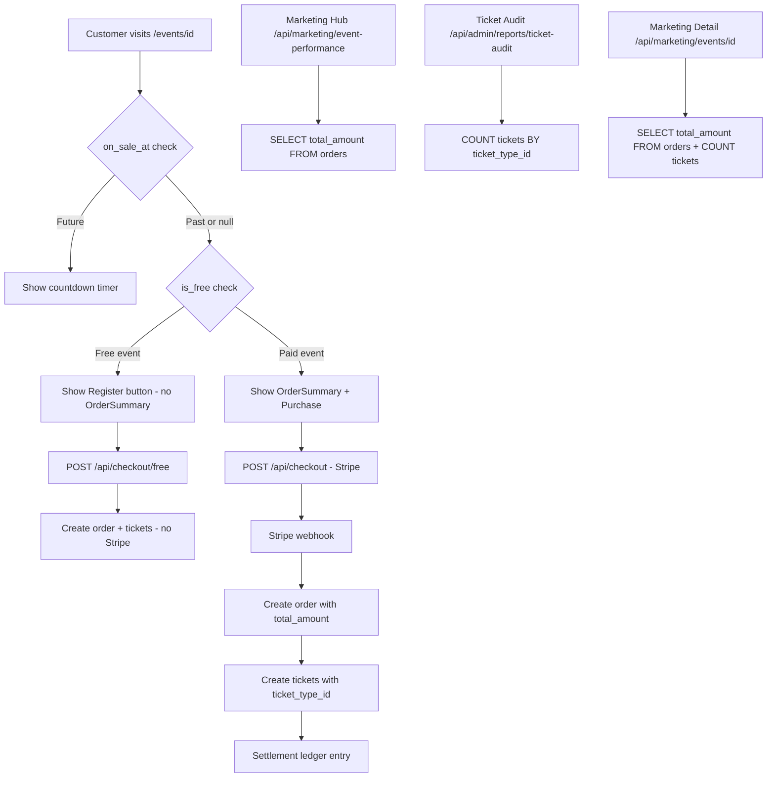

# Go-Live Bugfixes & Features Plan

## Critical Diagnosis: Why Sales Data Is Broken

### Root Cause #1 — Wrong Column Name in Marketing Hub APIs

**Files affected:**
- `app/api/marketing/event-performance/route.ts` (line 23)
- `app/api/marketing/events/[id]/route.ts` (lines 34, 94, 112, 192)

**The bug:** These API routes query the `orders` table selecting columns named `total` and `email`, but the actual database columns are `total_amount` and `customer_email`.

The Stripe webhook at `app/api/webhooks/stripe/route.ts` (line 360) inserts orders with:
```
total_amount: totalAmount,
customer_email: customerEmail,
```

But the marketing hub event-performance API selects:
```sql
SELECT quantity, total FROM orders WHERE event_id = ? AND status IN ('paid','completed')
```

And the marketing event detail API selects:
```sql
SELECT id, email, created_at, quantity, total, status, customer_name, ticket_type FROM orders ...
```

**`total` does not exist — the column is `total_amount`.** PostgREST returns a 400 error for unknown columns, so the entire orders query fails silently. Revenue shows $0 and ticket counts show 0 on all marketing hub event cards.

Similarly, `email` should be `customer_email`, and `ticket_type` does not exist on orders at all.

**Why the dashboard works:** The admin dashboard at `app/api/admin/dashboard/route.ts` (line 70) correctly uses `total_amount`:
```ts
admin.from("orders").select("total_amount, created_at, event_id").eq("status", "paid")
```

### Root Cause #2 — Ticket Audit Counts Tickets by `ticket_type_id`, Not Orders

**File:** `app/api/admin/reports/ticket-audit/route.ts` (lines 53-64)

The ticket audit report counts sold tickets by looking at the `tickets` table and grouping by `ticket_type_id`. This is architecturally correct — tickets DO have `ticket_type_id` set by the webhook.

**However**, the webhook at line 392-399 only assigns tickets to the **first** tier (sorted by `sort_order`). If a customer buys a VIP ticket, it still gets tagged as the first/default tier. This means tier-level breakdowns are inaccurate, but total counts should still work IF the tier exists.

**The actual failure scenario:** If `ticket_type_id` is `null` (which happens when no `ticket_tiers` rows exist for the event, or the tier query returns nothing), those tickets have `soldByTier[null]` which never matches any `tier.id` UUID. The report shows 0 sold for every tier.

**Check:** Do your test events have `ticket_tiers` rows? If the tier insert failed silently during event creation, no tiers exist → `ticket_type_id` on tickets is null → audit shows 0.

### Root Cause #3 — Marketing Event Detail Uses Non-Existent `ticket_type` on Orders

**File:** `app/api/marketing/events/[id]/route.ts` (lines 82-96)

The `salesByType` computation tries to match orders to tiers via `o.ticket_type === tier.name`. The `orders` table has no `ticket_type` column — orders don't store which tier was purchased. So `salesByType` always shows 0 for every tier, even if orders exist.

---

## Summary of Column Mismatches

| API File | Selects | Should Be |
|---|---|---|
| `marketing/event-performance/route.ts:23` | `quantity, total` | `quantity, total_amount` |
| `marketing/events/[id]/route.ts:34` | `email, total, ticket_type` | `customer_email, total_amount` (remove ticket_type) |
| `marketing/events/[id]/route.ts:94` | `o.total` | `o.total_amount` |
| `marketing/events/[id]/route.ts:112` | `o.total` | `o.total_amount` |
| `marketing/events/[id]/route.ts:192` | `o.total, o.email` | `o.total_amount, o.customer_email` |

---

## Fix Plan

### Phase 1: Critical Bugfixes (Must-do before go-live)

#### Fix 1: Marketing Event Performance API — column names
**File:** `app/api/marketing/event-performance/route.ts`
- Line 23: Change `.select("quantity, total")` → `.select("quantity, total_amount")`
- Line 32: Change `o.total` → `o.total_amount`

#### Fix 2: Marketing Event Detail API — column names
**File:** `app/api/marketing/events/[id]/route.ts`
- Line 34: Change `.select("id,email,created_at,quantity,total,status,customer_name,ticket_type")` → `.select("id,customer_email,created_at,quantity,total_amount,status,customer_name")`
- Line 85: Remove `ticket_type` matching logic (orders dont have ticket_type); instead count ALL paid orders for overall sold count and match tickets to tiers via the `tickets` table
- Line 94: Change `o.total` → `o.total_amount`
- Line 112: Change `o.total` → `o.total_amount`
- Line 189: Change `o.email` → `o.customer_email`
- Line 192: Change `o.total` → `o.total_amount`

#### Fix 3: Sales-by-tier logic in marketing detail
**File:** `app/api/marketing/events/[id]/route.ts`
- The `salesByType` section (lines 82-103) tries to match `o.ticket_type` which doesnt exist
- Replace with a query to the `tickets` table grouped by `ticket_type_id`, similar to how ticket-audit does it
- This gives accurate per-tier sold counts

#### Fix 4: Ticket audit — handle null ticket_type_id
**File:** `app/api/admin/reports/ticket-audit/route.ts`
- Add a fallback: if a ticket has `ticket_type_id = null`, still count it in a generic "Unassigned" bucket or attempt to match it to the first tier
- This ensures tickets created before the tier-assignment fix still show up

### Phase 2: Free Event Logic

#### Database changes
- Add `is_free` boolean column to `events` table (default: false)

#### Event creation page changes
**File:** `app/admin/events/new/page.tsx`
- Add a "Free Event" checkbox in the ticket tiers section
- When checked: disable price fields, set all tier prices to 0, hide facility fee toggle
- When unchecked: restore normal behavior

#### Event detail customer-facing page changes
**File:** `app/events/[id]/page.tsx`
- When `event.is_free` is true OR event price is 0 and all tier prices are 0:
  - Hide the `OrderSummary` component entirely
  - Replace the purchase flow with a simple "Register" / "Get Free Ticket" button
  - Skip Stripe checkout; use the new `/api/checkout/free` endpoint instead

#### Free checkout API
**File:** `app/api/checkout/free/route.ts` (already exists — verify/update)
- Accept `event_id, quantity, buyer_name, buyer_email, buyer_phone, fwb_opt_in`
- Create order with `total_amount: 0, status: "paid"`
- Create tickets with QR codes
- Send confirmation email
- No Stripe session needed, no fees

#### Event edit page changes
- Mirror the free event checkbox from the create page

### Phase 3: On-Sale Scheduler

#### Database changes
- Add `on_sale_at` timestamp column to `events` table (nullable, default: null)
- When null or in the past → tickets are on sale immediately
- When set to a future datetime → tickets go on sale at that time

#### Event creation/edit page changes
**Files:** `app/admin/events/new/page.tsx`, `app/admin/events/[id]/edit/page.tsx`
- Add "On-Sale Date & Time" datetime picker below the event date/time
- When left empty: tickets are on sale immediately upon publish
- When set: show a preview badge like "On sale April 1, 2026 at 10:00 AM"

#### Customer-facing event detail page changes
**File:** `app/events/[id]/page.tsx`
- Check `event.on_sale_at` against current time
- If `on_sale_at` is in the future:
  - Hide the purchase/register button
  - Show a countdown timer: "Tickets go on sale in X days, X hours, X minutes"
  - Optionally show a "Notify Me" email capture
- If `on_sale_at` is null or in the past:
  - Show normal purchase flow

#### Event API changes
**File:** `app/api/events/[id]/route.ts`
- Include `on_sale_at` in the GET select
- Include `on_sale_at` in the PUT updates

**File:** `app/api/events/route.js`
- Include `on_sale_at` in eventRow on POST
- Include `on_sale_at` in GET select

#### Checkout API guard
**File:** `app/api/checkout/route.ts`
- Add check at the top: if `event.on_sale_at` is set and in the future, return 403 "Tickets are not yet on sale"
- Same guard in `app/api/checkout/free/route.ts`

---

## Data Flow Diagram



## Migration SQL

```sql
-- Add free event flag and on-sale scheduler
ALTER TABLE events ADD COLUMN IF NOT EXISTS is_free boolean DEFAULT false;
ALTER TABLE events ADD COLUMN IF NOT EXISTS on_sale_at timestamptz DEFAULT null;
```
