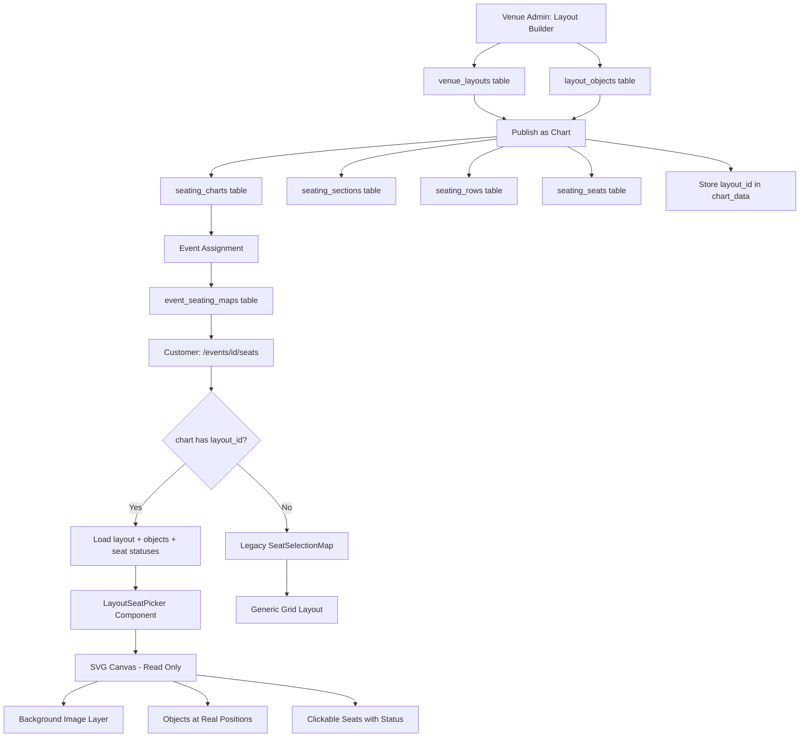

# Layout-Driven Customer Seating Chart — Architecture Plan

## The Problem

Today there are **two disconnected systems**:

1. **Layout Builder** — venue admin creates a visual layout with tables, rows, GA sections at real-world coordinates (feet). Data lives in `venue_layouts` + `layout_objects`.

2. **Classic Seating** — customer-facing seat picker uses `seating_charts` → `seating_sections` → `seating_rows` → `seating_seats`. The rendering is a **generic grid/orbit layout** — it does NOT preserve the spatial arrangement the venue designed.

When the admin clicks "Assign to Chart", the current code creates chart records but **throws away all spatial data** — the customer sees a generic auto-layout, not the venue's actual floor plan.

---

## The Solution: Layout-Native Seat Picker

The customer-facing seating chart should render **directly from layout data** — same SVG canvas, same coordinates, same background image — just without edit controls and with clickable seats.

---

## End-to-End Workflow

```
VENUE ADMIN                                    CUSTOMER
─────────────                                  ────────
1. Create Layout                               
   └─ Set room dimensions                     
   └─ Upload PDF background                   
   └─ Place tables, rows, GA sections         
   └─ Set price tiers + colors                
   └─ Save layout                             
                                               
2. Publish Layout                              
   └─ Click "Publish as Chart"                 
   └─ System generates seat records            
      in seating_seats table                   
   └─ Links layout_id to chart                 
                                               
3. Assign to Event                             
   └─ Event edit page → select chart           
   └─ reserved_seating_enabled = true          
                                               
                                               4. Customer visits /events/[id]/seats
                                               5. API detects layout-based chart
                                               6. Returns layout + objects + seat statuses
                                               7. Renders SVG canvas (read-only)
                                                  └─ Background image (no grid)
                                                  └─ Tables/rows at exact positions
                                                  └─ Clickable seats (color = status)
                                               8. Customer clicks seats → checkout
```

---

## Architecture Diagram



---

## Data Flow: Publish as Chart

When admin clicks **Publish as Chart**, the system:

1. Creates a `seating_charts` record with `chart_data.layout_id` pointing back to the layout
2. For each layout_object of type `table` or `row`:
   - Creates a `seating_sections` record with `color`, `price_tier`, `layout_type`
   - Creates a `seating_rows` record 
   - Creates individual `seating_seats` records with **x_position and y_position calculated from the layout object coordinates**
3. For GA sections: creates section with capacity but no individual seats
4. Stores a reference: `chart_data.layout_id = <layout_id>`

### Seat Position Calculation

For **tables**: seats orbit around the table center
```
seat[i].x_position = obj.x + obj.width/2 + orbit_radius * cos(angle_i)
seat[i].y_position = obj.y + obj.height/2 + orbit_radius * sin(angle_i)
```

For **rows**: seats are evenly spaced along the row width
```
seat[i].x_position = obj.x + i * (obj.width / (count - 1))
seat[i].y_position = obj.y + obj.height/2
```

These positions are stored in **feet** to match the layout coordinate system.

---

## New Component: LayoutSeatPicker

A **read-only** version of `SeatingCanvas` that:

- Loads the layout background image
- Renders all objects at their real positions
- Draws clickable seat circles with status colors
- Supports zoom/pan for mobile
- Shows tooltips on hover
- Handles seat click → selection
- Shows GA sections as "buy X tickets" zones

### Key Differences from Editor Canvas

| Feature | Editor Canvas | Customer Seat Picker |
|---------|--------------|---------------------|
| Grid | Yes | No |
| Drag objects | Yes | No |
| Resize | Yes | No |
| Snap guides | Yes | No |
| Click seats | No | Yes - toggles selection |
| Seat status colors | N/A | Available/Held/Sold/Selected |
| Background opacity | 0.35 | 0.25 |
| Zoom/Pan | Yes | Yes |
| Real-time updates | No | Yes - Supabase realtime |

---

## API Changes

### Modified: GET /api/seating/events/[eventId]

Add layout detection:

```
1. Load event_seating_maps → chart_id
2. Load seating_charts → check chart_data.layout_id
3. IF layout_id exists:
   a. Load venue_layouts record (background, dimensions)
   b. Load layout_objects (positions, types, colors)
   c. Load seating_seats with statuses (via sections/rows)
   d. Return { type: "layout", layout, objects, sections_with_seats }
4. ELSE:
   Return existing format { type: "classic", chart }
```

### Modified: POST /api/layouts/[id]/assign-chart

Upgrade to store spatial seat positions from layout coordinates.

---

## Component Structure

```
app/components/seating/
├── SeatingChartViewer.tsx        ← MODIFIED: detect layout vs classic
├── SeatSelectionMap.tsx          ← EXISTING: classic grid renderer
├── LayoutSeatPicker.tsx          ← NEW: layout-based SVG renderer
└── SeatLegend.tsx                ← NEW: extracted legend component
```

---

## Customer Seat Picker UX

### Visual Design
- Dark background matching the editor aesthetic
- Background image at 25% opacity 
- Tables rendered as circles with seats orbiting
- Rows rendered as labeled lines with seat dots
- GA sections as clickable zones
- Stage clearly labeled

### Seat States
- **Available**: Section color at 80% opacity, clickable
- **Selected**: Section color at 100% + white border ring, clickable to deselect
- **Held**: Amber/yellow, non-clickable, tooltip "Held by another buyer"
- **Sold**: Dark gray, non-clickable
- **Table hover**: Shows "Buy Full Table" option when all seats available

### Interactions
- Click seat → toggle selection
- Click table center → select/deselect all seats at table
- Pinch/scroll to zoom on mobile
- Touch-drag to pan
- Hover seat → tooltip with section, row, seat number, price

---

## Migration: No Schema Changes Needed

The existing tables already support this:
- `seating_charts.chart_data` (jsonb) — store `layout_id` reference
- `seating_seats.x_position` / `y_position` — already exist, just need real coordinates
- `layout_objects` — already has all spatial data

---

## Files to Create/Modify

### New Files
- `app/components/seating/LayoutSeatPicker.tsx` — SVG-based customer seat picker
- `app/components/seating/SeatLegend.tsx` — reusable legend component

### Modified Files
- `app/components/seating/SeatingChartViewer.tsx` — detect layout vs classic, route to correct renderer
- `app/api/seating/events/[eventId]/route.ts` — return layout data when chart has layout_id
- `app/api/layouts/[id]/assign-chart/route.ts` — store real seat positions from layout coordinates

---

## Implementation Steps

1. Update `assign-chart` API to calculate and store real seat positions in feet
2. Update `GET /api/seating/events/[eventId]` to detect and return layout data
3. Build `LayoutSeatPicker.tsx` — read-only SVG canvas with clickable seats
4. Build `SeatLegend.tsx` — extracted shared legend
5. Update `SeatingChartViewer.tsx` to auto-detect and render the correct picker
6. Test full flow: build layout → publish → assign to event → customer picks seats → checkout
