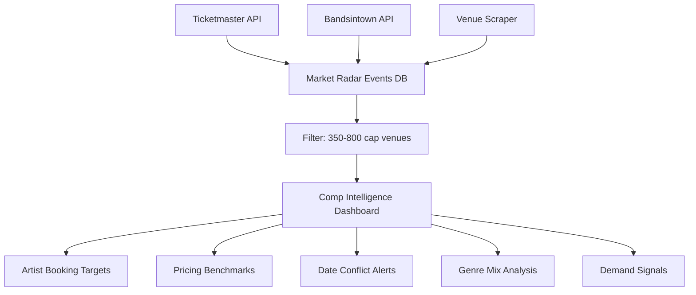

# Diagnosis & Plan: Market Radar, Social APIs, Sales Velocity & Comp Analytics

## Issues Found & Root Causes

### 1. Social Media Hub — Brown Background (CSS Mismatch)

**File:** `app/admin/marketing/social/page.tsx:128`

**Root Cause:** The entire page uses `background: "#111"` via inline styles instead of the admin layout's dark theme (`#0b0d1d`). Every other admin page uses the admin layout classes, but the social page overrides with its own background color.

**Fix:** Change `background: "#111"` to `background: "transparent"` on line 128 so it inherits the admin layout background. Same pattern as every other admin page.

---

### 2. Social Media APIs Not Pulling Insights

**File:** `app/api/marketing/social-sync/route.ts`

**Root Cause:** The sync API requires `META_SYSTEM_TOKEN` environment variable. The code is correct — it:
1. Discovers the Facebook Page ID via `/me/accounts`
2. Fetches FB Page Insights (impressions, engaged_users, fans, page_views, post_engagements)
3. Discovers IG User ID via `/{pageId}?fields=instagram_business_account`
4. Fetches IG Insights (reach, impressions, accounts_engaged, follower_count)
5. Fetches recent FB posts with engagement metrics
6. Stores everything in `social_metrics` table

**Likely issues:**
- `META_SYSTEM_TOKEN` is not set or has expired (tokens expire every 60 days)
- The token lacks required permissions: `pages_show_list`, `pages_read_engagement`, `instagram_basic`, `instagram_manage_insights`
- The Facebook Page may not have an Instagram Business Account connected

**Fix Plan:**
- Add a diagnostic check in the social sync GET endpoint that tests the token validity
- Add clearer error messages showing exactly which permission is missing
- Add a "Test Connection" button that validates the token and lists available pages/IG accounts
- Add instructions for generating a non-expiring System User Token via Meta Business Manager

---

### 3. Bandsintown Not Returning Events

**File:** `modules/market-radar/api/bandsintownScraper.ts`

**Root Cause:** The Bandsintown public API (`rest.bandsintown.com`) has been increasingly restrictive. Key issues:
1. The `app_id=VenueCoreRadar` may be getting rate-limited or blocked — Bandsintown started requiring registered app IDs
2. The API may return `403` or redirect to a captcha page
3. The SE US state filter drops events where `venue.region` doesn't match expected format
4. No error logging to Supabase — failures are silently swallowed with `continue`

**Fix Plan:**
- Add a fallback to the Bandsintown **v4 API** which uses proper API keys
- Add a health check endpoint `/api/market-radar/health` that tests each data source
- Store scan errors in a `market_radar_scan_logs` table so you can see failures in the UI
- Add more artists to the seed list relevant to 350-800 cap rooms
- Add a "Manual Artist Search" feature — type an artist name and see their upcoming SE US dates

---

### 4. Venue Scraper — Not Implemented (Placeholder)

**File:** `modules/market-radar/api/venueScraper.ts:172`

**Root Cause:** The function explicitly says `"placeholder"` — it fetches each venue URL but has no HTML parsing logic. It always returns an empty array.

**Fix Plan:** Replace the placeholder with real scraping using two approaches:

**Approach A — Ticketmaster Venue Search (best ROI):**
Most of the tracked venues (Saturn, Iron City, Variety Playhouse, Terminal West, etc.) have events listed on Ticketmaster. Instead of scraping HTML, query the Ticketmaster API with `venueId` parameters for each venue.

**Approach B — Cheerio HTML Parsing (for non-TM venues):**
Install `cheerio` and build per-venue parsers. Each venue gets a parser config with CSS selectors for: event title, date, ticket link, and price.

I recommend Approach A first (covers ~70% of venues) and then Approach B for remaining venues.

---

### 5. Ticket Sales Velocity Estimation (NEW)

**What you want:** For each event in Market Radar, estimate how many tickets have been sold based on venue capacity and availability data.

**How it works:**
- Ticketmaster API exposes `seatmap` data and sometimes `inventory` or `presale` information
- Bandsintown exposes `tracker_count` and `rsvp_count` as demand signals
- We already capture `estimated_tickets_sold`, `estimated_tickets_remaining`, and `sale_velocity` fields in the `market_radar_events` table — they're just never populated

**Fix Plan:**
- In `modules/market-radar/jobs/updateEventMetrics.ts`, add logic to:
  - Re-query Ticketmaster for events that have TM source IDs and check for availability changes
  - Calculate `sale_velocity = tickets_sold_delta / days_since_last_check`
  - Estimate percent sold based on `tracker_count / venue_capacity` ratio for Bandsintown events
- Add a new cron job that runs daily to update these metrics
- Surface the velocity data on the Market Radar EventTable with color-coded badges

---

### 6. Sales Trend Analysis (NEW)

**What you want:** Analyze patterns like:
- Which day of week do people buy tickets?
- Are sales fast at first announce then slow?
- Weekend vs weekday purchase patterns?
- Seasonal trends?

**Implementation Plan:**

Create a new **Trend Analysis Panel** on the Market Radar dashboard with:

**a) Day-of-Week Heatmap:**
- Query `market_radar_events` grouped by `event_date` day-of-week
- Show which days have the most events AND which days have the highest tracker counts
- Bar chart: Mon-Sun with event count + average demand

**b) Announce-to-Show Velocity Curve:**
- Track when events first appear in our system (`created_at`) vs event date
- Calculate "days until show" at time of first detection
- Group by lead time buckets: 30d, 60d, 90d, 120d+
- Show which lead times correlate with highest tracker counts

**c) Seasonal Demand Pattern:**
- Monthly event count + average tracker/demand score
- Identify peaks (festival season, holiday weekends) and valleys

**d) Sell-Through Pace:**
- For events we track over multiple scans, plot the velocity curve
- Fast sellers (front-loaded) vs slow burners vs late surgers

**Data source:** All of this comes from the existing `market_radar_events` table — we just need to add query logic and visualization.

---

### 7. Comp Venue Analytics for 350-800 Cap Rooms (NEW — Your Biggest Ask)

**What you want:** Know exactly what comparable venues are doing in the 350-800 cap range.

**Implementation Plan — "Comp Intelligence" Dashboard:**

New admin page: `/admin/market-radar` → new "Comp Venues" tab

**a) Filter the tracked venues to 350-800 cap:**
Current tracked venues in this range:
| Venue | City | Cap |
|-------|------|-----|
| Saturn | Birmingham, AL | 800 |
| The Camp | Muscle Shoals, AL | 500 |
| Duling Hall | Jackson, MS | 500 |
| The Grey Eagle | Asheville, NC | 375 |
| Track 29 | Chattanooga, TN | 800 |

Need to ADD more comp venues:
- Zydeco (Birmingham) ~500
- The Orange Peel (Asheville) ~950 (close)
- Workplay (Birmingham) ~350
- The Basement East (Nashville) ~800
- 3rd & Lindsley (Nashville) ~400
- Cannery Ballroom (Nashville) ~675
- Exit/In (Nashville) ~475
- SweetWater (Atlanta) ~350
- The Eastern (Atlanta) ~700

**b) Comp Dashboard Features:**
- **Who's playing comp rooms?** — List of artists booked at 350-800 cap venues in the next 90 days
- **Pricing analysis** — Average ticket price at comp venues, broken down by genre
- **Date conflicts** — Shows at comp venues on the same dates you have shows
- **Genre mix** — What genres are comp venues booking? Country vs Rock vs Indie vs Hip-Hop pie chart
- **Booking cadence** — How far in advance are comp venues announcing? 
- **Demand signals** — Which comp venue events have the highest tracker counts?
- **Gap analysis** — Artists playing nearby comp venues but NOT your market = potential booking targets

**c) Data Flow:**

---

## Priority Order

| # | Item | Impact | Complexity |
|---|------|--------|------------|
| 1 | Fix Social Hub brown background | Quick win | Tiny |
| 2 | Fix Social API token validation + diagnostics | Unblocks social data | Small |
| 3 | Fix Bandsintown scraper + error logging | Unblocks artist data | Medium |
| 4 | Replace Venue Scraper with Ticketmaster venue queries | Unblocks venue data | Medium |
| 5 | Populate sales velocity fields in Market Radar | Core analytics | Medium |
| 6 | Build Comp Venue Analytics (350-800 cap) | Highest business value | Large |
| 7 | Build Sales Trend Analysis panels | Decision support | Medium |

---

## Files to Create/Modify

### New Files:
- `app/api/market-radar/health/route.ts` — Health check for all data sources
- `modules/market-radar/api/ticketmasterVenues.ts` — Venue-specific TM queries
- `modules/market-radar/services/salesVelocity.ts` — Velocity estimation logic
- `modules/market-radar/services/trendAnalysis.ts` — Trend computation
- `modules/market-radar/dashboard/CompVenuePanel.tsx` — Comp venue dashboard tab
- `modules/market-radar/dashboard/TrendPanel.tsx` — Trend analysis tab

### Modified Files:
- `app/admin/marketing/social/page.tsx` — Fix background color
- `app/api/marketing/social-sync/route.ts` — Add token diagnostics
- `modules/market-radar/api/bandsintownScraper.ts` — Better error handling + logging
- `modules/market-radar/api/venueScraper.ts` — Replace placeholder with real implementation
- `modules/market-radar/constants.ts` — Add comp venue list for 350-800 cap
- `modules/market-radar/dashboard/MarketRadarPage.tsx` — Add new tabs
- `modules/market-radar/dashboard/EventTable.tsx` — Add velocity badges
- `modules/market-radar/jobs/updateEventMetrics.ts` — Populate velocity fields
- `app/api/cron/update-metrics/route.ts` — Wire up velocity job
