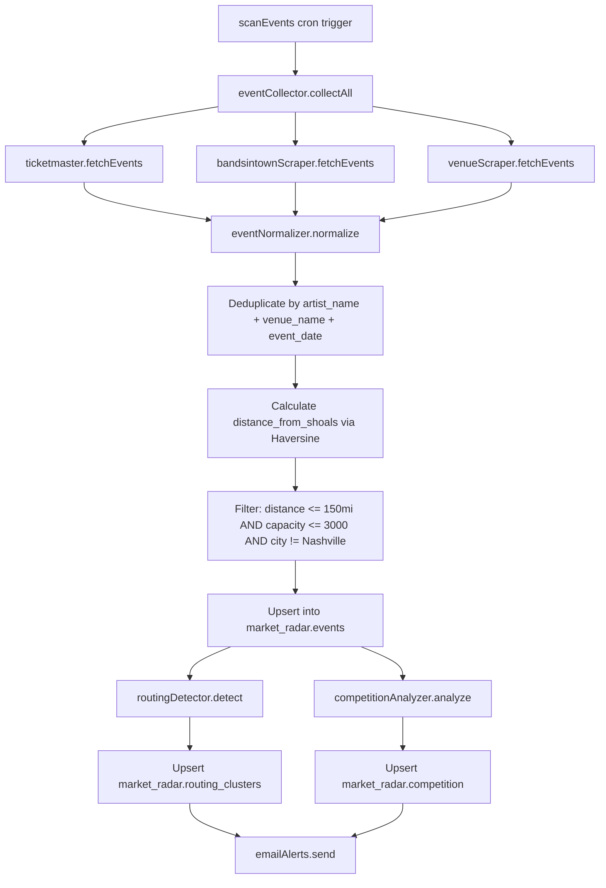
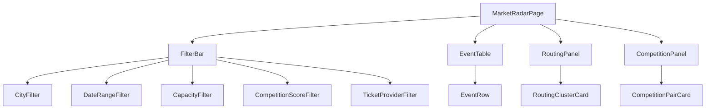

# Market Radar — Architecture Plan

## 1. Overview

Market Radar is a competitive intelligence module for VenueCore that continuously monitors live music events across the Southeast United States within a 150-mile radius of Florence, AL (34.7998°N, 87.6773°W). It targets venues with 300–3,000 capacity and excludes Nashville to focus on secondary and tertiary markets.

**Goals:**

- Give promoters early visibility into newly announced shows
- Detect artist routing patterns (artists touring through the region)
- Surface competition risk when nearby venues book overlapping dates or similar acts
- Deliver timely email alerts so promoters can act before the market saturates

**Key constraints:**

- Must live inside the existing Next.js App Router / TypeScript / Supabase stack
- Deployed on Vercel — no long-running processes; cron jobs use Vercel Cron or API route triggers
- Must not overwrite or alter any existing Supabase tables

---

## 2. File Structure

```
/modules/market-radar
│
├── /api
│   ├── ticketmaster.ts            # Ticketmaster Discovery API client with rate-limit handling
│   ├── bandsintownScraper.ts      # Bandsintown public page scraper using app_id = VenueCoreRadar
│   └── venueScraper.ts            # Per-venue calendar scraper / RSS reader
│
├── /services
│   ├── eventCollector.ts          # Orchestrator: calls all 3 sources, deduplicates, inserts
│   ├── eventNormalizer.ts         # Maps each source format to the unified MarketRadarEvent type
│   ├── routingDetector.ts         # Identifies routing clusters — 3+ shows within 10 days
│   └── competitionAnalyzer.ts     # Scores same-day events within 50 miles
│
├── /jobs
│   ├── scanEvents.ts              # Cron entry point: collects and normalizes events (every 6h)
│   └── updateEventMetrics.ts      # Cron entry point: refreshes ticket velocity estimates (every 12h)
│
├── /notifications
│   └── emailAlerts.ts             # Composes and sends email alerts via Resend / SMTP
│
├── /dashboard
│   ├── MarketRadarPage.tsx        # Top-level page component with filter bar and layout
│   ├── EventTable.tsx             # Sortable, filterable event table
│   ├── RoutingPanel.tsx           # Routing cluster cards with confidence scores
│   └── CompetitionPanel.tsx       # Competition risk heatmap / list
│
├── /types
│   └── index.ts                   # TypeScript interfaces: MarketRadarEvent, RoutingCluster, CompetitionRecord
│
└── /utils
    ├── geo.ts                     # Haversine distance calculator, Florence-AL constant
    └── rateLimiter.ts             # Token-bucket rate limiter for Ticketmaster calls
```

**App Router integration:**

```
/app
├── /admin/market-radar
│   └── page.tsx                   # Imports MarketRadarPage from /modules/market-radar/dashboard
│
├── /api/market-radar
│   ├── scan/route.ts              # POST — triggers scanEvents job (protected, Vercel Cron)
│   ├── metrics/route.ts           # POST — triggers updateEventMetrics job (protected, Vercel Cron)
│   └── events/route.ts            # GET — returns paginated, filtered events for the dashboard
│
└── /api/test-market-radar
    └── route.ts                   # GET — returns first 10 normalized events as JSON
```

---

## 3. Database Schema

All tables live under the `market_radar` schema. The migration must start with `CREATE SCHEMA IF NOT EXISTS market_radar;` to avoid conflicts.

### 3.1 `market_radar.events`

```sql
CREATE SCHEMA IF NOT EXISTS market_radar;

CREATE TABLE market_radar.events (
  id                    UUID PRIMARY KEY DEFAULT gen_random_uuid(),
  artist_name           TEXT NOT NULL,
  event_name            TEXT,
  venue_name            TEXT NOT NULL,
  venue_city            TEXT NOT NULL,
  venue_state           TEXT NOT NULL,
  venue_capacity        INTEGER,
  event_date            DATE NOT NULL,
  announce_date         TIMESTAMPTZ,
  ticket_price_low      NUMERIC(10, 2),
  ticket_price_high     NUMERIC(10, 2),
  ticket_url            TEXT,
  ticket_provider       TEXT NOT NULL,          -- ticketmaster | bandsintown | venue_scrape
  latitude              DOUBLE PRECISION,
  longitude             DOUBLE PRECISION,
  distance_from_shoals  DOUBLE PRECISION,       -- miles, calculated on insert
  tracker_count         INTEGER,                -- Bandsintown only
  rsvp_count            INTEGER,                -- Bandsintown only
  competition_score     DOUBLE PRECISION DEFAULT 0,
  routing_cluster_id    UUID REFERENCES market_radar.routing_clusters(id),
  tickets_sold_est      INTEGER,
  tickets_remaining_est INTEGER,
  ticket_velocity       DOUBLE PRECISION,       -- tickets sold per day estimate
  raw_payload           JSONB,                  -- original API/scrape response for debugging
  created_at            TIMESTAMPTZ NOT NULL DEFAULT now(),
  updated_at            TIMESTAMPTZ NOT NULL DEFAULT now(),

  CONSTRAINT uq_event UNIQUE (artist_name, venue_name, event_date)
);

-- Indexes
CREATE INDEX idx_mre_event_date      ON market_radar.events (event_date);
CREATE INDEX idx_mre_artist          ON market_radar.events (artist_name);
CREATE INDEX idx_mre_venue_city      ON market_radar.events (venue_city);
CREATE INDEX idx_mre_distance        ON market_radar.events (distance_from_shoals);
CREATE INDEX idx_mre_competition     ON market_radar.events (competition_score DESC);
CREATE INDEX idx_mre_routing_cluster ON market_radar.events (routing_cluster_id);
CREATE INDEX idx_mre_provider        ON market_radar.events (ticket_provider);
CREATE INDEX idx_mre_announce_date   ON market_radar.events (announce_date);
```

### 3.2 `market_radar.routing_clusters`

```sql
CREATE TABLE market_radar.routing_clusters (
  id                UUID PRIMARY KEY DEFAULT gen_random_uuid(),
  artist_name       TEXT NOT NULL,
  first_event_date  DATE NOT NULL,
  last_event_date   DATE NOT NULL,
  event_count       INTEGER NOT NULL,
  cities            TEXT[] NOT NULL,              -- array of city names in order
  avg_distance_gap  DOUBLE PRECISION,             -- avg miles between consecutive stops
  avg_date_gap      DOUBLE PRECISION,             -- avg days between consecutive shows
  confidence_score  DOUBLE PRECISION NOT NULL,    -- 0.0 – 1.0
  passes_near_shoals BOOLEAN DEFAULT FALSE,       -- TRUE if any stop is within 75 miles
  created_at        TIMESTAMPTZ NOT NULL DEFAULT now(),
  updated_at        TIMESTAMPTZ NOT NULL DEFAULT now()
);

CREATE INDEX idx_mrrc_artist     ON market_radar.routing_clusters (artist_name);
CREATE INDEX idx_mrrc_confidence ON market_radar.routing_clusters (confidence_score DESC);
CREATE INDEX idx_mrrc_near       ON market_radar.routing_clusters (passes_near_shoals) WHERE passes_near_shoals = TRUE;
```

### 3.3 `market_radar.competition`

```sql
CREATE TABLE market_radar.competition (
  id                    UUID PRIMARY KEY DEFAULT gen_random_uuid(),
  event_id_a            UUID NOT NULL REFERENCES market_radar.events(id) ON DELETE CASCADE,
  event_id_b            UUID NOT NULL REFERENCES market_radar.events(id) ON DELETE CASCADE,
  event_date            DATE NOT NULL,
  distance_between      DOUBLE PRECISION NOT NULL,  -- miles between the two venues
  price_overlap         BOOLEAN DEFAULT FALSE,       -- TRUE if ticket price ranges overlap
  capacity_overlap      BOOLEAN DEFAULT FALSE,       -- TRUE if capacities are within 50%
  avg_ticket_price      NUMERIC(10, 2),
  competition_score     DOUBLE PRECISION NOT NULL,   -- 0.0 – 1.0
  created_at            TIMESTAMPTZ NOT NULL DEFAULT now(),

  CONSTRAINT uq_competition_pair UNIQUE (event_id_a, event_id_b),
  CONSTRAINT chk_pair_order CHECK (event_id_a < event_id_b)   -- canonical ordering
);

CREATE INDEX idx_mrc_date  ON market_radar.competition (event_date);
CREATE INDEX idx_mrc_score ON market_radar.competition (competition_score DESC);
```

### 3.4 Row-Level Security

```sql
-- Enable RLS on all tables
ALTER TABLE market_radar.events ENABLE ROW LEVEL SECURITY;
ALTER TABLE market_radar.routing_clusters ENABLE ROW LEVEL SECURITY;
ALTER TABLE market_radar.competition ENABLE ROW LEVEL SECURITY;

-- Read policy: authenticated users with admin role
CREATE POLICY "Admins can read market radar events"
  ON market_radar.events FOR SELECT
  USING (auth.role() = 'authenticated');

CREATE POLICY "Admins can read routing clusters"
  ON market_radar.routing_clusters FOR SELECT
  USING (auth.role() = 'authenticated');

CREATE POLICY "Admins can read competition"
  ON market_radar.competition FOR SELECT
  USING (auth.role() = 'authenticated');

-- Write policy: service_role only (jobs run server-side)
CREATE POLICY "Service role can insert/update events"
  ON market_radar.events FOR ALL
  USING (auth.role() = 'service_role');

CREATE POLICY "Service role can insert/update routing clusters"
  ON market_radar.routing_clusters FOR ALL
  USING (auth.role() = 'service_role');

CREATE POLICY "Service role can insert/update competition"
  ON market_radar.competition FOR ALL
  USING (auth.role() = 'service_role');
```

---

## 4. API Layer

### 4.1 Ticketmaster Discovery API

| Detail | Value |
|--------|-------|
| Env var | `TICKETMASTER_API_KEY` |
| Base URL | `https://app.ticketmaster.com/discovery/v2/events.json` |
| Rate limit | 5 requests/second, 5000/day |

**Query strategy:**

- Issue one query per target city: Florence, Birmingham, Huntsville, Memphis, Chattanooga, Atlanta, Knoxville
- Parameters per query: `classificationName=music`, `radius=50`, `unit=miles`, `size=200`, `sort=date,asc`, `startDateTime={now}`, `endDateTime={now + 90 days}`
- Paginate if `page.totalPages > 1`

**Rate limiting:**

- Use a token-bucket rate limiter in `utils/rateLimiter.ts` — max 5 tokens, refill 5/second
- Before each request, `await rateLimiter.acquire()`
- On 429 response, back off exponentially: 1s → 2s → 4s → max 30s
- Cache Ticketmaster responses in memory for the duration of a single scan run to avoid re-fetching during retries

**Error handling:**

- Wrap each city query in try/catch
- Log failed cities but continue scanning remaining cities
- If all cities fail, mark the scan run as `partial_failure` and retry on next cron cycle
- Store `raw_payload` JSONB for post-mortem debugging

**Filtering:**

- Exclude Nashville results at the query level (`city != Nashville`) or post-fetch
- Post-filter: exclude venues with capacity > 3,000 (use `_embedded.venues[0].upcomingEvents` or venue detail lookup)
- Post-filter: exclude non-music classifications

### 4.2 Bandsintown Scraper

| Detail | Value |
|--------|-------|
| app_id | `VenueCoreRadar` |
| Base URL | `https://rest.bandsintown.com/artists/{artistName}/events?app_id=VenueCoreRadar` |

**Strategy:**

- Maintain a seed list of artists from recent Ticketmaster results plus a curated watchlist
- For each artist, fetch upcoming events and filter by region / distance
- Extract `tracker_count` and `rsvp_count` from the response
- Rate limit: 1 request/second (conservative, no published limit)
- On HTTP error, skip the artist and continue

**Fallback scraping:**

- If the public API becomes unavailable, fall back to scraping `bandsintown.com/artist/{name}` pages
- Use regex or DOM parsing to extract event data from server-rendered HTML

### 4.3 Venue Calendar Scraper

| Detail | Value |
|--------|-------|
| Method | HTTP fetch + HTML parsing or RSS |

**Strategy:**

- Maintain a configurable list of venue URLs and their scrape type (`rss` or `html`)
- For RSS feeds, parse `<item>` elements for event title, date, and link
- For HTML, use CSS selectors defined per venue in a config map
- Normalize extracted text into `MarketRadarEvent` fields
- If a venue page changes structure, log a scrape failure alert; do not crash the entire scan

**Config structure (stored in code or Supabase):**

```typescript
type VenueScraperConfig = {
  venue_name: string;
  venue_city: string;
  venue_state: string;
  capacity: number;
  latitude: number;
  longitude: number;
  url: string;
  type: 'rss' | 'html';
  selectors?: {
    eventContainer: string;
    title: string;
    date: string;
    link?: string;
  };
};
```

---

## 5. Service Layer

### 5.1 Data Flow



### 5.2 Event Collector — `eventCollector.ts`

- Calls all three API clients in parallel using `Promise.allSettled`
- Collects results into a single `RawEvent[]` array
- Passes to the normalizer, then deduplicates
- Uses Supabase `upsert` with `onConflict: 'artist_name,venue_name,event_date'`
- On conflict, updates fields that may have changed: prices, ticket URL, tracker/RSVP counts, announce date
- Returns a summary object: `{ inserted: number, updated: number, skipped: number, errors: string[] }`

### 5.3 Event Normalizer — `eventNormalizer.ts`

Exposes one function per source:

- `normalizeTicketmaster(raw: TicketmasterEvent): MarketRadarEvent`
- `normalizeBandsintown(raw: BandsintownEvent): MarketRadarEvent`
- `normalizeVenueScrape(raw: VenueScrapeResult): MarketRadarEvent`

Each mapper:

1. Extracts artist name, event name, venue details, dates, and prices
2. Sets `ticket_provider` to the source identifier
3. Sets `announce_date` to the earliest known date the event appeared (first-seen timestamp)
4. Leaves nullable fields as `null` if the source does not provide them

### 5.4 Routing Detector — `routingDetector.ts`

**Algorithm:**

1. Query `market_radar.events` for events in the next 90 days, ordered by `artist_name, event_date`
2. Group events by `artist_name`
3. For each artist with 3+ events, check if any consecutive window of events falls within 10 days
4. For qualifying windows, create or update a routing cluster:
   - `cities`: ordered list of cities
   - `avg_distance_gap`: mean Haversine distance between consecutive venue coordinates
   - `avg_date_gap`: mean days between consecutive event dates
   - `confidence_score`: calculated as below
   - `passes_near_shoals`: `TRUE` if any event in the cluster is within 75 miles of Florence

**Confidence score formula:**

```
confidence = w1 * date_proximity + w2 * distance_coherence + w3 * event_density

Where:
  date_proximity    = 1 - (avg_date_gap / 10)              — closer dates = higher score
  distance_coherence = 1 - (avg_distance_gap / 500)         — shorter jumps = higher score
  event_density      = min(event_count / 5, 1.0)            — more stops = higher score
  w1 = 0.4, w2 = 0.3, w3 = 0.3

Clamped to [0.0, 1.0]
```

### 5.5 Competition Analyzer — `competitionAnalyzer.ts`

**Algorithm:**

1. Query `market_radar.events` grouped by `event_date`
2. For each date with 2+ events, compute pairwise distances using Haversine
3. For pairs within 50 miles:
   - `price_overlap`: TRUE if the ticket price ranges `[low, high]` intersect
   - `capacity_overlap`: TRUE if the two venue capacities are within 50% of each other
   - `avg_ticket_price`: mean of all four price bounds
   - `competition_score`:

```
score = w1 * proximity + w2 * price_sim + w3 * capacity_sim

Where:
  proximity     = 1 - (distance_between / 50)
  price_sim     = price_overlap ? 1.0 : 0.0
  capacity_sim  = capacity_overlap ? 1.0 : 0.0
  w1 = 0.5, w2 = 0.25, w3 = 0.25
```

4. Upsert into `market_radar.competition`
5. Update `competition_score` on both events in `market_radar.events` (max score across all their pairs)

---

## 6. Job Scheduling

Vercel Cron is the primary scheduling mechanism. Define cron jobs in `vercel.json`:

```json
{
  "crons": [
    {
      "path": "/api/market-radar/scan",
      "schedule": "0 */6 * * *"
    },
    {
      "path": "/api/market-radar/metrics",
      "schedule": "0 */12 * * *"
    }
  ]
}
```

### 6.1 `/api/market-radar/scan` — POST

- Validates `Authorization: Bearer <CRON_SECRET>` header (Vercel injects this)
- Calls `scanEvents()` from `jobs/scanEvents.ts`
- `scanEvents` orchestrates: collect → normalize → deduplicate → insert → detect routing → analyze competition → send alerts
- Returns `{ status: 'ok', summary: { ... } }` or `{ status: 'partial_failure', errors: [...] }`
- Max execution time: set Vercel function `maxDuration` to 300s (Pro plan) to accommodate multi-city scanning

### 6.2 `/api/market-radar/metrics` — POST

- Same auth pattern
- Calls `updateEventMetrics()` from `jobs/updateEventMetrics.ts`
- For each event with a `ticket_url`, attempts to fetch current availability:
  - Ticketmaster: use the event detail endpoint to check `dates.status.code`
  - Bandsintown: re-fetch the artist events page for RSVP count deltas
  - Venue scrape: mark as unavailable if event is no longer listed
- Calculates `ticket_velocity = (tickets_sold_est_new - tickets_sold_est_old) / hours_elapsed`
- Updates `tickets_sold_est`, `tickets_remaining_est`, `ticket_velocity` on `market_radar.events`

### 6.3 Manual Trigger

Both endpoints also accept manual POST requests from the admin dashboard (with session-based auth) so promoters can force a refresh.

---

## 7. Notification System

### 7.1 Trigger Conditions

| Trigger | Condition | Priority |
|---------|-----------|----------|
| New event within 50 miles | `distance_from_shoals <= 50` | Normal |
| New routing cluster passes near Shoals | `passes_near_shoals = TRUE AND confidence_score >= 0.6` | High |
| High competition alert | `competition_score >= 0.7` for an event within 75 miles | High |
| Ticket velocity spike | `ticket_velocity` increases by > 50% between metric runs | Normal |

### 7.2 Email Delivery

- Use the existing Resend integration (already present at `app/api/webhooks/resend/route.ts`)
- `emailAlerts.ts` composes HTML email using a template with:
  - Alert type and priority badge
  - Event details: artist, venue, date, price range, ticket link
  - For routing alerts: list of cities in the route, confidence score
  - For competition alerts: competing events and scores
- Recipients: configurable list stored in Supabase (`market_radar.alert_subscribers` — optional future table) or hardcoded admin email addresses initially

### 7.3 Batching

- Alerts generated during a single scan run are batched into one email per recipient
- Grouped by alert type: New Events, Routing Clusters, Competition Alerts
- Sent at the end of the `scanEvents` job, not inline during processing

---

## 8. Dashboard

### 8.1 Component Hierarchy



### 8.2 Page: `MarketRadarPage.tsx`

- Server component that fetches initial data via Supabase server client
- Renders the FilterBar and three main panels
- URL search params drive filters for shareable/bookmarkable views

### 8.3 `EventTable.tsx`

- Client component with sorting and pagination
- Columns: Artist, Event, Venue, City, Date, Price Range, Distance, Competition Score, Provider, Ticket Link
- Sortable by: Date, Distance, Competition Score, Price
- Click row to expand details (announce date, tracker/RSVP counts, velocity)

### 8.4 `RoutingPanel.tsx`

- Displays routing clusters as cards, sorted by confidence score descending
- Each card shows: artist name, cities in order (as a route), date range, confidence badge
- Highlight clusters that `passes_near_shoals = TRUE`
- Click to expand: list of individual events in the cluster

### 8.5 `CompetitionPanel.tsx`

- Displays high-competition dates as a list or calendar heatmap
- Each entry shows: date, event pair, distance, competition score, price overlap badge
- Filter to only show scores above a threshold

### 8.6 Data Fetching

- Initial load: server-side Supabase query with default filters (next 30 days, all cities)
- Filter changes: client-side fetch to `/api/market-radar/events?city=...&dateFrom=...&dateTo=...&minCapacity=...&maxCapacity=...&minCompetition=...&provider=...`
- The API route queries Supabase with dynamic filters and returns paginated JSON

---

## 9. Test Endpoint

### `GET /api/test-market-radar`

**Purpose:** Quick verification that the data pipeline works end-to-end.

**Request:**

```
GET /api/test-market-radar
Authorization: Bearer <admin session cookie>
```

**Response (200):**

```json
{
  "status": "ok",
  "count": 10,
  "events": [
    {
      "id": "uuid",
      "artist_name": "Tyler Childers",
      "event_name": "Tyler Childers Live",
      "venue_name": "Mars Music Hall",
      "venue_city": "Huntsville",
      "venue_state": "AL",
      "event_date": "2026-04-15",
      "announce_date": "2026-03-01T00:00:00Z",
      "ticket_price_low": 35.00,
      "ticket_price_high": 75.00,
      "ticket_url": "https://...",
      "ticket_provider": "ticketmaster",
      "latitude": 34.7304,
      "longitude": -86.5861,
      "distance_from_shoals": 62.4,
      "tracker_count": null,
      "rsvp_count": null,
      "competition_score": 0.45,
      "routing_cluster_id": "uuid | null"
    }
  ]
}
```

**Error Response (500):**

```json
{
  "status": "error",
  "message": "Failed to fetch events",
  "details": "..."
}
```

**Behavior:**

- Queries `market_radar.events` ordered by `event_date ASC`, limited to 10
- If the table is empty, runs a quick single-city Ticketmaster fetch (Florence only), normalizes, and returns the results without persisting
- Auth: requires authenticated admin session

---

## 10. Environment Variables

| Variable | Purpose | Required |
|----------|---------|----------|
| `TICKETMASTER_API_KEY` | Ticketmaster Discovery API authentication | Yes |
| `NEXT_PUBLIC_SUPABASE_URL` | Supabase project URL (already exists) | Yes |
| `SUPABASE_SERVICE_ROLE_KEY` | Server-side Supabase access for job writes (already exists) | Yes |
| `CRON_SECRET` | Vercel cron job authentication token | Yes |
| `RESEND_API_KEY` | Email delivery via Resend (already exists) | Yes |
| `MARKET_RADAR_ALERT_EMAILS` | Comma-separated list of alert recipient emails | Yes |
| `MARKET_RADAR_ENABLED` | Feature flag: `true` or `false` — disables scanning when false | No (default: true) |

---

## 11. Implementation Order

The recommended build sequence, designed so each step is independently testable:

1. **Database migration** — Create the `market_radar` schema and all 3 tables with indexes, constraints, and RLS policies. Run in Supabase SQL editor.

2. **TypeScript types** — Define `MarketRadarEvent`, `RoutingCluster`, `CompetitionRecord` interfaces in `modules/market-radar/types/index.ts`.

3. **Geo utility** — Implement Haversine distance function and Florence-AL coordinate constant in `modules/market-radar/utils/geo.ts`.

4. **Rate limiter utility** — Build the token-bucket rate limiter in `modules/market-radar/utils/rateLimiter.ts`.

5. **Ticketmaster API client** — Implement multi-city query logic with pagination, rate limiting, and error handling in `modules/market-radar/api/ticketmaster.ts`.

6. **Event normalizer** — Build the `normalizeTicketmaster` function in `modules/market-radar/services/eventNormalizer.ts`.

7. **Test endpoint** — Wire up `/api/test-market-radar` to call Ticketmaster → normalize → return JSON. This validates the pipeline early.

8. **Bandsintown scraper** — Implement artist event fetching in `modules/market-radar/api/bandsintownScraper.ts` and add `normalizeBandsintown` to the normalizer.

9. **Venue scraper** — Implement configurable scraper in `modules/market-radar/api/venueScraper.ts` and add `normalizeVenueScrape` to the normalizer.

10. **Event collector** — Build the orchestrator in `modules/market-radar/services/eventCollector.ts` that calls all 3 sources, deduplicates, and upserts.

11. **Scan job** — Create `modules/market-radar/jobs/scanEvents.ts` and the `/api/market-radar/scan` route. Test with a manual POST.

12. **Routing detector** — Implement the clustering algorithm in `modules/market-radar/services/routingDetector.ts`. Integrate into the scan job.

13. **Competition analyzer** — Implement pairwise scoring in `modules/market-radar/services/competitionAnalyzer.ts`. Integrate into the scan job.

14. **Metrics job** — Build `modules/market-radar/jobs/updateEventMetrics.ts` and the `/api/market-radar/metrics` route.

15. **Email alerts** — Implement `modules/market-radar/notifications/emailAlerts.ts` with batched alert composition. Integrate into the scan job.

16. **Dashboard — EventTable** — Build the event list page at `/admin/market-radar` with the `EventTable` component and the `/api/market-radar/events` data route.

17. **Dashboard — Filters** — Add the `FilterBar` with City, Date Range, Capacity, Competition Score, and Provider filters.

18. **Dashboard — RoutingPanel** — Build the routing cluster display panel.

19. **Dashboard — CompetitionPanel** — Build the competition risk panel.

20. **Vercel cron configuration** — Add cron definitions to `vercel.json` and deploy.
