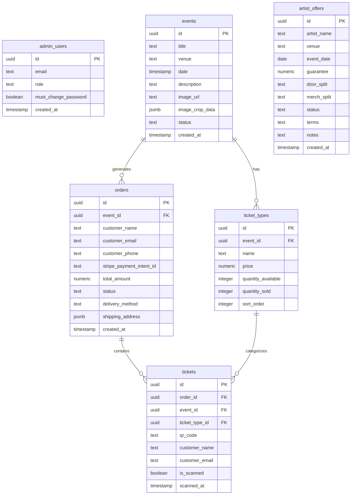
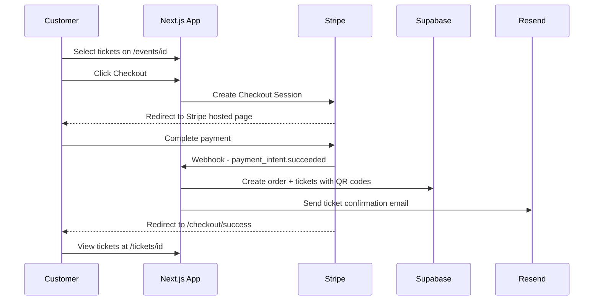
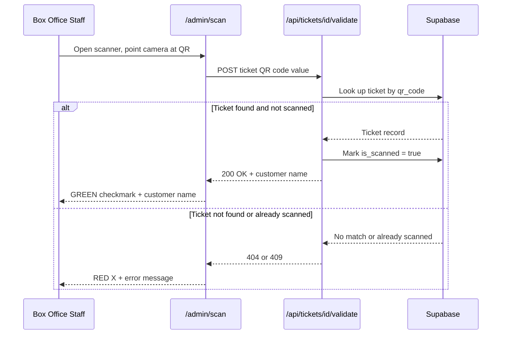

# Shoals Ticketing Platform — Architecture Plan

## Vision
A proprietary ticketing platform (inspired by Tixr/Ticketmaster + OpenDate/Prism.FM) for West72 Entertainment. Customers browse events, select ticket types, checkout via Stripe, and receive digital (QR/wallet) or physical tickets. Admins manage events, view sales data, scan tickets at the door, and create artist deals/offers.

---

## System Architecture

```mermaid
graph TD
    subgraph Customer Site
        HOME[Home Page]
        EVENTS[/events - Browse Events]
        DETAIL[/events/id - Event Detail + Ticket Selection]
        CHECKOUT[Stripe Checkout]
        TICKET_VIEW[/tickets/id - Digital Ticket + QR]
    end

    subgraph Admin Dashboard - Protected
        LOGIN[/admin/login]
        DASH[/admin - Dashboard Stats]
        MANAGE_EVENTS[/admin/events - CRUD Events]
        CREATE_EVENT[/admin/events/new - Create + Image Crop]
        ORDERS[/admin/orders - Sales + Customer Data]
        SCAN[/admin/scan - QR Scanner - Box Office]
        OFFERS[/admin/offers - Artist Deals]
        SETTINGS[/admin/settings - Password + Users]
    end

    subgraph External Services
        STRIPE[Stripe Payments]
        SUPA_AUTH[Supabase Auth]
        SUPA_DB[Supabase Database]
        EMAIL[Email Service - Resend]
    end

    HOME --> EVENTS
    EVENTS --> DETAIL
    DETAIL --> CHECKOUT
    CHECKOUT --> STRIPE
    STRIPE -->|webhook| SUPA_DB
    STRIPE -->|success| TICKET_VIEW
    TICKET_VIEW -->|sends| EMAIL

    LOGIN --> SUPA_AUTH
    MANAGE_EVENTS --> SUPA_DB
    ORDERS --> SUPA_DB
    SCAN --> SUPA_DB
    OFFERS --> SUPA_DB
```

---

## Database Schema (Supabase)



### Key Schema Notes
- `admin_users.role`: `full_admin` or `box_office`
- `events.status`: `draft` or `published`
- `events.image_crop_data`: JSON storing crop coordinates so the card displays the chosen portion
- `orders.status`: `pending`, `paid`, `refunded`, `cancelled`
- `orders.delivery_method`: `digital` or `physical`
- `tickets.qr_code`: Unique string used to generate QR codes and validate at scan
- `artist_offers.status`: `draft`, `sent`, `accepted`, `declined`, `expired`

---

## Admin Role Permissions

| Feature | Full Admin | Box Office |
|---|---|---|
| Dashboard stats | ✅ | ❌ |
| Create/edit events | ✅ | ❌ |
| View orders/customers | ✅ | ❌ |
| QR scanner | ✅ | ✅ |
| Artist offers | ✅ | ❌ |
| Manage admin users | ✅ | ❌ |
| Change own password | ✅ | ✅ |

---

## Route Map

### Customer Routes
| Route | Purpose |
|---|---|
| `/` | Home — hero + event carousel (existing) |
| `/events` | Browse all upcoming events (redesign needed) |
| `/events/[id]` | Event detail — select ticket type, add to cart |
| `/checkout` | Stripe Checkout session redirect |
| `/checkout/success` | Post-payment confirmation + ticket delivery |
| `/tickets/[id]` | View digital ticket with QR code |

### Admin Routes (protected)
| Route | Purpose |
|---|---|
| `/admin/login` | Admin sign-in (Supabase Auth) |
| `/admin` | Dashboard — tickets sold, revenue, quick stats |
| `/admin/events` | List all events with create/edit/delete |
| `/admin/events/new` | Create event form with image upload + crop |
| `/admin/events/[id]/edit` | Edit existing event |
| `/admin/orders` | All orders with customer data, filters |
| `/admin/scan` | QR code scanner for door check-in |
| `/admin/offers` | Artist deals list |
| `/admin/offers/new` | Create new artist offer/contract |
| `/admin/offers/[id]` | View/edit offer details |
| `/admin/settings` | Change password, manage admin users |

### API Routes
| Route | Method | Purpose |
|---|---|---|
| `/api/events` | GET | List published events (existing, needs update) |
| `/api/events` | POST | Create event (admin only) |
| `/api/events/[id]` | GET/PUT/DELETE | Single event CRUD |
| `/api/events/[id]/ticket-types` | GET/POST | Manage ticket types |
| `/api/checkout` | POST | Create Stripe Checkout session |
| `/api/webhooks/stripe` | POST | Handle Stripe payment events |
| `/api/tickets/[id]/validate` | POST | Validate ticket QR at scan |
| `/api/admin/auth` | POST | Admin login |
| `/api/admin/users` | GET/POST | Manage admin users |
| `/api/orders` | GET | List orders (admin only) |
| `/api/offers` | GET/POST | Artist offers CRUD |
| `/api/offers/[id]` | GET/PUT/DELETE | Single offer CRUD |
| `/api/upload` | POST | Image upload to Supabase Storage |

---

## Tech Stack Additions

| Need | Recommended Library | Why |
|---|---|---|
| Stripe payments | `stripe` + `@stripe/stripe-js` | Industry standard, Checkout Sessions are PCI compliant |
| QR code generation | `qrcode` | Lightweight, generates QR as data URL or buffer |
| QR code scanning | `html5-qrcode` | Browser camera access, works on mobile |
| Image cropping | `react-easy-crop` | Lightweight, returns crop area coordinates |
| Email delivery | `resend` | Developer-friendly, great Next.js integration |
| Apple Wallet passes | `passkit-generator` | Generate .pkpass files |
| Google Wallet passes | Google Wallet API | REST API for wallet passes |
| PDF tickets | `@react-pdf/renderer` | For printable physical ticket PDFs |
| Auth middleware | Next.js middleware + Supabase Auth | Route protection for /admin/* |

---

## Checkout Flow



---

## Scanning Flow



---

## Phased Build Order

### Phase 1: Database + Auth Foundation
- Design and create all Supabase tables (events update, ticket_types, orders, tickets, admin_users, artist_offers)
- Set up Supabase Auth for admin users
- Create auth middleware to protect `/admin/*` routes
- Build admin login page with forced password change on first login
- Update `Event` TypeScript type and API route

### Phase 2: Customer Event Experience
- Redesign `/events` page to match home page design quality
- Build `/events/[id]` event detail page with ticket type selection
- Implement image crop display on event cards
- Add Footer component with Box Office link

### Phase 3: Stripe Checkout + Orders
- Install and configure Stripe
- Build checkout API route (create Stripe Checkout Session)
- Build Stripe webhook handler
- Create order + ticket records on successful payment
- Build `/checkout/success` confirmation page
- Generate unique QR codes per ticket

### Phase 4: Ticket Delivery
- Build `/tickets/[id]` digital ticket page with QR code
- Set up Resend for transactional email
- Send ticket confirmation emails with QR codes
- Generate Apple Wallet .pkpass files
- Generate Google Wallet pass links
- Build printable PDF ticket for physical delivery option

### Phase 5: Admin Dashboard
- Build admin layout and navigation
- Dashboard home with stats (tickets sold, revenue, event counts)
- Event management CRUD with image upload + react-easy-crop
- Orders/customer data table with search and filters
- Admin user management (create box_office or full_admin accounts)

### Phase 6: Box Office Scanner
- Build `/admin/scan` with camera-based QR reader
- Green/red validation UI with customer name display
- Box office role access control
- Footer "Box Office" link on main site

### Phase 7: Artist Offers + Deals
- Build offer/contract creation form
- Deal status tracking workflow
- Offer list and detail views
- (Future: PDF contract generation)

### Future Considerations
- Live auction handling
- Seating charts
- Multi-event packages
- Refund management
- Analytics/reporting dashboard
