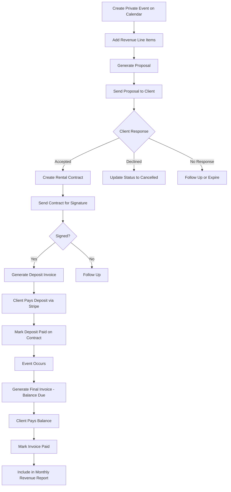
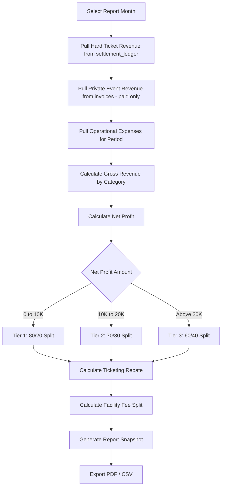

# Private Events & Reports — Architecture Plan

## Overview

Expand VenueCore from a ticketed-event platform into a full-service event management system supporting **Hard Ticket** (public concert) events and **Private Events**, with comprehensive financial reporting aligned to the management/ownership revenue-share model.

---

## 1. Columns to Add to Existing Tables

### [`events`](lib/types/event.ts:1) table

The `event_type` column already exists with values `ticketed | non_ticketed | private`. We need to:

1. **Rename** `ticketed` → `hard_ticket` (migration updates existing rows + CHECK constraint)
2. **Add** `booking_status` — replaces reliance on the generic `status` field for calendar display
3. **Add** contact fields for private event clients
4. **Add** `capacity` for house-size calculations in reports

```
-- New/modified columns on events:
booking_status    TEXT DEFAULT 'Hold'
                  CHECK booking_status IN: confirmed, hold, cancelled
contact_name      TEXT
contact_phone     TEXT
contact_email     TEXT
capacity          INTEGER          -- total house capacity for % of house calcs
```

> **Note:** The existing `status` column (`draft | published`) controls public visibility. The new `booking_status` column controls calendar color-coding and internal workflow state.

### [`settlement_ledger`](plans/settlement-ledger-migration.sql:14) table

Add `facility_fee` column for the $3/ticket split tracking:

```
facility_fee      NUMERIC(10,2) DEFAULT 0
```

---

## 2. New Supabase Tables

### 2a. `private_event_revenue` — Revenue line items for private events

Each private event can have multiple revenue line items representing what the venue charges the client.

```sql
private_event_revenue
  id               UUID PRIMARY KEY DEFAULT gen_random_uuid()
  event_id         UUID NOT NULL REFERENCES events(id) ON DELETE CASCADE
  venue_id         UUID NOT NULL REFERENCES venues(id)
  category         TEXT NOT NULL
                   CHECK category IN:
                     room_rental, production, food_beverage, setup, labor, other
  description      TEXT                    -- optional line item detail
  amount           NUMERIC(10,2) NOT NULL DEFAULT 0
  sort_order       INTEGER DEFAULT 0
  created_at       TIMESTAMPTZ DEFAULT now()
  updated_at       TIMESTAMPTZ DEFAULT now()
```

**Indexes:** `idx_prv_rev_event` on `(event_id)`, `idx_prv_rev_venue` on `(venue_id)`

### 2b. `private_event_proposals` — Proposals sent to private event clients

```sql
private_event_proposals
  id               UUID PRIMARY KEY DEFAULT gen_random_uuid()
  event_id         UUID NOT NULL REFERENCES events(id) ON DELETE CASCADE
  venue_id         UUID NOT NULL REFERENCES venues(id)

  -- Client info snapshot
  client_name      TEXT NOT NULL
  client_email     TEXT
  client_phone     TEXT
  client_company   TEXT

  -- Proposal content
  event_date       DATE
  event_start_time TEXT             -- e.g. 6:00 PM
  event_end_time   TEXT             -- e.g. 11:00 PM
  guest_count      INTEGER
  event_description TEXT
  notes            TEXT             -- internal notes

  -- Financial snapshot: JSON array of line items
  -- Each: { category, description, amount }
  line_items       JSONB NOT NULL DEFAULT '[]'
  subtotal         NUMERIC(10,2) DEFAULT 0
  tax_rate         NUMERIC(5,4) DEFAULT 0
  tax_amount       NUMERIC(10,2) DEFAULT 0
  total            NUMERIC(10,2) DEFAULT 0

  -- Status
  status           TEXT DEFAULT 'draft'
                   CHECK status IN: draft, sent, accepted, declined, expired
  sent_at          TIMESTAMPTZ
  accepted_at      TIMESTAMPTZ
  declined_at      TIMESTAMPTZ
  expires_at       TIMESTAMPTZ      -- optional expiration date

  -- PDF
  pdf_url          TEXT             -- Supabase storage path
  version          INTEGER DEFAULT 1

  created_at       TIMESTAMPTZ DEFAULT now()
  updated_at       TIMESTAMPTZ DEFAULT now()
```

**Indexes:** `idx_proposal_event` on `(event_id)`, `idx_proposal_venue` on `(venue_id)`, `idx_proposal_status` on `(status)`

### 2c. `rental_contracts` — Rental agreements for private events

Separate from the existing [`contracts`](app/api/contracts/route.ts:1) table which handles artist performance contracts.

```sql
rental_contracts
  id               UUID PRIMARY KEY DEFAULT gen_random_uuid()
  event_id         UUID NOT NULL REFERENCES events(id) ON DELETE CASCADE
  venue_id         UUID NOT NULL REFERENCES venues(id)
  proposal_id      UUID REFERENCES private_event_proposals(id)

  -- Client info
  client_name      TEXT NOT NULL
  client_email     TEXT
  client_phone     TEXT
  client_company   TEXT
  client_address   TEXT

  -- Event details
  event_date       DATE
  event_start_time TEXT
  event_end_time   TEXT
  guest_count      INTEGER
  event_description TEXT

  -- Financial terms
  line_items       JSONB NOT NULL DEFAULT '[]'
  subtotal         NUMERIC(10,2) DEFAULT 0
  tax_rate         NUMERIC(5,4) DEFAULT 0
  tax_amount       NUMERIC(10,2) DEFAULT 0
  total            NUMERIC(10,2) DEFAULT 0

  -- Deposit terms
  deposit_percent  NUMERIC(5,2) DEFAULT 25    -- 20-30% at signing
  deposit_amount   NUMERIC(10,2) DEFAULT 0
  deposit_due_date DATE
  deposit_paid     BOOLEAN DEFAULT false
  deposit_paid_at  TIMESTAMPTZ
  balance_due_date DATE

  -- Cancellation policy
  cancellation_policy TEXT          -- free-text or template
  cancellation_fee_percent NUMERIC(5,2) DEFAULT 0

  -- PDF / signature
  pdf_url          TEXT
  file_name        TEXT
  version          INTEGER DEFAULT 1
  status           TEXT DEFAULT 'draft'
                   CHECK status IN: draft, sent, signed, cancelled, void
  signed_at        TIMESTAMPTZ
  signed_by        TEXT             -- client name
  signed_ip        TEXT             -- for audit

  created_at       TIMESTAMPTZ DEFAULT now()
  updated_at       TIMESTAMPTZ DEFAULT now()
```

**Indexes:** `idx_rental_event` on `(event_id)`, `idx_rental_venue` on `(venue_id)`, `idx_rental_status` on `(status)`

### 2d. `invoices` — Billing/invoicing for private events

```sql
invoices
  id               UUID PRIMARY KEY DEFAULT gen_random_uuid()
  invoice_number   TEXT NOT NULL     -- auto-generated: INV-2026-0001
  event_id         UUID NOT NULL REFERENCES events(id) ON DELETE CASCADE
  venue_id         UUID NOT NULL REFERENCES venues(id)
  rental_contract_id UUID REFERENCES rental_contracts(id)

  -- Client info
  client_name      TEXT NOT NULL
  client_email     TEXT
  client_phone     TEXT
  client_company   TEXT
  client_address   TEXT

  -- Line items: JSON array of { category, description, amount }
  line_items       JSONB NOT NULL DEFAULT '[]'
  subtotal         NUMERIC(10,2) DEFAULT 0
  tax_rate         NUMERIC(5,4) DEFAULT 0
  tax_amount       NUMERIC(10,2) DEFAULT 0
  total            NUMERIC(10,2) DEFAULT 0

  -- Payment tracking
  amount_paid      NUMERIC(10,2) DEFAULT 0
  balance_due      NUMERIC(10,2) DEFAULT 0
  due_date         DATE
  status           TEXT DEFAULT 'draft'
                   CHECK status IN: draft, sent, partial, paid, overdue, void

  -- Stripe
  stripe_payment_link TEXT          -- Stripe payment page URL
  stripe_invoice_id   TEXT          -- Stripe Invoice object ID

  -- PDF
  pdf_url          TEXT
  sent_at          TIMESTAMPTZ
  paid_at          TIMESTAMPTZ

  created_at       TIMESTAMPTZ DEFAULT now()
  updated_at       TIMESTAMPTZ DEFAULT now()
```

**Indexes:** `idx_invoice_event` on `(event_id)`, `idx_invoice_venue` on `(venue_id)`, `idx_invoice_status` on `(status)`, `UNIQUE` on `(invoice_number, venue_id)`

### 2e. `invoice_payments` — Payment records for invoices

```sql
invoice_payments
  id               UUID PRIMARY KEY DEFAULT gen_random_uuid()
  invoice_id       UUID NOT NULL REFERENCES invoices(id) ON DELETE CASCADE
  venue_id         UUID NOT NULL REFERENCES venues(id)

  amount           NUMERIC(10,2) NOT NULL
  payment_method   TEXT DEFAULT 'stripe'
                   CHECK payment_method IN: stripe, check, cash, wire, other
  stripe_payment_intent_id TEXT
  stripe_charge_id TEXT

  type             TEXT DEFAULT 'payment'
                   CHECK type IN: payment, deposit, refund
  notes            TEXT
  received_at      TIMESTAMPTZ DEFAULT now()
  created_at       TIMESTAMPTZ DEFAULT now()
```

**Indexes:** `idx_inv_payment_invoice` on `(invoice_id)`, `idx_inv_payment_venue` on `(venue_id)`

### 2f. `operational_expenses` — Venue-level operational expenses for monthly reporting

Distinct from settlement expenses (which are per-show artist deal expenses). These track the venue operational costs referenced in the management agreement.

```sql
operational_expenses
  id               UUID PRIMARY KEY DEFAULT gen_random_uuid()
  venue_id         UUID NOT NULL REFERENCES venues(id)
  event_id         UUID REFERENCES events(id)     -- NULL = general venue expense

  category         TEXT NOT NULL
                   CHECK category IN:
                     staffing, security, production_av, marketing,
                     ticketing_fees, merchant_processing, insurance,
                     artist_guarantees, vendor_services, facility, other
  description      TEXT NOT NULL
  amount           NUMERIC(10,2) NOT NULL
  expense_date     DATE NOT NULL
  receipt_url      TEXT
  notes            TEXT

  created_at       TIMESTAMPTZ DEFAULT now()
  updated_at       TIMESTAMPTZ DEFAULT now()
```

**Indexes:** `idx_opex_venue` on `(venue_id)`, `idx_opex_event` on `(event_id)`, `idx_opex_date` on `(expense_date)`, `idx_opex_category` on `(category)`

### 2g. `revenue_share_reports` — Monthly revenue share calculation snapshots

Stores finalized monthly report snapshots so they cannot be retroactively altered.

```sql
revenue_share_reports
  id               UUID PRIMARY KEY DEFAULT gen_random_uuid()
  venue_id         UUID NOT NULL REFERENCES venues(id)
  report_month     TEXT NOT NULL     -- YYYY-MM format
  period_start     DATE NOT NULL
  period_end       DATE NOT NULL

  -- Gross revenue breakdown
  hard_ticket_revenue    NUMERIC(10,2) DEFAULT 0
  private_event_revenue  NUMERIC(10,2) DEFAULT 0
  other_revenue          NUMERIC(10,2) DEFAULT 0
  total_gross_revenue    NUMERIC(10,2) DEFAULT 0

  -- Expenses
  total_expenses         NUMERIC(10,2) DEFAULT 0
  expense_breakdown      JSONB DEFAULT '{}'  -- { category: amount }

  -- Revenue guarantee
  base_guarantee         NUMERIC(10,2) DEFAULT 3000
  guarantee_met          BOOLEAN DEFAULT false

  -- Net profit + split
  net_profit             NUMERIC(10,2) DEFAULT 0
  profit_tier            TEXT           -- tier_1, tier_2, tier_3
  management_share_pct   NUMERIC(5,2)
  ownership_share_pct    NUMERIC(5,2)
  management_share       NUMERIC(10,2) DEFAULT 0
  ownership_share        NUMERIC(10,2) DEFAULT 0

  -- Ticketing rebate
  total_ticketing_fees   NUMERIC(10,2) DEFAULT 0
  mgmt_ticketing_rebate  NUMERIC(10,2) DEFAULT 0  -- 50% of fees
  owner_rebate_of_mgmt   NUMERIC(10,2) DEFAULT 0  -- 5% of mgmt rebate

  -- Facility fees
  total_facility_fees    NUMERIC(10,2) DEFAULT 0
  mgmt_facility_share    NUMERIC(10,2) DEFAULT 0   -- 50%
  owner_facility_share   NUMERIC(10,2) DEFAULT 0   -- 50%

  -- Totals
  total_to_management    NUMERIC(10,2) DEFAULT 0
  total_to_ownership     NUMERIC(10,2) DEFAULT 0

  status           TEXT DEFAULT 'draft'
                   CHECK status IN: draft, finalized
  finalized_at     TIMESTAMPTZ
  finalized_by     TEXT
  notes            TEXT

  created_at       TIMESTAMPTZ DEFAULT now()
  updated_at       TIMESTAMPTZ DEFAULT now()
```

**Indexes:** `idx_revshare_venue` on `(venue_id)`, `UNIQUE` on `(venue_id, report_month)`

---

## 3. New API Routes

### 3a. Private Event Revenue

| Method | Route | Description |
|--------|-------|-------------|
| `GET` | `/api/private-events/[eventId]/revenue` | List revenue line items for a private event |
| `POST` | `/api/private-events/[eventId]/revenue` | Add revenue line item |
| `PUT` | `/api/private-events/[eventId]/revenue/[id]` | Update a line item |
| `DELETE` | `/api/private-events/[eventId]/revenue/[id]` | Delete a line item |

### 3b. Proposals

| Method | Route | Description |
|--------|-------|-------------|
| `GET` | `/api/private-events/[eventId]/proposals` | List proposals for an event |
| `POST` | `/api/private-events/[eventId]/proposals` | Create a proposal |
| `GET` | `/api/private-events/[eventId]/proposals/[id]` | Get single proposal |
| `PUT` | `/api/private-events/[eventId]/proposals/[id]` | Update proposal |
| `POST` | `/api/private-events/[eventId]/proposals/[id]/send` | Send proposal PDF via Resend email |
| `GET` | `/api/private-events/[eventId]/proposals/[id]/pdf` | Generate/download proposal PDF |

### 3c. Rental Contracts

| Method | Route | Description |
|--------|-------|-------------|
| `GET` | `/api/private-events/[eventId]/rental-contracts` | List rental contracts |
| `POST` | `/api/private-events/[eventId]/rental-contracts` | Create rental contract (optionally from proposal) |
| `GET` | `/api/private-events/[eventId]/rental-contracts/[id]` | Get single contract |
| `PUT` | `/api/private-events/[eventId]/rental-contracts/[id]` | Update contract |
| `POST` | `/api/private-events/[eventId]/rental-contracts/[id]/send` | Send contract via email |
| `GET` | `/api/private-events/[eventId]/rental-contracts/[id]/pdf` | Generate/download PDF |

### 3d. Invoices & Payments

| Method | Route | Description |
|--------|-------|-------------|
| `GET` | `/api/invoices?venue_id=&event_id=&status=` | List invoices with filters |
| `POST` | `/api/invoices` | Create invoice (from contract or manual) |
| `GET` | `/api/invoices/[id]` | Get single invoice |
| `PUT` | `/api/invoices/[id]` | Update invoice |
| `POST` | `/api/invoices/[id]/send` | Send invoice via email with Stripe payment link |
| `GET` | `/api/invoices/[id]/pdf` | Generate/download invoice PDF |
| `POST` | `/api/invoices/[id]/payments` | Record a payment |
| `GET` | `/api/invoices/[id]/payments` | List payments for invoice |
| `POST` | `/api/invoices/[id]/stripe-link` | Generate Stripe payment page |

### 3e. Operational Expenses

| Method | Route | Description |
|--------|-------|-------------|
| `GET` | `/api/operational-expenses?venue_id=&event_id=&start=&end=&category=` | List expenses |
| `POST` | `/api/operational-expenses` | Create expense |
| `PUT` | `/api/operational-expenses/[id]` | Update expense |
| `DELETE` | `/api/operational-expenses/[id]` | Delete expense |

### 3f. Reports

| Method | Route | Description |
|--------|-------|-------------|
| `GET` | `/api/admin/reports/ticket-audit?event_id=` | Ticket audit report (no customer data) |
| `GET` | `/api/admin/reports/monthly-revenue?venue_id=&month=` | Monthly revenue report with profit split |
| `GET` | `/api/admin/reports/expenses?venue_id=&event_id=&start=&end=` | Expense report |
| `POST` | `/api/admin/reports/monthly-revenue/finalize` | Finalize a monthly report snapshot |
| `GET` | `/api/admin/reports/ticket-audit/pdf?event_id=` | Export ticket audit as PDF |
| `GET` | `/api/admin/reports/monthly-revenue/pdf?venue_id=&month=` | Export monthly revenue as PDF |
| `GET` | `/api/admin/reports/expenses/pdf?venue_id=&start=&end=` | Export expenses as PDF |

### 3g. Modified Existing Routes

| Route | Change |
|-------|--------|
| [`/api/events`](app/api/events/route.js:1) | Add `event_type` filter param; filter `private` events from public GET; accept new contact/booking fields on POST |
| [`/api/events/[id]`](app/api/events/[id]/route.ts) | Accept `booking_status`, `contact_*` fields on PUT |
| [`/api/calendar`](app/api/calendar/route.ts:1) | Update `event_type` values in SELECT; add `booking_status` to returned columns; fix color mapping for `hard_ticket` |

---

## 4. New/Modified Pages

### 4a. Modified Pages

| Page | Changes |
|------|---------|
| [`/admin/events`](app/admin/events/page.tsx:1) | Add filter dropdown: All / Hard Ticket / Private. Show `booking_status` badge. Show contact info for private events. |
| [`/admin/events/new`](app/admin/events/new/page.tsx:1) | Add `event_type` selector (Hard Ticket vs Private). When Private: hide ticket tiers, show contact fields + revenue line items. Add `booking_status` selector. |
| [`/admin/events/[id]/edit`](app/admin/events/[id]/edit/page.tsx) | Same changes as new event form. Add tabs for Private Event workflows when `event_type=private`. |
| [`/admin/calendar`](app/admin/calendar/page.tsx:1) | Fix: events created from calendar not showing (investigate POST response handling). Update color mapping: `hard_ticket` → gold, `private` → purple, `non_ticketed` → blue. Add `booking_status` color overlay: `confirmed` green border, `hold` yellow border, `cancelled` red + strikethrough. Add contact fields to calendar event modal. |
| [`/admin/reports`](app/admin/reports/page.tsx:1) | **Full redesign** — card-based layout (see section 4b below). |

### 4b. Reports Page Redesign

Replace the current tab-based layout with a card grid. Each card is a report type:

```
+----------------------------------+  +----------------------------------+
|  TICKET AUDIT                    |  |  MONTHLY REVENUE REPORT          |
|  Per-event ticket sales audit    |  |  Cross-event revenue & splits    |
|                                  |  |                                  |
|  Event: [dropdown________]       |  |  Month: [dropdown________]       |
|                                  |  |                                  |
|  [Export CSV]  [Export PDF]       |  |  [Export CSV]  [Export PDF]       |
+----------------------------------+  +----------------------------------+

+----------------------------------+  +----------------------------------+
|  EXPENSE REPORT                  |  |  TIER BREAKDOWN                  |
|  Operational expenses by event   |  |  Ticket tier sales analysis      |
|  or date range                   |  |                                  |
|                                  |  |  Event: [dropdown________]       |
|  Event: [dropdown________]       |  |  Date Range: [from] - [to]       |
|  Date Range: [from] - [to]      |  |                                  |
|  Category: [dropdown____]        |  |  [Export CSV]  [Export PDF]       |
|                                  |  +----------------------------------+
|  [Export CSV]  [Export PDF]       |
+----------------------------------+  +----------------------------------+
                                      |  CHECK-IN LOGS                   |
                                      |  Scanned ticket records          |
                                      |                                  |
                                      |  Event: [dropdown________]       |
                                      |  Date Range: [from] - [to]       |
                                      |                                  |
                                      |  [Export CSV]  [Export PDF]       |
                                      +----------------------------------+
```

### 4c. New Pages

| Page | Description |
|------|-------------|
| `/admin/private-events/[eventId]` | Private event detail/management page with tabs: Overview, Revenue, Proposals, Contract, Invoices |
| `/admin/private-events/[eventId]/proposal/new` | Create/edit proposal form |
| `/admin/private-events/[eventId]/contract/new` | Create/edit rental contract form |
| `/admin/private-events/[eventId]/invoice/new` | Create/edit invoice form |
| `/admin/invoices` | Invoice list page (all venues, filterable) |
| `/admin/expenses` | Operational expense tracker (add/edit/list) |
| `/pay/[invoiceId]` | **Public** — Stripe-powered secure payment page for clients |

### 4d. New PDF Templates

| Template | Location | Description |
|----------|----------|-------------|
| Proposal PDF | `lib/pdf/proposal-pdf.ts` | Branded proposal with venue logo, line items, totals, terms |
| Rental Contract PDF | `lib/pdf/rental-contract-pdf.ts` | Rental agreement with cancellation policy, deposit terms, signature block |
| Invoice PDF | `lib/pdf/invoice-pdf.ts` | Professional invoice with line items, payment instructions, Stripe link QR |
| Ticket Audit PDF | `lib/pdf/ticket-audit-pdf.ts` | Per-event audit: grouped by show, per-tier rows with columns matching sample format |
| Monthly Revenue PDF | `lib/pdf/monthly-revenue-pdf.ts` | Gross revenue by category, expenses, net profit, tiered split calculations |

### 4e. New TypeScript Types

| File | Types |
|------|-------|
| `lib/types/private-event.ts` | `PrivateEventRevenue`, `PrivateEventProposal`, `RentalContract`, `Invoice`, `InvoicePayment` |
| `lib/types/report.ts` | `TicketAuditReport`, `TicketAuditRow` (new format), `MonthlyRevenueReport`, `ExpenseReport`, `RevenueShareReport` |
| Update [`lib/types/event.ts`](lib/types/event.ts:1) | Add `booking_status`, `contact_name`, `contact_phone`, `contact_email`, `capacity`; update `event_type` union |

---

## 5. Ticket Audit Report Format

The ticket audit report matches the sample PDF format. **NO customer data** is included.

### Columns per tier row:

| Column | Source |
|--------|--------|
| Date | `tickets.created_at` date |
| Day of Week | Derived from date |
| Weeks Prior | Weeks between purchase date and event date |
| Quantity Sold | Count of tickets purchased that day for this tier |
| Percent of House | `qty_sold / event.capacity * 100` |
| Price Paid | `ticket_tiers.price` |
| Sales | `qty * price` |
| Cumulative $ | Running total of Sales |
| Taxes | `sales * venue.tax_rate` |
| Total Cost | `sales + taxes` |
| Cumulative $ | Running total of Total Cost |

### Grouping:
- Grouped by **event/show name** with date range header
- Per-tier sections within each event
- **Subtotals** per event
- **Grand total** across all events (if multi-event report)

---

## 6. Monthly Revenue Report — Profit Split Logic

```
Revenue Guarantee to Ownership:     $3,000/month (quarterly true-up)

Net Profit = Total Revenue - Operational Expenses

Tiered Profit Split (after $3K base):
  Tier 1:  net_profit <= $10,000    → 80% management / 20% ownership
  Tier 2:  $10,001 - $20,000       → 70% management / 30% ownership
  Tier 3:  net_profit > $20,000     → 60% management / 40% ownership

Ticketing Rebate:
  Management gets 50% of ticketing service fees
  Ownership gets 5% of managements rebate

Facility Fee ($3/ticket):
  50% management / 50% ownership
```

### Report Sections:
1. **Gross Revenue by Event Category** — Hard Ticket total, Private Event total, Other
2. **Operational Expenses** — By category with subtotals
3. **Net Profit Calculation** — Gross - Expenses
4. **Revenue Share Distribution** — Base guarantee + tiered split + rebates + facility fees
5. **Summary** — Total to Management, Total to Ownership

---

## 7. Workflow Diagrams

### Private Event Lifecycle



### Monthly Revenue Report Generation



---

## 8. Migration SQL

```sql
-- ============================================================
-- Private Events & Reports Migration
-- Run in Supabase SQL Editor
-- ============================================================

-- ────────────────────────────────────────────────────────────
-- 1. Update events table
-- ────────────────────────────────────────────────────────────

-- 1a. Rename ticketed → hard_ticket in existing rows
UPDATE events SET event_type = 'hard_ticket' WHERE event_type = 'ticketed';

-- 1b. Drop old CHECK and add new one
ALTER TABLE events DROP CONSTRAINT IF EXISTS events_event_type_check;
ALTER TABLE events ADD CONSTRAINT events_event_type_check
  CHECK (event_type IN ('hard_ticket', 'non_ticketed', 'private'));

-- 1c. Add booking_status column
ALTER TABLE events ADD COLUMN IF NOT EXISTS booking_status TEXT DEFAULT 'confirmed';
ALTER TABLE events ADD CONSTRAINT events_booking_status_check
  CHECK (booking_status IN ('confirmed', 'hold', 'cancelled'));

-- 1d. Add contact fields
ALTER TABLE events ADD COLUMN IF NOT EXISTS contact_name TEXT;
ALTER TABLE events ADD COLUMN IF NOT EXISTS contact_phone TEXT;
ALTER TABLE events ADD COLUMN IF NOT EXISTS contact_email TEXT;

-- 1e. Add capacity
ALTER TABLE events ADD COLUMN IF NOT EXISTS capacity INTEGER;

-- Index for booking status queries
CREATE INDEX IF NOT EXISTS idx_events_booking_status ON events(booking_status);

-- ────────────────────────────────────────────────────────────
-- 2. Add facility_fee to settlement_ledger
-- ────────────────────────────────────────────────────────────
ALTER TABLE settlement_ledger
  ADD COLUMN IF NOT EXISTS facility_fee NUMERIC(10,2) DEFAULT 0;

-- ────────────────────────────────────────────────────────────
-- 3. Private Event Revenue
-- ────────────────────────────────────────────────────────────
CREATE TABLE IF NOT EXISTS private_event_revenue (
  id          UUID PRIMARY KEY DEFAULT gen_random_uuid(),
  event_id    UUID NOT NULL REFERENCES events(id) ON DELETE CASCADE,
  venue_id    UUID NOT NULL REFERENCES venues(id),
  category    TEXT NOT NULL CHECK (category IN (
                'room_rental', 'production', 'food_beverage', 'setup', 'labor', 'other'
              )),
  description TEXT,
  amount      NUMERIC(10,2) NOT NULL DEFAULT 0,
  sort_order  INTEGER DEFAULT 0,
  created_at  TIMESTAMPTZ DEFAULT now(),
  updated_at  TIMESTAMPTZ DEFAULT now()
);

CREATE INDEX IF NOT EXISTS idx_prv_rev_event ON private_event_revenue(event_id);
CREATE INDEX IF NOT EXISTS idx_prv_rev_venue ON private_event_revenue(venue_id);

ALTER TABLE private_event_revenue ENABLE ROW LEVEL SECURITY;
CREATE POLICY "admin_manage_prv_revenue" ON private_event_revenue
  FOR ALL USING (
    EXISTS (
      SELECT 1 FROM admin_users au
      WHERE au.id = auth.uid()
        AND (au.role IN ('owner','super_admin')
             OR (au.role = 'venue_admin' AND au.venue_id = private_event_revenue.venue_id))
    )
  );

-- ────────────────────────────────────────────────────────────
-- 4. Private Event Proposals
-- ────────────────────────────────────────────────────────────
CREATE TABLE IF NOT EXISTS private_event_proposals (
  id                UUID PRIMARY KEY DEFAULT gen_random_uuid(),
  event_id          UUID NOT NULL REFERENCES events(id) ON DELETE CASCADE,
  venue_id          UUID NOT NULL REFERENCES venues(id),
  client_name       TEXT NOT NULL,
  client_email      TEXT,
  client_phone      TEXT,
  client_company    TEXT,
  event_date        DATE,
  event_start_time  TEXT,
  event_end_time    TEXT,
  guest_count       INTEGER,
  event_description TEXT,
  notes             TEXT,
  line_items        JSONB NOT NULL DEFAULT '[]',
  subtotal          NUMERIC(10,2) DEFAULT 0,
  tax_rate          NUMERIC(5,4) DEFAULT 0,
  tax_amount        NUMERIC(10,2) DEFAULT 0,
  total             NUMERIC(10,2) DEFAULT 0,
  status            TEXT DEFAULT 'draft' CHECK (status IN (
                      'draft', 'sent', 'accepted', 'declined', 'expired'
                    )),
  sent_at           TIMESTAMPTZ,
  accepted_at       TIMESTAMPTZ,
  declined_at       TIMESTAMPTZ,
  expires_at        TIMESTAMPTZ,
  pdf_url           TEXT,
  version           INTEGER DEFAULT 1,
  created_at        TIMESTAMPTZ DEFAULT now(),
  updated_at        TIMESTAMPTZ DEFAULT now()
);

CREATE INDEX IF NOT EXISTS idx_proposal_event ON private_event_proposals(event_id);
CREATE INDEX IF NOT EXISTS idx_proposal_venue ON private_event_proposals(venue_id);
CREATE INDEX IF NOT EXISTS idx_proposal_status ON private_event_proposals(status);

ALTER TABLE private_event_proposals ENABLE ROW LEVEL SECURITY;
CREATE POLICY "admin_manage_proposals" ON private_event_proposals
  FOR ALL USING (
    EXISTS (
      SELECT 1 FROM admin_users au
      WHERE au.id = auth.uid()
        AND (au.role IN ('owner','super_admin')
             OR (au.role = 'venue_admin' AND au.venue_id = private_event_proposals.venue_id))
    )
  );

-- ────────────────────────────────────────────────────────────
-- 5. Rental Contracts
-- ────────────────────────────────────────────────────────────
CREATE TABLE IF NOT EXISTS rental_contracts (
  id                     UUID PRIMARY KEY DEFAULT gen_random_uuid(),
  event_id               UUID NOT NULL REFERENCES events(id) ON DELETE CASCADE,
  venue_id               UUID NOT NULL REFERENCES venues(id),
  proposal_id            UUID REFERENCES private_event_proposals(id),
  client_name            TEXT NOT NULL,
  client_email           TEXT,
  client_phone           TEXT,
  client_company         TEXT,
  client_address         TEXT,
  event_date             DATE,
  event_start_time       TEXT,
  event_end_time         TEXT,
  guest_count            INTEGER,
  event_description      TEXT,
  line_items             JSONB NOT NULL DEFAULT '[]',
  subtotal               NUMERIC(10,2) DEFAULT 0,
  tax_rate               NUMERIC(5,4) DEFAULT 0,
  tax_amount             NUMERIC(10,2) DEFAULT 0,
  total                  NUMERIC(10,2) DEFAULT 0,
  deposit_percent        NUMERIC(5,2) DEFAULT 25,
  deposit_amount         NUMERIC(10,2) DEFAULT 0,
  deposit_due_date       DATE,
  deposit_paid           BOOLEAN DEFAULT false,
  deposit_paid_at        TIMESTAMPTZ,
  balance_due_date       DATE,
  cancellation_policy    TEXT,
  cancellation_fee_percent NUMERIC(5,2) DEFAULT 0,
  pdf_url                TEXT,
  file_name              TEXT,
  version                INTEGER DEFAULT 1,
  status                 TEXT DEFAULT 'draft' CHECK (status IN (
                           'draft', 'sent', 'signed', 'cancelled', 'void'
                         )),
  signed_at              TIMESTAMPTZ,
  signed_by              TEXT,
  signed_ip              TEXT,
  created_at             TIMESTAMPTZ DEFAULT now(),
  updated_at             TIMESTAMPTZ DEFAULT now()
);

CREATE INDEX IF NOT EXISTS idx_rental_event ON rental_contracts(event_id);
CREATE INDEX IF NOT EXISTS idx_rental_venue ON rental_contracts(venue_id);
CREATE INDEX IF NOT EXISTS idx_rental_status ON rental_contracts(status);

ALTER TABLE rental_contracts ENABLE ROW LEVEL SECURITY;
CREATE POLICY "admin_manage_rental_contracts" ON rental_contracts
  FOR ALL USING (
    EXISTS (
      SELECT 1 FROM admin_users au
      WHERE au.id = auth.uid()
        AND (au.role IN ('owner','super_admin')
             OR (au.role = 'venue_admin' AND au.venue_id = rental_contracts.venue_id))
    )
  );

-- ────────────────────────────────────────────────────────────
-- 6. Invoices
-- ────────────────────────────────────────────────────────────
CREATE TABLE IF NOT EXISTS invoices (
  id                   UUID PRIMARY KEY DEFAULT gen_random_uuid(),
  invoice_number       TEXT NOT NULL,
  event_id             UUID NOT NULL REFERENCES events(id) ON DELETE CASCADE,
  venue_id             UUID NOT NULL REFERENCES venues(id),
  rental_contract_id   UUID REFERENCES rental_contracts(id),
  client_name          TEXT NOT NULL,
  client_email         TEXT,
  client_phone         TEXT,
  client_company       TEXT,
  client_address       TEXT,
  line_items           JSONB NOT NULL DEFAULT '[]',
  subtotal             NUMERIC(10,2) DEFAULT 0,
  tax_rate             NUMERIC(5,4) DEFAULT 0,
  tax_amount           NUMERIC(10,2) DEFAULT 0,
  total                NUMERIC(10,2) DEFAULT 0,
  amount_paid          NUMERIC(10,2) DEFAULT 0,
  balance_due          NUMERIC(10,2) DEFAULT 0,
  due_date             DATE,
  status               TEXT DEFAULT 'draft' CHECK (status IN (
                         'draft', 'sent', 'partial', 'paid', 'overdue', 'void'
                       )),
  stripe_payment_link  TEXT,
  stripe_invoice_id    TEXT,
  pdf_url              TEXT,
  sent_at              TIMESTAMPTZ,
  paid_at              TIMESTAMPTZ,
  created_at           TIMESTAMPTZ DEFAULT now(),
  updated_at           TIMESTAMPTZ DEFAULT now()
);

CREATE UNIQUE INDEX IF NOT EXISTS idx_invoice_number_venue
  ON invoices(invoice_number, venue_id);
CREATE INDEX IF NOT EXISTS idx_invoice_event ON invoices(event_id);
CREATE INDEX IF NOT EXISTS idx_invoice_venue ON invoices(venue_id);
CREATE INDEX IF NOT EXISTS idx_invoice_status ON invoices(status);

ALTER TABLE invoices ENABLE ROW LEVEL SECURITY;
CREATE POLICY "admin_manage_invoices" ON invoices
  FOR ALL USING (
    EXISTS (
      SELECT 1 FROM admin_users au
      WHERE au.id = auth.uid()
        AND (au.role IN ('owner','super_admin')
             OR (au.role = 'venue_admin' AND au.venue_id = invoices.venue_id))
    )
  );

-- ────────────────────────────────────────────────────────────
-- 7. Invoice Payments
-- ────────────────────────────────────────────────────────────
CREATE TABLE IF NOT EXISTS invoice_payments (
  id                       UUID PRIMARY KEY DEFAULT gen_random_uuid(),
  invoice_id               UUID NOT NULL REFERENCES invoices(id) ON DELETE CASCADE,
  venue_id                 UUID NOT NULL REFERENCES venues(id),
  amount                   NUMERIC(10,2) NOT NULL,
  payment_method           TEXT DEFAULT 'stripe' CHECK (payment_method IN (
                             'stripe', 'check', 'cash', 'wire', 'other'
                           )),
  stripe_payment_intent_id TEXT,
  stripe_charge_id         TEXT,
  type                     TEXT DEFAULT 'payment' CHECK (type IN (
                             'payment', 'deposit', 'refund'
                           )),
  notes                    TEXT,
  received_at              TIMESTAMPTZ DEFAULT now(),
  created_at               TIMESTAMPTZ DEFAULT now()
);

CREATE INDEX IF NOT EXISTS idx_inv_payment_invoice ON invoice_payments(invoice_id);
CREATE INDEX IF NOT EXISTS idx_inv_payment_venue ON invoice_payments(venue_id);

ALTER TABLE invoice_payments ENABLE ROW LEVEL SECURITY;
CREATE POLICY "admin_manage_invoice_payments" ON invoice_payments
  FOR ALL USING (
    EXISTS (
      SELECT 1 FROM admin_users au
      WHERE au.id = auth.uid()
        AND (au.role IN ('owner','super_admin')
             OR (au.role = 'venue_admin' AND au.venue_id = invoice_payments.venue_id))
    )
  );

-- ────────────────────────────────────────────────────────────
-- 8. Operational Expenses
-- ────────────────────────────────────────────────────────────
CREATE TABLE IF NOT EXISTS operational_expenses (
  id           UUID PRIMARY KEY DEFAULT gen_random_uuid(),
  venue_id     UUID NOT NULL REFERENCES venues(id),
  event_id     UUID REFERENCES events(id),
  category     TEXT NOT NULL CHECK (category IN (
                 'staffing', 'security', 'production_av', 'marketing',
                 'ticketing_fees', 'merchant_processing', 'insurance',
                 'artist_guarantees', 'vendor_services', 'facility', 'other'
               )),
  description  TEXT NOT NULL,
  amount       NUMERIC(10,2) NOT NULL,
  expense_date DATE NOT NULL,
  receipt_url  TEXT,
  notes        TEXT,
  created_at   TIMESTAMPTZ DEFAULT now(),
  updated_at   TIMESTAMPTZ DEFAULT now()
);

CREATE INDEX IF NOT EXISTS idx_opex_venue ON operational_expenses(venue_id);
CREATE INDEX IF NOT EXISTS idx_opex_event ON operational_expenses(event_id);
CREATE INDEX IF NOT EXISTS idx_opex_date ON operational_expenses(expense_date);
CREATE INDEX IF NOT EXISTS idx_opex_category ON operational_expenses(category);

ALTER TABLE operational_expenses ENABLE ROW LEVEL SECURITY;
CREATE POLICY "admin_manage_opex" ON operational_expenses
  FOR ALL USING (
    EXISTS (
      SELECT 1 FROM admin_users au
      WHERE au.id = auth.uid()
        AND (au.role IN ('owner','super_admin')
             OR (au.role = 'venue_admin' AND au.venue_id = operational_expenses.venue_id))
    )
  );

-- ────────────────────────────────────────────────────────────
-- 9. Revenue Share Reports
-- ────────────────────────────────────────────────────────────
CREATE TABLE IF NOT EXISTS revenue_share_reports (
  id                     UUID PRIMARY KEY DEFAULT gen_random_uuid(),
  venue_id               UUID NOT NULL REFERENCES venues(id),
  report_month           TEXT NOT NULL,
  period_start           DATE NOT NULL,
  period_end             DATE NOT NULL,
  hard_ticket_revenue    NUMERIC(10,2) DEFAULT 0,
  private_event_revenue  NUMERIC(10,2) DEFAULT 0,
  other_revenue          NUMERIC(10,2) DEFAULT 0,
  total_gross_revenue    NUMERIC(10,2) DEFAULT 0,
  total_expenses         NUMERIC(10,2) DEFAULT 0,
  expense_breakdown      JSONB DEFAULT '{}',
  base_guarantee         NUMERIC(10,2) DEFAULT 3000,
  guarantee_met          BOOLEAN DEFAULT false,
  net_profit             NUMERIC(10,2) DEFAULT 0,
  profit_tier            TEXT,
  management_share_pct   NUMERIC(5,2),
  ownership_share_pct    NUMERIC(5,2),
  management_share       NUMERIC(10,2) DEFAULT 0,
  ownership_share        NUMERIC(10,2) DEFAULT 0,
  total_ticketing_fees   NUMERIC(10,2) DEFAULT 0,
  mgmt_ticketing_rebate  NUMERIC(10,2) DEFAULT 0,
  owner_rebate_of_mgmt   NUMERIC(10,2) DEFAULT 0,
  total_facility_fees    NUMERIC(10,2) DEFAULT 0,
  mgmt_facility_share    NUMERIC(10,2) DEFAULT 0,
  owner_facility_share   NUMERIC(10,2) DEFAULT 0,
  total_to_management    NUMERIC(10,2) DEFAULT 0,
  total_to_ownership     NUMERIC(10,2) DEFAULT 0,
  status                 TEXT DEFAULT 'draft' CHECK (status IN ('draft', 'finalized')),
  finalized_at           TIMESTAMPTZ,
  finalized_by           TEXT,
  notes                  TEXT,
  created_at             TIMESTAMPTZ DEFAULT now(),
  updated_at             TIMESTAMPTZ DEFAULT now()
);

CREATE UNIQUE INDEX IF NOT EXISTS idx_revshare_venue_month
  ON revenue_share_reports(venue_id, report_month);
CREATE INDEX IF NOT EXISTS idx_revshare_venue ON revenue_share_reports(venue_id);

ALTER TABLE revenue_share_reports ENABLE ROW LEVEL SECURITY;
CREATE POLICY "admin_manage_revshare" ON revenue_share_reports
  FOR ALL USING (
    EXISTS (
      SELECT 1 FROM admin_users au
      WHERE au.id = auth.uid()
        AND (au.role IN ('owner','super_admin')
             OR (au.role = 'venue_admin' AND au.venue_id = revenue_share_reports.venue_id))
    )
  );

-- ────────────────────────────────────────────────────────────
-- 10. Helper: auto-generate invoice numbers
-- ────────────────────────────────────────────────────────────
CREATE OR REPLACE FUNCTION generate_invoice_number(p_venue_id UUID)
RETURNS TEXT AS $$
DECLARE
  v_year TEXT;
  v_count INTEGER;
BEGIN
  v_year := to_char(now(), 'YYYY');
  SELECT COUNT(*) + 1 INTO v_count
  FROM invoices
  WHERE venue_id = p_venue_id
    AND invoice_number LIKE 'INV-' || v_year || '-%';
  RETURN 'INV-' || v_year || '-' || lpad(v_count::TEXT, 4, '0');
END;
$$ LANGUAGE plpgsql;
```

---

## 9. Implementation Phases

### Phase 1: Database & Event Type Foundation
- Run migration SQL (sections 1-2: events table updates + settlement_ledger)
- Update [`lib/types/event.ts`](lib/types/event.ts:1) with new fields
- Update [`/api/events`](app/api/events/route.js:1) to handle `hard_ticket` type and filter private events from public
- Update [`/api/calendar`](app/api/calendar/route.ts:1) for new `event_type` values and `booking_status`
- Fix calendar event creation bug (events not showing after POST)
- Update [`/admin/calendar`](app/admin/calendar/page.tsx:1) with booking status colors and contact fields
- Update [`/admin/events`](app/admin/events/page.tsx:1) with event type filter dropdown

### Phase 2: Private Event Revenue & Core Tables
- Run migration SQL (sections 3-5: private_event_revenue, proposals, rental_contracts)
- Create `lib/types/private-event.ts` type definitions
- Build `/api/private-events/[eventId]/revenue` CRUD routes
- Update event create/edit forms to support private event type with revenue line items
- Build `/admin/private-events/[eventId]` management page with Overview + Revenue tabs

### Phase 3: Proposals
- Build `/api/private-events/[eventId]/proposals` routes
- Create `lib/pdf/proposal-pdf.ts` (follow pattern from [`lib/pdf/settlement-pdf.ts`](lib/pdf/settlement-pdf.ts:1))
- Build proposal create/edit UI in private event management page
- Wire up Resend email for sending proposals

### Phase 4: Rental Contracts
- Build `/api/private-events/[eventId]/rental-contracts` routes
- Create `lib/pdf/rental-contract-pdf.ts`
- Build rental contract create/edit UI (auto-populate from accepted proposal)
- Wire up Resend email for sending contracts

### Phase 5: Invoicing & Payments
- Run migration SQL (sections 6-7: invoices, invoice_payments)
- Build `/api/invoices` CRUD + payment routes
- Create `lib/pdf/invoice-pdf.ts`
- Build Stripe payment link generation (Stripe Checkout or Payment Links API)
- Build `/pay/[invoiceId]` public payment page
- Build `/admin/invoices` list page
- Build invoice create/edit UI in private event management page
- Add Stripe webhook handler for invoice payments

### Phase 6: Operational Expenses
- Run migration SQL (section 8: operational_expenses)
- Build `/api/operational-expenses` CRUD routes
- Build `/admin/expenses` page with add/edit/list

### Phase 7: Reports
- Run migration SQL (section 9: revenue_share_reports)
- Build `/api/admin/reports/ticket-audit` (new format, no customer data)
- Build `/api/admin/reports/monthly-revenue` with profit split logic
- Build `/api/admin/reports/expenses`
- Create `lib/pdf/ticket-audit-pdf.ts` matching sample format
- Create `lib/pdf/monthly-revenue-pdf.ts`
- Redesign [`/admin/reports`](app/admin/reports/page.tsx:1) to card-based layout
- Build report finalization workflow for monthly snapshots

---

## 10. Calendar Bug Investigation Notes

The [`/admin/calendar`](app/admin/calendar/page.tsx:1) page creates events via [`POST /api/calendar`](app/api/calendar/route.ts:72). Likely causes for events not showing after creation:

1. **State not refreshing** — After POST success, the calendar may not re-fetch events. Check if `fetchEvents()` is called after successful save.
2. **Date format mismatch** — The calendar POST sends a combined ISO datetime, but the GET query uses date range filtering. If the created event date does not fall within the displayed month range, it will not appear.
3. **Missing `venue_id`** — If `venue_id` is not passed on POST, the event is created without a venue association, and the GET query filters by `venue_id`, so the event would be excluded.

Fix: After successful POST, either re-fetch the month data or optimistically add the new event to local state with the correct date format.
