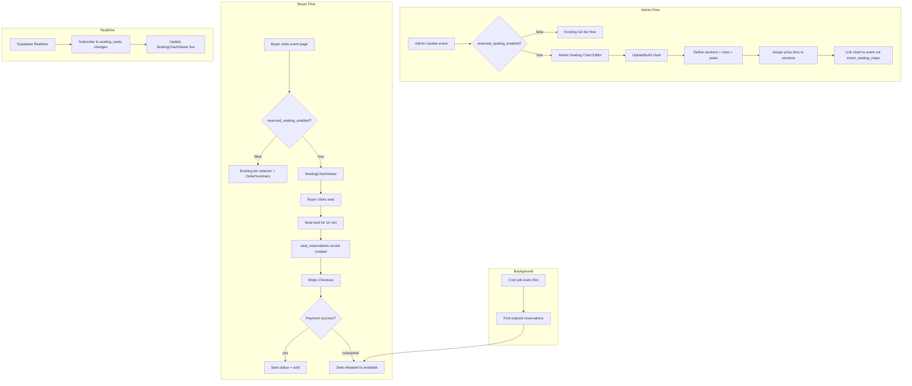
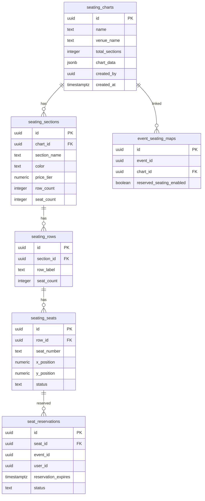
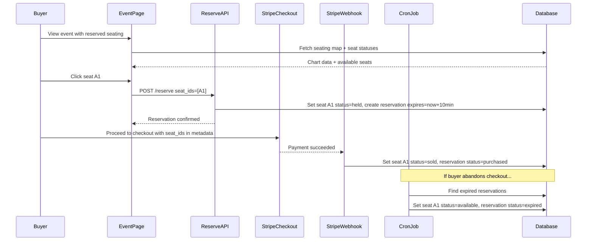

# Reserved Seating Architecture Plan

## Overview

Extend VenueCore's ticketing system to support **optional reserved seating** without disrupting the existing GA ticket flow. Reserved seating activates only when `reserved_seating_enabled` is checked during event creation. Existing events continue to function identically.

---

## System Architecture

---

## Database Schema - New Tables Only

No existing tables are modified. Six new tables are added.

---

## File Changes Summary

### New Files

| File | Purpose |
|------|---------|
| `plans/reserved-seating-migration.sql` | SQL migration for 6 new tables + RLS + indexes |
| `lib/types/seating.ts` | TypeScript types for all seating entities |
| `app/api/seating/charts/route.ts` | CRUD for seating charts |
| `app/api/seating/charts/[id]/route.ts` | GET/PUT/DELETE single chart |
| `app/api/seating/charts/[id]/sections/route.ts` | CRUD sections within a chart |
| `app/api/seating/charts/[id]/generate-seats/route.ts` | Auto-generate rows + seats for a chart |
| `app/api/seating/events/[eventId]/route.ts` | GET seating map + all seats for an event |
| `app/api/seating/events/[eventId]/reserve/route.ts` | POST to hold a seat for 10 min |
| `app/api/seating/events/[eventId]/release/route.ts` | POST to release a held seat |
| `app/api/test-seating/route.ts` | Test endpoint returning all seats + statuses |
| `app/api/cron/release-seats/route.ts` | Background job to expire held seats |
| `app/components/seating/SeatingChartViewer.tsx` | Buyer-facing interactive seating chart |
| `app/components/seating/SeatSelectionMap.tsx` | Seat click/selection handler with cart integration |
| `app/components/seating/AdminSeatingChartEditor.tsx` | Admin chart builder UI |
| `app/admin/seating/page.tsx` | Admin seating management page |

### Modified Files

| File | Change |
|------|--------|
| `app/admin/events/new/page.tsx` | Add `reserved_seating_enabled` checkbox; show chart selector when enabled |
| `app/admin/events/[id]/edit/page.tsx` | Add same checkbox + chart selector to edit form |
| `app/events/[id]/page.tsx` | Conditionally render `SeatingChartViewer` instead of tier selector when reserved seating is enabled |
| `app/api/checkout/route.ts` | Accept `seat_ids` param; hold seats during checkout; pass seat metadata to Stripe |
| `app/api/webhooks/stripe/route.ts` | On payment success, mark reserved seats as sold |
| `lib/types/event.ts` | No change needed - event_seating_maps is a separate table |

---

## Phase Breakdown

### Phase 1: SQL Migration

Create `plans/reserved-seating-migration.sql` with:
- 6 new tables as specified
- `chart_data JSONB` column on `seating_charts` for storing SVG/JSON layout data
- Proper foreign keys with `ON DELETE CASCADE`
- RLS policies following existing pattern from `ticket-tiers-migration.sql`
- Indexes on foreign key columns and status fields
- `venue_id` on `seating_charts` for multi-tenant scoping

### Phase 2: TypeScript Types

Create `lib/types/seating.ts`:
- `SeatingChart`, `SeatingSection`, `SeatingRow`, `SeatingSeat`
- `EventSeatingMap`, `SeatReservation`
- Draft types for the admin editor forms

### Phase 3: API Routes

**Charts CRUD** - `/api/seating/charts`
- GET: list charts for venue
- POST: create new chart

**Chart Detail** - `/api/seating/charts/[id]`
- GET: full chart with sections, rows, seats
- PUT: update chart metadata
- DELETE: remove chart

**Generate Seats** - `/api/seating/charts/[id]/generate-seats`
- POST: given sections with row_count and seat_count, auto-generate `seating_rows` and `seating_seats` with calculated x/y positions

**Event Seating** - `/api/seating/events/[eventId]`
- GET: return the seating map for an event with all seat statuses

**Reserve** - `/api/seating/events/[eventId]/reserve`
- POST `{ seat_ids, user_id }`: set seats to held, create `seat_reservations` with 10-min expiry

**Release** - `/api/seating/events/[eventId]/release`
- POST `{ seat_ids }`: release held seats back to available

### Phase 4: Event Form Updates

In both `app/admin/events/new/page.tsx` and `app/admin/events/[id]/edit/page.tsx`:
- Add `reserved_seating_enabled` checkbox (default false)
- When checked, show a dropdown to select/create a seating chart
- On submit, create `event_seating_maps` record linking event to chart
- Tier builder remains visible - tiers serve as price references for sections

### Phase 5: Admin Seating Chart Editor

`app/admin/seating/page.tsx` + `AdminSeatingChartEditor.tsx`:
- Upload JSON/SVG chart data
- Visual section editor with color coding
- Row and seat auto-generation
- Section-to-price-tier assignment
- Preview mode before publishing

### Phase 6: Buyer Seating Components

`SeatingChartViewer.tsx`:
- Renders the seating chart from `chart_data` JSON
- Color-codes seats by status: available, held, sold
- Supabase realtime subscription on `seating_seats` for live updates

`SeatSelectionMap.tsx`:
- Handles click events on seats
- Calls reserve API on selection
- Manages selected seats state
- Integrates with existing `OrderSummary` component

### Phase 7: Checkout Extension

Modify `app/api/checkout/route.ts`:
- Accept optional `seat_ids[]` parameter
- When present, validate seats are held by this user
- Include seat info in Stripe line items: section name, row, seat number
- Pass `seat_ids` in Stripe session metadata

### Phase 8: Stripe Webhook Update

Modify `app/api/webhooks/stripe/route.ts`:
- After successful payment, check metadata for `seat_ids`
- If present, update `seating_seats.status` to `sold`
- Update `seat_reservations.status` to `purchased`

### Phase 9: Cron Job - Expired Reservations

`app/api/cron/release-seats/route.ts`:
- Runs every 60 seconds via Vercel Cron
- Finds `seat_reservations` where `status = held` AND `reservation_expires < now()`
- Sets `seat_reservations.status` to `expired`
- Sets corresponding `seating_seats.status` back to `available`
- Add cron config to `vercel.json`

### Phase 10: Realtime Subscriptions

In `SeatingChartViewer.tsx`:
- Subscribe to Supabase realtime channel on `seating_seats` table
- Filter by seats belonging to the current event chart
- On INSERT/UPDATE events, update local seat state immediately
- Unsubscribe on component unmount

### Phase 11: Test Endpoint

`app/api/test-seating/route.ts`:
- GET `?event_id=xxx`
- Returns all seats for the event with their current status
- Includes section name, row label, seat number, x/y position

---

## Checkout Flow - Reserved Seating Path

---

## Key Design Decisions

1. **Additive only** - No existing tables or columns modified. The `event_seating_maps` table acts as a bridge.
2. **Chart reuse** - Seating charts are venue-level resources that can be linked to multiple events.
3. **Price from sections** - Each `seating_section` has a `price_tier` that determines the seat price, keeping it decoupled from existing ticket tiers.
4. **10-minute hold** - Standard industry practice; enforced both client-side and via cron cleanup.
5. **Realtime via Supabase** - No polling; uses Supabase Realtime subscriptions for instant seat status updates.
6. **Graceful fallback** - If `reserved_seating_enabled` is false or `event_seating_maps` has no record, the existing GA flow runs unchanged.
