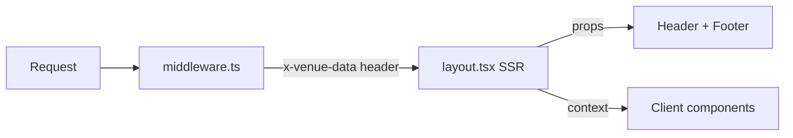

# VenueCore Stability & Revenue Plan

## Root Cause Analysis

### 1. Header Hydration Flicker
- [`VenueThemeProvider.tsx`](app/components/VenueThemeProvider.tsx) is `"use client"` with `useEffect` fetch
- First render uses `defaultTheme` (no logo, no venue name) → fetch completes → re-render with venue data = visible flicker
- [`Header.tsx`](app/components/Header.tsx) and [`Footer.tsx`](app/components/Footer.tsx) both read from this context
- [`middleware.ts`](middleware.ts) already resolves the venue slug but only sets a cookie — doesn't pass data to SSR

### 2. Custom Tenant Color Theming
- CSS vars `--venue-primary/secondary/accent` used in ~80+ places in [`globals.css`](app/styles/globals.css:4133)
- Dynamic `<style>` injection via [`VenueThemeProvider.tsx`](app/components/VenueThemeProvider.tsx:64) causes FOUC
- Color pickers in 4 admin pages: [`settings`](app/admin/settings/page.tsx:218), [`onboarding`](app/admin/onboarding/page.tsx:237), [`venue edit`](app/admin/venues/[id]/edit/page.tsx:166), [`portal`](app/portal/page.tsx:278)
- Per-venue colors are stored in DB but nearly every venue uses the defaults anyway

### 3. Fragile Image Hosting
- 3 separate Supabase buckets: `event-images`, `venue-logos`, `hero-images`
- [`page.tsx`](app/page.tsx:13) has hardcoded **signed URLs with expiring tokens** for default hero images — these will break
- [`upload/route.ts`](app/api/upload/route.ts:36) routes to different buckets by parameter

### 4. No Stripe Settlement Ledger
- [`webhooks/stripe/route.ts`](app/api/webhooks/stripe/route.ts:26) only handles `checkout.session.completed`
- No tracking of: refunds, disputes, payouts, fee breakdowns
- [`checkout/route.ts`](app/api/checkout/route.ts:130) stores fee metadata but webhook ignores it
- No `settlement_ledger` or `stripe_events` table exists

### 5. Tenant Routing Complexity
- [`middleware.ts`](middleware.ts:8) extracts slug → sets cookie
- [`cookies.ts`](lib/cookies.ts:3) reads cookie client-side
- [`VenueThemeProvider.tsx`](app/components/VenueThemeProvider.tsx:41) fetches `/api/venues?slug=` on every page load
- This is 3 hops to get venue data that middleware already knows

---

## Implementation Plan

### Goal 1: Fix Header Hydration/Flicker — Move Venue to SSR

**Strategy:** Resolve venue data in [`middleware.ts`](middleware.ts) and pass it via a request header. Read it in a server component wrapper. No client-side fetch needed.



**Files to change:**
- [`middleware.ts`](middleware.ts) — fetch venue from Supabase, set `x-venue-data` header with JSON
- [`app/layout.tsx`](app/layout.tsx) — read header via `headers()`, pass venue as prop
- [`app/components/VenueThemeProvider.tsx`](app/components/VenueThemeProvider.tsx) — accept `initialVenue` prop instead of fetching
- [`app/components/Header.tsx`](app/components/Header.tsx) — no changes needed if context works
- [`app/components/Footer.tsx`](app/components/Footer.tsx) — no changes needed if context works

**Key detail:** Middleware can cache venue lookups since <50 venues. Use a simple in-memory Map with TTL or just accept the DB hit per request (fast on Supabase edge).

---

### Goal 2: Remove Custom Tenant Color Theming

**Strategy:** Replace all `--venue-primary/secondary/accent` CSS vars with the hardcoded default values. Remove color picker UI. Remove color fields from venue forms. Keep DB columns for now (non-breaking).

**Files to change:**
- [`app/styles/globals.css`](app/styles/globals.css:4133) — replace all `var(--venue-primary)` with `#d0c290`, `var(--venue-secondary)` with `#0b0d1d`, `var(--venue-accent)` with `#202045`. Remove `:root` venue var block.
- [`app/components/VenueThemeProvider.tsx`](app/components/VenueThemeProvider.tsx:64) — remove `themeCSS` state and `<style>` injection, remove color fields from context type
- [`app/admin/settings/page.tsx`](app/admin/settings/page.tsx:218) — remove color picker section
- [`app/admin/onboarding/page.tsx`](app/admin/onboarding/page.tsx:237) — remove color picker section
- [`app/admin/venues/[id]/edit/page.tsx`](app/admin/venues/[id]/edit/page.tsx:166) — remove color picker section
- [`app/portal/page.tsx`](app/portal/page.tsx:278) — remove color picker section
- [`lib/types/venue.ts`](lib/types/venue.ts:17) — make color fields optional (keep for backward compat)
- [`app/admin/offers/[id]/page.tsx`](app/admin/offers/[id]/page.tsx:123) — hardcode PDF colors

---

### Goal 3: Consolidate Image Hosting

**Strategy:** Single public bucket `venuecore-assets` with folder prefixes. Migrate upload route. Replace hardcoded signed URLs with public URLs.

**Files to change:**
- **Supabase:** Create `venuecore-assets` bucket (public). Migrate existing files.
- [`app/api/upload/route.ts`](app/api/upload/route.ts) — single bucket, use folder prefixes: `events/`, `venues/logos/`, `venues/heroes/`
- [`app/page.tsx`](app/page.tsx:13) — replace signed URLs with public bucket URLs for default heroes
- Any admin forms that reference bucket names

**SQL:**
```sql
-- Run in Supabase dashboard
INSERT INTO storage.buckets (id, name, public) 
VALUES ('venuecore-assets', 'venuecore-assets', true)
ON CONFLICT DO NOTHING;
```

---

### Goal 4: Stripe Settlement Ledger + Webhook Reconciliation

**Strategy:** Create a `stripe_events` table for idempotent webhook processing, and a `settlement_ledger` table for fee/payout tracking. Expand webhook handler.

**New tables:**
```sql
CREATE TABLE stripe_events (
  id TEXT PRIMARY KEY,           -- Stripe event ID
  type TEXT NOT NULL,
  processed_at TIMESTAMPTZ DEFAULT now(),
  payload JSONB
);

CREATE TABLE settlement_ledger (
  id UUID PRIMARY KEY DEFAULT gen_random_uuid(),
  order_id UUID REFERENCES orders(id),
  event_id UUID REFERENCES events(id),
  venue_id UUID REFERENCES venues(id),
  stripe_session_id TEXT,
  gross_amount NUMERIC(10,2) NOT NULL,
  ticket_revenue NUMERIC(10,2) NOT NULL,
  ticketing_fee NUMERIC(10,2) NOT NULL DEFAULT 0,
  venue_rebate NUMERIC(10,2) NOT NULL DEFAULT 0,
  tax_collected NUMERIC(10,2) NOT NULL DEFAULT 0,
  stripe_fee NUMERIC(10,2) NOT NULL DEFAULT 0,
  net_to_venue NUMERIC(10,2) NOT NULL DEFAULT 0,
  net_to_platform NUMERIC(10,2) NOT NULL DEFAULT 0,
  type TEXT NOT NULL DEFAULT 'sale',  -- sale, refund, dispute, payout
  created_at TIMESTAMPTZ DEFAULT now()
);

CREATE INDEX idx_ledger_venue ON settlement_ledger(venue_id);
CREATE INDEX idx_ledger_order ON settlement_ledger(order_id);
CREATE INDEX idx_ledger_type ON settlement_ledger(type);
```

**Files to change:**
- [`app/api/webhooks/stripe/route.ts`](app/api/webhooks/stripe/route.ts) — add idempotency check via `stripe_events`, write to `settlement_ledger` on `checkout.session.completed`, handle `charge.refunded` and `charge.dispute.created`
- [`app/api/checkout/route.ts`](app/api/checkout/route.ts:135) — include `venue_id` in session metadata
- [`app/admin/reports/page.tsx`](app/admin/reports/page.tsx) — add settlement summary view (future, not blocking)

---

### Goal 5: Simplify Tenant Routing and Config Schema

**Strategy:** Eliminate the cookie-based venue resolution chain. Middleware sets header, layout reads it. Remove [`lib/cookies.ts`](lib/cookies.ts) usage for venue slug. Simplify `VenueTheme` type.

**Simplified venue config type:**
```typescript
type VenueConfig = {
  id: string;
  name: string;
  slug: string;
  logo_url: string | null;
  hero_image_url: string | null;
  hero_image_2_url: string | null;
  isVenueSubdomain: boolean;
};
```

**Files to change:**
- [`middleware.ts`](middleware.ts) — keep cookie for API routes that need venue context, but add `x-venue-data` header for SSR
- [`app/components/VenueThemeProvider.tsx`](app/components/VenueThemeProvider.tsx) — accept server-resolved venue as prop, no `useEffect` fetch
- [`app/page.tsx`](app/page.tsx:43) — read venue from context instead of `getCookie` + separate fetch
- [`app/events/page.tsx`](app/events/page.tsx) — same pattern
- Remove [`lib/cookies.ts`](lib/cookies.ts) if no longer needed anywhere

---

### Goal 6: Verify No Breakage

**Checklist:**
- Stripe Embedded Checkout flow: [`checkout/route.ts`](app/api/checkout/route.ts) unchanged except metadata addition
- Webhook: backward compatible, new tables are additive
- Admin pages: only color picker UI removed, all other functionality intact
- Public pages: same visual appearance (colors just hardcoded instead of dynamic)
- Subdomain routing: still works, just faster (no client fetch)

---

## Execution Order

1. **Goal 3** — Consolidate images (independent, unblocks hero URL fix)
2. **Goal 2** — Remove color theming (simplifies Goal 1)
3. **Goal 1 + 5** — Fix hydration + simplify routing (coupled changes)
4. **Goal 4** — Settlement ledger (independent, revenue feature)
5. **Goal 6** — Verification pass
