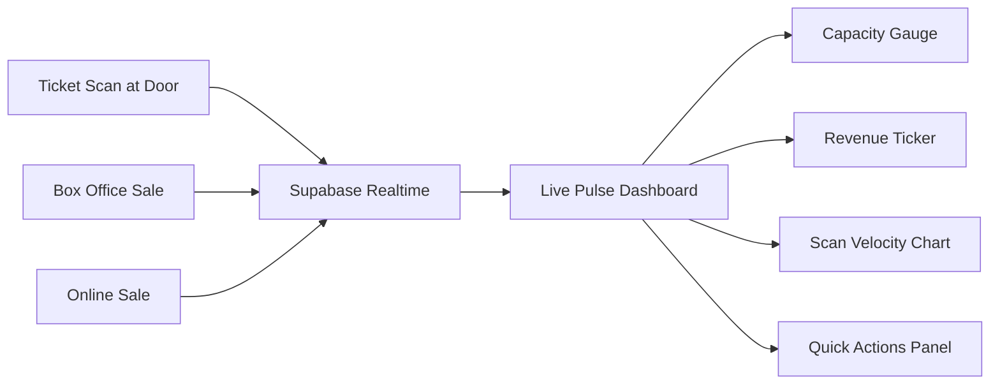
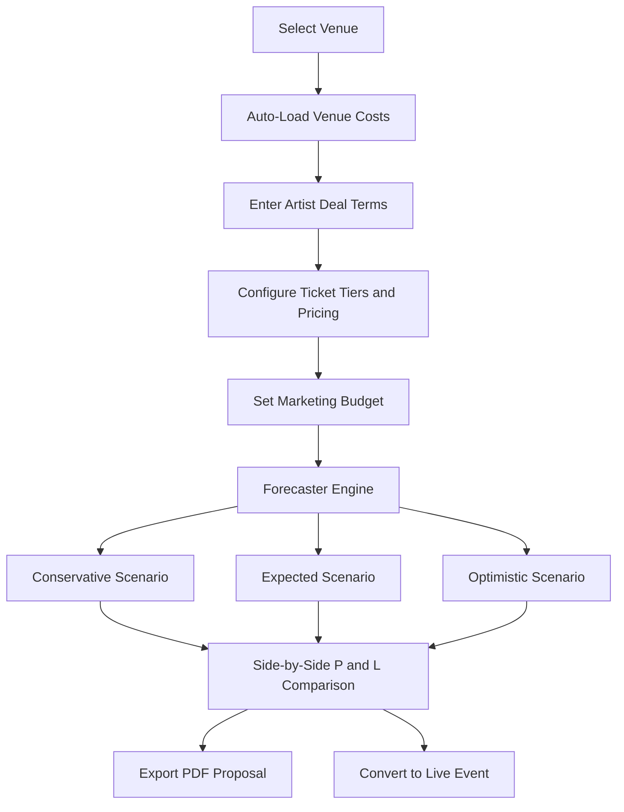
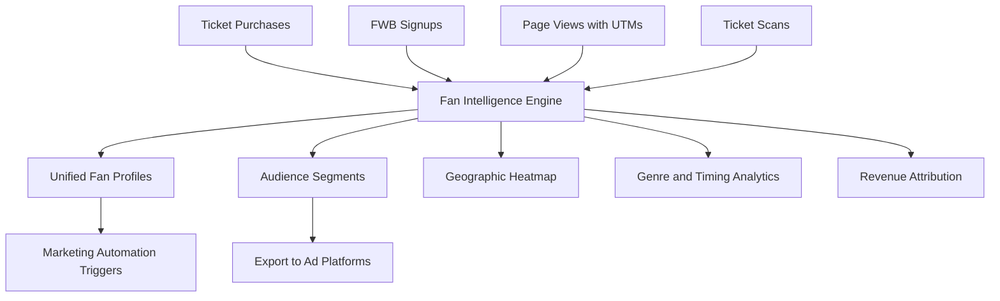

# VenueCore: UI Improvements & High-Value New Features

## Part 1: UI Improvements Identified

### A. Public-Facing / Consumer UI

| # | Area | File(s) | Issue | Recommended Fix |
|---|------|---------|-------|-----------------|
| 1 | **Homepage Hero — Placeholder Partner Logos** | `app/page.tsx:94-98` | Partner logos section still shows emoji placeholders (`Logoipsum`) — looks unfinished and hurts credibility | Replace with real partner logos from Supabase `sponsors` table or hide section until populated |
| 2 | **TicketSelector — Completely Stubbed** | `app/components/TicketSelector.tsx` | Component is a TODO stub with "awaiting design" text — dead code that could accidentally render | Either delete (already replaced by inline selector in event detail) or implement properly |
| 3 | **Checkout — Heavy Inline Styles** | `app/checkout/page.tsx:163-243` | Promo code section uses 40+ lines of inline `style={{}}` objects instead of CSS classes | Refactor to use CSS classes matching the project's BEM-like pattern in `globals.css` |
| 4 | **Event Detail — No Loading Skeleton** | `app/events/[id]/page.tsx:244-249` | Loading state is a plain text "Loading event..." with no visual skeleton | Add shimmer/skeleton placeholders for the hero image, title, and ticket selector areas |
| 5 | **Event Cards — No "Sold Out" Indicator** | `app/components/EventCard.tsx` | Cards show price but never indicate if an event is sold out — users click through only to be disappointed | Add a sold-out badge overlay when `quantity_sold >= quantity_available` |
| 6 | **Events List — No Pagination or Lazy Loading** | `app/events/page.tsx` | All events fetched and rendered in one shot — will degrade as event count grows | Add infinite scroll or "Load More" pagination |
| 7 | **Homepage — No "Past Events" Filter** | `app/page.tsx:44-52` | Search only filters by title/venue — no way to toggle between upcoming vs. past shows | Add a date-based toggle (Upcoming / Past) to the search bar |
| 8 | **Mobile Nav — No Close on Outside Click** | `app/components/Header.tsx` | Hamburger menu only closes on link click, not on tapping outside the nav overlay | Add an overlay backdrop with click-to-close |
| 9 | **Footer — Generic Social Links** | `app/components/Footer.tsx:25-29` | Social links point to generic `instagram.com` / `facebook.com` — not actual venue pages | Pull social URLs from venue settings or make them configurable per venue |
| 10 | **Order Summary — Dollar Sign Spacing** | `app/components/OrderSummary.tsx:75` | Currency formatted as `$ 25.00` (space after $) instead of standard `$25.00` | Remove the space: `$${subtotal.toFixed(2)}` |
| 11 | **Checkout — No Order Summary Recap** | `app/checkout/page.tsx` | Buyer enters info but sees no recap of what they're buying (event name, qty, price) before payment | Add a mini order summary card above the buyer info form |
| 12 | **Event Detail — Duplicate Artist Sections** | `app/events/[id]/page.tsx:357-485` | "Featured Artists" section AND "Performing" section can both render for the same event, showing overlapping data | Consolidate into a single artist section with a unified design |
| 13 | **EventBadges — Hardcoded Doors Time** | `app/components/EventBadges.tsx:24` | Doors time is always calculated as 1 hour before show — not configurable per event | Add a `doors_time` field to events or make the offset venue-configurable |

### B. Admin / Back-Office UI

| # | Area | File(s) | Issue | Recommended Fix |
|---|------|---------|-------|-----------------|
| 14 | **Private Events — Raw Inline Styles** | `app/admin/private-events/page.tsx:65-76` | Entire page uses inline style objects instead of the admin CSS class system | Refactor to use `admin-form-page`, `admin-page-header`, etc. classes for consistency |
| 15 | **Admin Dashboard — Duplicated KPI Markup** | `app/admin/page.tsx:226-400` | Artist dashboard and Admin dashboard duplicate ~170 lines of identical KPI card markup | Extract shared KPI grid into a reusable `<DashboardKPIGrid>` component |
| 16 | **Sidebar — 18 Items, No Grouping** | `app/admin/layout.tsx:18-38` | Sidebar is a flat list of 18+ items — hard to scan, especially on smaller screens | Group items under collapsible sections: Operations, Finance, Marketing, Settings |
| 17 | **Sales Page — N+1 Fetches** | `app/admin/orders/page.tsx:81-100` | For each event, fires 3 separate API calls (tiers, drop-count, ticket count) — scales terribly | Create a single `/api/admin/sales-summary` endpoint that returns enriched data |
| 18 | **Reports — No PDF for 3 of 4 Reports** | `app/admin/reports/page.tsx:20-57` | Only Ticket Audit has PDF export; Monthly Revenue, Expenses, and Orders are CSV-only | Add PDF generation for remaining report types |
| 19 | **Calendar — 980-Line Monolith** | `app/admin/calendar/page.tsx` | Single file is nearly 1,000 lines mixing calendar grid, event forms, and drag-drop logic | Split into `CalendarGrid`, `CalendarEventForm`, `CalendarDayCell` sub-components |
| 20 | **Guest Lists — 989-Line Monolith** | `app/admin/guest-lists/page.tsx` | Same problem — nearly 1,000 lines in one component | Extract into `GuestListTable`, `GuestListForm`, `GuestListPDFExport` |
| 21 | **Market Radar — `any` Types** | `modules/market-radar/dashboard/MarketRadarPage.tsx:41-44` | Uses `any[]` for clusters and competitions — defeats TypeScript safety | Define proper interfaces for `RoutingCluster` and `CompetitionEntry` |

### C. Cross-Cutting Concerns

| # | Area | Issue | Recommended Fix |
|---|------|-------|-----------------|
| 22 | **Duplicated `safeDate()` Helper** | The same date-parsing function is copy-pasted in 7+ files | Extract to `lib/dates.ts` and import everywhere |
| 23 | **No Global Error Boundary** | Unhandled errors crash the whole app with a white screen | Add a React Error Boundary in `layout.tsx` with a branded fallback UI |
| 24 | **No Toast/Notification System** | Success/error messages are scattered as inline `
` tags with inline styles | Implement a lightweight toast system (or adopt `sonner`/`react-hot-toast`) |
| 25 | **No Accessibility Audit** | Many interactive elements lack proper ARIA labels, focus states, and keyboard navigation | Run axe-core audit and fix critical a11y violations |

---

## Part 2: Three New Features to Skyrocket Value

### Feature 1: **Live Show Pulse — Real-Time Event Command Center**

**What it is:** A real-time dashboard that concert promoters and venue managers open on show day. It combines live ticket scanning velocity, door flow rates, capacity utilization, and revenue in a single, auto-updating view — think "mission control for live events."

**Why it skyrockets value:**
- Promoters currently have to piece together data from scanning, sales, and settlement pages separately
- No existing view shows *real-time* data — everything is post-hoc
- Competing platforms (Eventbrite, AXS) charge premium tiers for real-time analytics

**Key capabilities:**
- Live headcount: scanned-in vs. tickets sold vs. capacity — animated gauge
- Revenue ticker: real-time gross/net as walk-up and box office sales come in
- Scan velocity heatmap: tickets scanned per minute, with alerts for bottleneck detection at doors
- Walk-up conversion rate: how many box office page loads convert to purchases
- Quick-action buttons: pause sales, release held tickets, push a notification to FWB members
- Mobile-optimized so promoters can check from backstage on their phone

**Implementation scope:**
- New page: `/admin/live/[eventId]`
- Supabase Realtime subscriptions on `tickets` and `ticket_scans` tables
- New API endpoint: `/api/admin/live-pulse` aggregating real-time metrics
- WebSocket or SSE for push updates (Supabase Realtime channels)
- Responsive dashboard layout with animated KPI cards and a timeline chart

---

### Feature 2: **Profitability Forecaster — AI-Powered Show Economics Simulator**

**What it is:** A financial modeling tool that lets promoters simulate different pricing strategies, marketing spend scenarios, and deal structures *before* they confirm a show. Input your artist guarantee, ticket tiers, projected sell-through, and marketing budget — get a projected P&L with break-even analysis and scenario comparison.

**Why it skyrockets value:**
- Promoters currently do this in spreadsheets — disconnected from actual venue costs, fees, and historical data
- VenueCore already has settlement data, venue fees, tax rates, and historical sell-through — this feature makes that data *actionable before the show happens*
- Turns VenueCore from a "ticketing tool" into a "business decision platform" — massive stickiness
- No competitor in the small/mid venue space offers this

**Key capabilities:**
- Pre-built templates pulling real venue costs (facility fee, tax rate, ticketing fee, Stripe fees)
- Scenario comparison: side-by-side "Conservative / Expected / Optimistic" projections
- Historical benchmarking: auto-suggest sell-through rates based on similar past events at the venue
- Break-even calculator: "You need to sell X tickets to cover the guarantee"
- Deal structure simulator: flat guarantee vs. door deal vs. hybrid split — see the difference
- Export to PDF proposal for artist/agent negotiations (builds on existing `proposal-pdf.ts`)

**Implementation scope:**
- New page: `/admin/forecaster` with sub-routes for `/new` and `/[id]`
- New DB table: `show_forecasts` storing scenario parameters and results
- Calculation engine in `lib/forecaster/` using existing venue fee/tax data
- Integration with existing settlement and offer systems for data seeding
- Chart.js or Recharts for visual P&L waterfall chart

---

### Feature 3: **Fan Intelligence Hub — Audience Analytics & Segmentation Engine**

**What it is:** A unified audience analytics platform that aggregates data from ticket purchases, FWB signups, newsletter engagement, event page views, and scan history into rich fan profiles. Enables promoters to segment their audience and answer questions like "Who are my repeat buyers?", "Which zip codes drive the most revenue?", and "What genre sells best on Thursday nights?"

**Why it skyrockets value:**
- Promoters are *desperate* for audience data but typically only get a CSV of email addresses
- VenueCore already captures buyer name, email, phone, page views with UTM tracking, FWB opt-ins, and scan data — but none of it is surfaced in a unified view
- This turns every ticket sale into an intelligence asset
- Enables data-driven booking decisions ("Country shows outsell hip-hop 3:1 at this venue")
- Directly feeds the existing marketing automation and email campaign tools

**Key capabilities:**
- **Fan Profiles:** Unified view per customer — purchase history, total spend, events attended, FWB status, engagement score
- **Audience Segments:** Pre-built segments (VIPs/top spenders, one-time buyers, lapsed fans, genre-loyal) plus custom segment builder
- **Geographic Heatmap:** Where fans are coming from, overlaid on a map — critical for marketing spend decisions
- **Genre/Day-of-Week Analytics:** Which show types perform best on which nights
- **Repeat Rate Dashboard:** What percentage of buyers come back, and how often
- **Lookalike Export:** Export segments to Facebook/Instagram custom audiences for targeted ad campaigns
- **Revenue Attribution:** Which marketing channel (UTM source) drives the most ticket revenue

**Implementation scope:**
- New admin section: `/admin/fan-intelligence` with sub-pages for profiles, segments, geo, and attribution
- New DB views/materialized views aggregating `orders`, `tickets`, `newsletter_subscribers`, `event_page_views`, `ticket_scans`
- Fan profile API: `/api/admin/fans/[email]` returning unified profile
- Segment builder API: `/api/admin/segments` with filter criteria
- Mapbox or Google Maps integration for geographic visualization
- CSV/JSON export for ad platform integration

---

## Summary: Priority Matrix

| Initiative | Impact | Scope |
|-----------|--------|-------|
| UI Fixes (Items 1-25) | Medium — polish and credibility | Small-Medium per item |
| **Feature 1: Live Show Pulse** | High — solves show-day chaos | Medium |
| **Feature 2: Profitability Forecaster** | Very High — changes buying decisions | Medium-Large |
| **Feature 3: Fan Intelligence Hub** | Very High — long-term strategic moat | Large |
