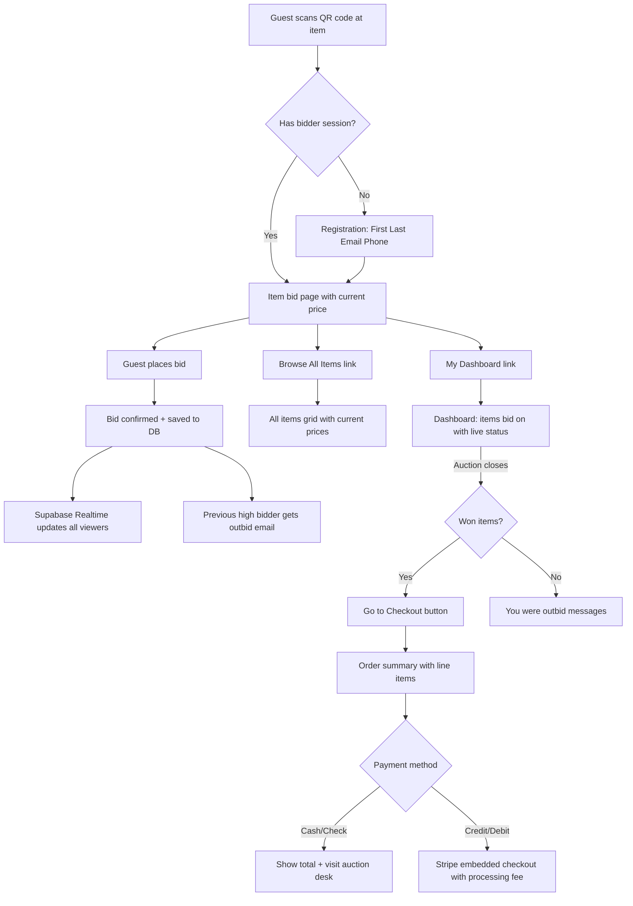
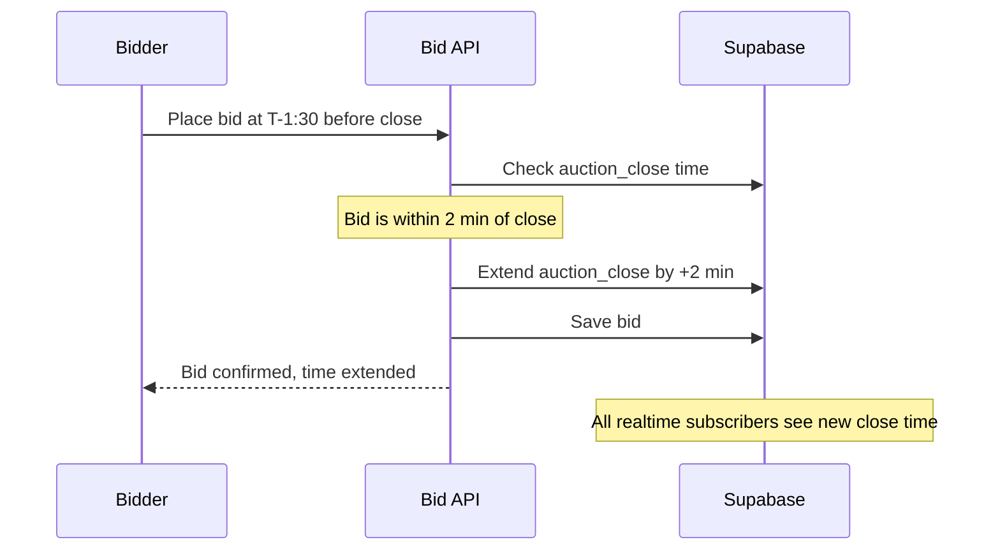

# VC Auction — Feature Plan

## Decisions Summary

| Decision | Answer |
|---|---|
| Feature gating | Boolean flag on venue (`auction_enabled`) |
| Auction type | Silent auction only ("live" = real-time updates) |
| Event relationship | Optionally linkable to an event, also standalone |
| Stripe routing | Single platform Stripe account, settle with organizer later |
| Host fee | Configurable percentage per auction with a platform default |
| Processing fee | Passed to guest, visible line item at checkout |
| Logo | Separate auction-specific logo upload per auction |
| Reserve prices | Yes, hidden minimum — item unsold if not met |
| Anti-sniping | +2 min auto-extend if bid in final 2 min |
| Outbid notifications | Email via Resend in v1 |
| Browse all items | Yes, guests can see all items not just their bids |
| Item quantity | Single winner per item only |

---

## Database Schema

### New Tables

```sql
-- Feature flag on venues
ALTER TABLE venues ADD COLUMN auction_enabled BOOLEAN DEFAULT false;

-- Core auction table
CREATE TABLE auctions (
  id UUID PRIMARY KEY DEFAULT gen_random_uuid(),
  venue_id UUID REFERENCES venues(id),
  event_id UUID REFERENCES events(id),  -- nullable, optional link
  name TEXT NOT NULL,
  description TEXT,
  logo_url TEXT,                          -- auction-specific logo
  auction_open TIMESTAMPTZ NOT NULL,
  auction_close TIMESTAMPTZ NOT NULL,
  status TEXT NOT NULL DEFAULT 'draft',   -- draft, published, open, closed, settled
  anti_snipe_enabled BOOLEAN DEFAULT true,
  anti_snipe_minutes INTEGER DEFAULT 2,
  host_fee_percent NUMERIC(5,2) DEFAULT 8.00,
  created_at TIMESTAMPTZ DEFAULT now()
);

-- Auction items
CREATE TABLE auction_items (
  id UUID PRIMARY KEY DEFAULT gen_random_uuid(),
  auction_id UUID REFERENCES auctions(id) ON DELETE CASCADE,
  name TEXT NOT NULL,
  starting_bid NUMERIC(10,2) NOT NULL,
  min_increment NUMERIC(10,2) NOT NULL,
  reserve_price NUMERIC(10,2),           -- hidden minimum, nullable
  current_bid NUMERIC(10,2),             -- denormalized for perf
  current_winner_id UUID,                -- denormalized for perf
  qr_code TEXT,                          -- unique code for QR generation
  sort_order INTEGER DEFAULT 0,
  created_at TIMESTAMPTZ DEFAULT now()
);

-- Bidder registration (no auth required, just contact info)
CREATE TABLE auction_bidders (
  id UUID PRIMARY KEY DEFAULT gen_random_uuid(),
  auction_id UUID REFERENCES auctions(id) ON DELETE CASCADE,
  first_name TEXT NOT NULL,
  last_name TEXT NOT NULL,
  email TEXT NOT NULL,
  phone TEXT NOT NULL,
  created_at TIMESTAMPTZ DEFAULT now(),
  UNIQUE(auction_id, email)              -- one bidder record per email per auction
);

-- Individual bids
CREATE TABLE auction_bids (
  id UUID PRIMARY KEY DEFAULT gen_random_uuid(),
  item_id UUID REFERENCES auction_items(id) ON DELETE CASCADE,
  bidder_id UUID REFERENCES auction_bidders(id),
  amount NUMERIC(10,2) NOT NULL,
  created_at TIMESTAMPTZ DEFAULT now()
);

-- Post-auction orders/checkout
CREATE TABLE auction_orders (
  id UUID PRIMARY KEY DEFAULT gen_random_uuid(),
  auction_id UUID REFERENCES auctions(id),
  bidder_id UUID REFERENCES auction_bidders(id),
  total_amount NUMERIC(10,2) NOT NULL,      -- sum of winning items
  processing_fee NUMERIC(10,2) DEFAULT 0,   -- Stripe fee passed to guest
  grand_total NUMERIC(10,2) NOT NULL,        -- total + processing fee
  payment_method TEXT,                        -- cash, check, credit_debit
  stripe_payment_intent_id TEXT,
  stripe_transaction_id TEXT,
  status TEXT DEFAULT 'pending',              -- pending, paid, failed
  created_at TIMESTAMPTZ DEFAULT now()
);

-- Line items for what was won
CREATE TABLE auction_order_items (
  id UUID PRIMARY KEY DEFAULT gen_random_uuid(),
  order_id UUID REFERENCES auction_orders(id) ON DELETE CASCADE,
  item_id UUID REFERENCES auction_items(id),
  winning_price NUMERIC(10,2) NOT NULL
);
```

### Indexes

```sql
CREATE INDEX idx_auction_items_auction ON auction_items(auction_id);
CREATE INDEX idx_auction_bids_item ON auction_bids(item_id);
CREATE INDEX idx_auction_bids_bidder ON auction_bids(bidder_id);
CREATE INDEX idx_auction_bidders_auction ON auction_bidders(auction_id);
CREATE INDEX idx_auction_bidders_email ON auction_bidders(auction_id, email);
CREATE INDEX idx_auction_orders_bidder ON auction_orders(bidder_id);
CREATE INDEX idx_auction_orders_auction ON auction_orders(auction_id);
```

### Realtime Subscriptions

Enable Supabase Realtime on:
- `auction_items` (for current_bid / current_winner_id updates)
- `auction_bids` (for bid feed on guest dashboard)

---

## Route Structure

### Guest-Facing Routes

| Route | Purpose |
|---|---|
| `/auction/[auctionId]` | Auction landing — browse all items, auction info |
| `/auction/[auctionId]/items/[itemId]` | Single item bid page (QR code lands here) |
| `/auction/[auctionId]/register` | Bidder registration (name, email, phone) |
| `/auction/[auctionId]/dashboard` | Guest dashboard — items bid on, live updates |
| `/auction/[auctionId]/checkout` | Post-auction checkout — order summary + payment |

### Admin Routes

| Route | Purpose |
|---|---|
| `/admin/auctions` | Auction list (create new) |
| `/admin/auctions/new` | Create auction form |
| `/admin/auctions/[id]/edit` | Edit auction + manage items |
| `/admin/auctions/[id]/reports` | Auction reports |

### API Routes

| Route | Method | Purpose |
|---|---|---|
| `/api/auctions` | GET/POST | List/create auctions |
| `/api/auctions/[id]` | GET/PUT/DELETE | Single auction CRUD |
| `/api/auctions/[id]/items` | GET/POST | List/create items |
| `/api/auctions/[id]/items/[itemId]` | PUT/DELETE | Edit/delete item |
| `/api/auctions/[id]/bid` | POST | Place a bid |
| `/api/auctions/[id]/register` | POST | Register bidder |
| `/api/auctions/[id]/checkout` | POST | Create checkout session |
| `/api/auctions/[id]/reports` | GET | Generate reports |
| `/api/auctions/[id]/qr-codes` | GET | Generate printable QR codes PDF |

---

## Guest Flow



---

## Anti-Sniping Logic



---

## QR Code Print Layout

Each printed QR code card contains:
1. **Top**: Auction Name, Item Name, Starting Bid price
2. **Center**: QR Code (links to `/auction/[auctionId]/items/[itemId]`)
3. **Below QR**: "Use your phone to scan the code and place your bid"
4. **Bottom fine print**: "Powered by VenueCore" with VenueCore logo

Print layout: multiple cards per page (2x3 grid on letter size), generated as PDF via jspdf.

---

## Reports

| Report | When Available | Contents | Sort |
|---|---|---|---|
| Item Report | Anytime | All items, starting bids, min increments, reserve prices | Sort order |
| All Bidders Report | After close | Last Name, First Name, Email, Phone | Alpha by last name |
| Winning Bidders Report | After close | Last, First, Email, Phone, Item Won, Winning Price, Total Due/Paid, Payment Method | Alpha by last name |
| Paid by CC Report | After close | Last, First, Email, Phone, Transaction Timestamp, Transaction ID, Amount Paid | Alpha by last name |
| Gross Receipts Report | After close | All items, total bids per item, starting bid, winning price, summary total | Sort order |

All reports exportable as PDF with naming: `orgname_auctiondate_reportname.pdf`

---

## Key UX Details

### Mobile-First Guest Experience
- Item cards same size as event cards on ticketing mobile UI
- Large tap targets for bid buttons
- Quick-bid button: +minimum increment with one tap
- Custom amount input for larger bids
- Bid confirmation modal before placing
- 2:00 countdown timer + progress bar on item cards near close
- "You are the highest bidder" / "Sarah H. outbid you...keep bidding?" messaging
- Bidder session persisted in localStorage (no re-entry of info per item)

### Organizer Admin Experience
- Auction card with edit button on auction list
- Item management with + New Item button, item counter in top right
- Enter key moves to next field (not submit)
- Print QR Codes button generates PDF of all item QR codes
- Auction status badges (draft/published/open/closed/settled)
- Reports tab with export buttons

### Post-Auction Checkout
- Order summary: line items of all won items + winning prices
- Payment method selector: Cash, Check, Credit/Debit
- Cash/Check: show total, instruct to visit auction desk
- Credit/Debit: Stripe embedded checkout with visible processing fee line item
- Congratulations/outbid messaging on item cards after close
- Reserve not met items show "Reserve not met — item unsold"
