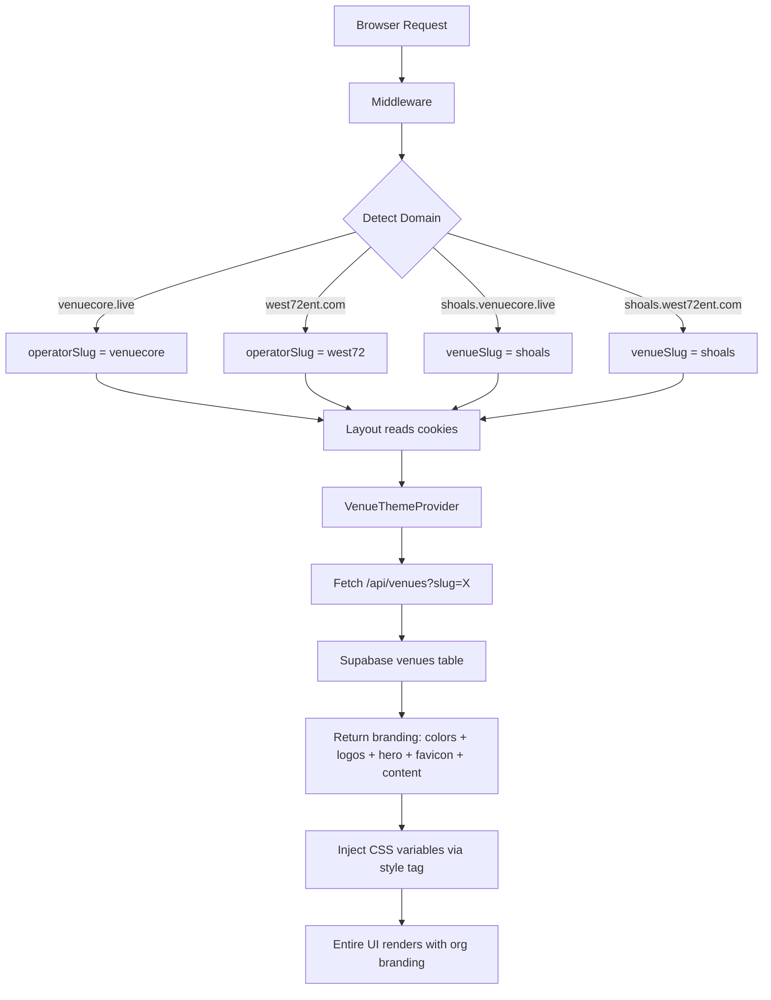

# Multi-Tenant White-Label Website System — Architecture Plan

## Overview

Every venue, promoter, or organizer on VenueCore gets their own fully-branded public website powered by the same codebase. Visitors to `shoals.venuecore.live` see the Shoals brand; visitors to `west72ent.com` see West72's brand. Admins configure everything — colors, logos, hero images, content — through the admin panel.

---

## Current State Assessment

### What Already Exists

| Layer | Status | What's there |
|-------|--------|-------------|
| Domain routing | Working | `middleware.ts` detects `operatorSlug` + `venueSlug` from hostname |
| Operator config | Working | `lib/operators.ts` — hardcoded config for VenueCore + West72 |
| Venue context | Working | `VenueContext.tsx` provides `venueSlug` + `isVenueSubdomain` |
| Venue theme | Partial | `VenueThemeProvider.tsx` fetches venue name, logo, hero images |
| CSS variables | Partial | `--venue-primary`, `--venue-secondary`, `--venue-accent` defined in `:root` but NOT dynamically set from DB |
| Database columns | Partial | `venues` table has `primary_color`, `secondary_color`, `logo_url`, `hero_image_url`, `hero_image_2_url` |
| Admin color picker | Missing | No UI for admins to change colors |
| Favicon per org | Missing | Favicon is per-operator, not per-venue |
| Homepage content | Missing | No CMS — homepage content is hardcoded |

### The Gap

The CSS variable system (`--venue-primary` etc.) exists with 60+ overrides in `globals.css`, but the variables are **never dynamically set from the database**. They're hardcoded to `#d0c290` in `:root`. The `VenueThemeProvider` fetches venue data but only extracts `name`, `logo_url`, and `hero_image_url` — it ignores the color columns.

---

## Proposed Architecture



---

## 1. Database Schema

### Extend `venues` table

```sql
-- New branding columns
ALTER TABLE venues ADD COLUMN IF NOT EXISTS accent_color TEXT DEFAULT '#202045';
ALTER TABLE venues ADD COLUMN IF NOT EXISTS favicon_url TEXT;
ALTER TABLE venues ADD COLUMN IF NOT EXISTS tagline TEXT;
ALTER TABLE venues ADD COLUMN IF NOT EXISTS footer_description TEXT;
ALTER TABLE venues ADD COLUMN IF NOT EXISTS support_email TEXT;
ALTER TABLE venues ADD COLUMN IF NOT EXISTS contact_email TEXT;
ALTER TABLE venues ADD COLUMN IF NOT EXISTS instagram_url TEXT;
ALTER TABLE venues ADD COLUMN IF NOT EXISTS facebook_url TEXT;
ALTER TABLE venues ADD COLUMN IF NOT EXISTS website_url TEXT;

-- Homepage content
ALTER TABLE venues ADD COLUMN IF NOT EXISTS homepage_headline TEXT;
ALTER TABLE venues ADD COLUMN IF NOT EXISTS homepage_subheadline TEXT;
ALTER TABLE venues ADD COLUMN IF NOT EXISTS homepage_cta_text TEXT DEFAULT 'See Whats Coming';
ALTER TABLE venues ADD COLUMN IF NOT EXISTS homepage_cta_url TEXT DEFAULT '/events';
ALTER TABLE venues ADD COLUMN IF NOT EXISTS about_headline TEXT;
ALTER TABLE venues ADD COLUMN IF NOT EXISTS about_description TEXT;
ALTER TABLE venues ADD COLUMN IF NOT EXISTS about_image_url TEXT;

-- Feature cards on about page
ALTER TABLE venues ADD COLUMN IF NOT EXISTS about_features JSONB DEFAULT '[]';
-- Each feature: { title: string, description: string, icon: string }
```

### Full venue branding columns after migration

```
venues
├── id UUID PK
├── name TEXT
├── slug TEXT UNIQUE
├── nickname TEXT
├── capacity INT
├── address_street TEXT
├── address_city TEXT
├── address_state TEXT
├── address_zip TEXT
├── logo_url TEXT              ← uploaded logo
├── favicon_url TEXT           ← uploaded favicon (NEW)
├── hero_image_url TEXT        ← homepage hero
├── hero_image_2_url TEXT      ← secondary hero
├── primary_color TEXT         ← admin-configurable (EXISTS)
├── secondary_color TEXT       ← admin-configurable (EXISTS)
├── accent_color TEXT          ← admin-configurable (NEW)
├── tagline TEXT               ← site tagline (NEW)
├── footer_description TEXT    ← footer blurb (NEW)
├── support_email TEXT         ← (NEW)
├── contact_email TEXT         ← (NEW)
├── instagram_url TEXT         ← (NEW — separate from social table)
├── facebook_url TEXT          ← (NEW)
├── website_url TEXT           ← (NEW)
├── homepage_headline TEXT     ← (NEW)
├── homepage_subheadline TEXT  ← (NEW)
├── homepage_cta_text TEXT     ← (NEW)
├── homepage_cta_url TEXT      ← (NEW)
├── about_headline TEXT        ← (NEW)
├── about_description TEXT     ← (NEW)
├── about_image_url TEXT       ← (NEW)
├── about_features JSONB       ← (NEW)
├── buyer_name TEXT
├── buyer_phone TEXT
├── buyer_email TEXT
├── promoter_address TEXT
├── ticketing_fee NUMERIC
├── facility_fee NUMERIC
├── tax_rate NUMERIC
├── venue_rebate NUMERIC
└── created_at TIMESTAMPTZ
```

---

## 2. Theme System Architecture

### Theme Injection Flow

```mermaid
graph LR
    A[VenueThemeProvider] -->|fetches| B[/api/venues?slug=X]
    B -->|returns| C[Venue branding data]
    C -->|sets| D[CSS variables on document.body]
    C -->|provides| E[React context for components]
    D -->|cascades to| F[All CSS using var --venue-primary etc.]
    E -->|consumed by| G[Header, Footer, HomePage, About]
```

### Enhanced VenueThemeProvider

The existing `VenueThemeProvider` needs to:

1. Fetch the **full** venue record (not just name/logo/hero)
2. Set CSS custom properties on `document.documentElement` dynamically
3. Provide all branding data via React context

```typescript
// What the enhanced VenueTheme type looks like
type VenueTheme = {
  // Identity
  name: string;
  slug: string;
  isVenueSubdomain: boolean;

  // Visual branding
  logo_url: string | null;
  favicon_url: string | null;
  hero_image_url: string | null;
  hero_image_2_url: string | null;
  primary_color: string;     // e.g. '#d0c290'
  secondary_color: string;   // e.g. '#111827'
  accent_color: string;      // e.g. '#202045'

  // Contact/social
  tagline: string | null;
  footer_description: string | null;
  support_email: string | null;
  contact_email: string | null;
  instagram_url: string | null;
  facebook_url: string | null;

  // Homepage content
  homepage_headline: string | null;
  homepage_subheadline: string | null;
  homepage_cta_text: string;
  homepage_cta_url: string;

  // About page content
  about_headline: string | null;
  about_description: string | null;
  about_image_url: string | null;
  about_features: Array<{
    title: string;
    description: string;
    icon: string;
  }>;
};
```

### CSS Variable Injection

When the VenueThemeProvider loads venue data, it sets CSS variables on the root element:

```typescript
useEffect(() => {
  if (!theme.isVenueSubdomain) return;
  const root = document.documentElement;
  root.style.setProperty('--venue-primary', theme.primary_color);
  root.style.setProperty('--venue-secondary', theme.secondary_color);
  root.style.setProperty('--venue-accent', theme.accent_color);
}, [theme]);
```

This is the **missing link** — the 60+ CSS overrides in `globals.css` that reference `var(--venue-primary)` will immediately work once the variables are dynamically set.

### Operator-Level Defaults

The `lib/operators.ts` config provides **fallback defaults** when no venue is detected:
- `venuecore.live` root → uses VenueCore defaults
- `west72ent.com` root → uses West72 defaults
- `shoals.venuecore.live` → fetches Shoals venue branding from DB

---

## 3. Admin Branding Panel

### New Admin Page: `/admin/settings/branding`

Layout of the branding admin:

```
+--[ Branding Settings ]--------------------------------------+
|                                                              |
|  COLORS                                                      |
|  ┌──────────┐  ┌──────────┐  ┌──────────┐                   |
|  │ Primary  │  │Secondary │  │ Accent   │                   |
|  │ [picker] │  │ [picker] │  │ [picker] │                   |
|  │ #d0c290  │  │ #111827  │  │ #202045  │                   |
|  └──────────┘  └──────────┘  └──────────┘                   |
|                                                              |
|  LOGOS & IMAGES                                              |
|  ┌────────────────┐  ┌────────────────┐                     |
|  │ Logo           │  │ Favicon        │                     |
|  │ [upload zone]  │  │ [upload zone]  │                     |
|  └────────────────┘  └────────────────┘                     |
|  ┌────────────────┐  ┌────────────────┐                     |
|  │ Hero Image     │  │ Secondary Hero │                     |
|  │ [upload zone]  │  │ [upload zone]  │                     |
|  └────────────────┘  └────────────────┘                     |
|                                                              |
|  HOMEPAGE CONTENT                                            |
|  Headline:     [________________________]                    |
|  Subheadline:  [________________________]                    |
|  CTA Text:     [________________________]                    |
|  CTA Link:     [________________________]                    |
|                                                              |
|  CONTACT & SOCIAL                                            |
|  Tagline:           [________________________]               |
|  Support Email:     [________________________]               |
|  Contact Email:     [________________________]               |
|  Instagram URL:     [________________________]               |
|  Facebook URL:      [________________________]               |
|                                                              |
|  LIVE PREVIEW                                                |
|  ┌──────────────────────────────────────────┐               |
|  │  Mini preview of how the site will look  │               |
|  │  with the selected colors + logo         │               |
|  └──────────────────────────────────────────┘               |
|                                                              |
|  [ Save Changes ]                                            |
+--------------------------------------------------------------+
```

### Color Picker Component

A simple HTML5 `<input type="color">` with a hex text input beside it. The live preview updates in real-time as colors change.

### Image Upload

Uses the existing `/api/upload` route to upload to Supabase Storage. Returns a public URL that gets saved to the venue record.

---

## 4. How Branding Values Flow Through the UI

### Public-Facing Pages

| Page | What's branded |
|------|---------------|
| Homepage | Hero image, headline, subheadline, CTA text, primary color accents |
| Events list | Primary color on hover states, badges |
| Event detail | Ticket selection accent color, sponsor heading |
| Checkout | Embed section border color |
| About | Headline, description, feature cards, image |
| Contact | Email addresses, social links |
| Footer | Logo, description, social links, column headings |
| Header | Logo |
| Tickets | Primary color on QR card, event name |

### Admin Pages

| Element | What's branded |
|---------|---------------|
| Sidebar | Active link color, venue name color |
| Page titles | Primary color |
| Buttons | Primary color background/border |
| KPI cards | Primary color borders and values |
| Form submit buttons | Primary color |
| Report tabs | Active tab primary color |

All of these already use `var(--venue-primary)` in the CSS. The only missing piece is **dynamically setting the variable from the database**.

---

## 5. Favicon Per Organization

### Current System

The favicon route (`/api/favicon`) reads the operator slug from the hostname and serves the operator-level favicon.

### Enhanced System

When on a venue subdomain, the favicon route should check:
1. Does the venue have a `favicon_url`? → serve that
2. No? → fall back to the operator's favicon

Update the `/api/favicon/route.ts` to also accept a `venueSlug` cookie and query the venue's `favicon_url`.

---

## 6. How It Scales to Hundreds of Venues

### One Codebase, One Deployment

Every venue gets a subdomain: `{slug}.venuecore.live` or `{slug}.west72ent.com`

Vercel handles wildcard subdomains natively — one deployment serves all of them.

### Per-Request Branding

No build step needed per venue. Branding is fetched at runtime:
1. Middleware sets `venueSlug` cookie
2. `VenueThemeProvider` fetches venue data client-side
3. CSS variables are set on the DOM
4. Everything renders branded

### Caching Strategy

Venue branding data rarely changes. Cache aggressively:
- API response: `Cache-Control: public, max-age=300, stale-while-revalidate=3600`
- Client-side: `VenueThemeProvider` stores in `sessionStorage` to avoid refetch on navigation
- When admin saves branding changes, bust the cache with a version param

---

## 7. Implementation Phases

### Phase 1: Database Migration
- Add new columns to `venues` table
- Backfill existing venues with default values

### Phase 2: Enhanced VenueThemeProvider
- Fetch full venue branding data (not just name/logo/hero)
- Dynamically set `--venue-primary`, `--venue-secondary`, `--venue-accent` on `document.documentElement`
- Provide full branding data via context

### Phase 3: Admin Branding Panel
- Create `/admin/settings/branding` page
- Color pickers for primary/secondary/accent
- Image upload zones for logo, favicon, hero images
- Text inputs for homepage content, tagline, emails
- Save to Supabase `venues` table

### Phase 4: Dynamic Homepage Content
- Update `app/page.tsx` to read headline/subheadline/CTA from venue theme context
- Update `app/about/page.tsx` to read about content from venue theme context
- Update `app/components/Footer.tsx` to read social links from venue theme

### Phase 5: Dynamic Favicon
- Update `/api/favicon/route.ts` to check venue `favicon_url` before operator favicon
- Update `generateMetadata` in `app/layout.tsx` to use venue favicon

### Phase 6: Custom Domain Support
- Venues can bring their own domain (like West72 already does with `west72ent.com`)
- Add a `custom_domain` column to `venues`
- Extend middleware to match custom domains to venues
- Vercel custom domain added per venue as needed

---

## 8. Security Considerations

- Branding settings are write-protected by venue_id — admins can only edit their own venue
- Image uploads go through the existing `/api/upload` route with auth checks
- CSS variable values are sanitized (hex colors only, no arbitrary CSS injection)
- Favicon URLs are validated to only serve files from Supabase Storage

---

## 9. What This Enables

Once implemented, any VenueCore customer can:

1. Log into `/admin/settings/branding`
2. Pick their colors using the color picker
3. Upload their logo, favicon, and hero images
4. Set their homepage headline and description
5. Click "Save"
6. Their public site at `{slug}.venuecore.live` immediately reflects the new branding
7. No developer involvement required
8. No redeployment needed
